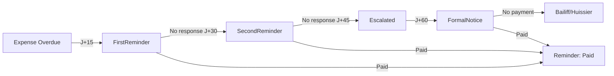

# Payment Recovery Workflow - Documentation Complète

**Issue**: #83 (Workflow Recouvrement Impayés)
**Priorité**: 🔴 CRITIQUE
**Estimation**: 6-8 heures
**Phase**: VPS MVP (Nov 2025 - Mar 2026)
**Impact Business**: Réduction impayés 30-50% via automatisation

---

## 📋 Vue d'ensemble

Le système de recouvrement automatisé des paiements implémente un workflow en 3 niveaux conforme à la législation belge, avec calcul automatique des pénalités de retard au taux légal de 8% annuel.

### Objectifs

1. **Automatiser** les relances d'impayés selon 3 niveaux d'escalade
2. **Réduire** les impayés de 30-50% via suivi systématique
3. **Conformité** légale belge (taux pénalité 8% annuel)
4. **Traçabilité** complète via audit logs

---

## 🎯 Architecture

### Hexagonal Architecture (Ports & Adapters)

```
Domain Layer (Pure Business Logic)
  └─ PaymentReminder entity
     ├─ ReminderLevel enum (FirstReminder, SecondReminder, FormalNotice)
     ├─ ReminderStatus enum (Pending, Sent, Opened, Paid, Escalated, Cancelled)
     ├─ Business rules: penalty calculation (8% annual)
     └─ Invariants: level timing, escalation logic

Application Layer (Use Cases + Ports)
  ├─ PaymentReminderRepository trait (port)
  ├─ PaymentReminderUseCases
  └─ DTOs (CreatePaymentReminderDto, PaymentReminderResponseDto, etc.)

Infrastructure Layer (Adapters)
  ├─ PostgresPaymentReminderRepository (database adapter)
  ├─ payment_reminder_handlers (HTTP API adapter)
  └─ Migration SQL (20251107120000_create_payment_reminders.sql)
```

---

## 📐 Workflow de Recouvrement

### Niveaux de Relance

| Niveau | Délai | Ton | Méthode | Contenu |
|--------|-------|-----|---------|---------|
| **FirstReminder** | J+15 | Aimable | Email | Rappel courtois + montant dû |
| **SecondReminder** | J+30 | Ferme | Email + PDF | Mention pénalités + échéance |
| **FormalNotice** | J+60 | Juridique | Lettre recommandée | Mise en demeure légale |

### Escalade Automatique



### Calcul Pénalités

**Taux légal belge**: 8% annuel

```rust
pénalité = montant_impayé * 0.08 * (jours_retard / 365)

// Exemples:
// 100€, 30 jours → 0.66€
// 1000€, 365 jours → 80€
```

---

## 🔧 API Endpoints

### Base URL

```
POST   /api/v1/payment-reminders
GET    /api/v1/payment-reminders
GET    /api/v1/payment-reminders/{id}
DELETE /api/v1/payment-reminders/{id}
```

### Par Ressource

```
# Par expense
GET /api/v1/expenses/{expense_id}/payment-reminders

# Par owner
GET /api/v1/owners/{owner_id}/payment-reminders
GET /api/v1/owners/{owner_id}/payment-reminders/active

# Statistiques
GET /api/v1/payment-reminders/stats
GET /api/v1/payment-reminders/overdue-without-reminders?min_days_overdue=15
```

### Actions

```
PUT  /api/v1/payment-reminders/{id}/mark-sent
PUT  /api/v1/payment-reminders/{id}/mark-opened
PUT  /api/v1/payment-reminders/{id}/mark-paid
PUT  /api/v1/payment-reminders/{id}/cancel
POST /api/v1/payment-reminders/{id}/escalate
PUT  /api/v1/payment-reminders/{id}/tracking-number
```

### Bulk Operations

```
POST /api/v1/payment-reminders/bulk-create
```

---

## 📊 Database Schema

```sql
CREATE TABLE payment_reminders (
    id UUID PRIMARY KEY,
    organization_id UUID NOT NULL REFERENCES organizations(id),
    expense_id UUID NOT NULL REFERENCES expenses(id),
    owner_id UUID NOT NULL REFERENCES owners(id),

    -- Reminder details
    level reminder_level NOT NULL,  -- FirstReminder, SecondReminder, FormalNotice
    status reminder_status NOT NULL, -- Pending, Sent, Opened, Paid, Escalated, Cancelled

    -- Financial details
    amount_owed DOUBLE PRECISION NOT NULL CHECK (amount_owed > 0),
    penalty_amount DOUBLE PRECISION NOT NULL DEFAULT 0.0,
    total_amount DOUBLE PRECISION NOT NULL,

    -- Timing
    due_date TIMESTAMPTZ NOT NULL,
    days_overdue INTEGER NOT NULL,

    -- Delivery
    delivery_method delivery_method NOT NULL, -- Email, RegisteredLetter, Bailiff
    sent_date TIMESTAMPTZ,
    opened_date TIMESTAMPTZ,
    pdf_path TEXT,
    tracking_number TEXT,
    notes TEXT,

    created_at TIMESTAMPTZ NOT NULL DEFAULT NOW(),
    updated_at TIMESTAMPTZ NOT NULL DEFAULT NOW()
);

-- Indexes for performance
CREATE INDEX idx_payment_reminders_organization ON payment_reminders(organization_id);
CREATE INDEX idx_payment_reminders_expense ON payment_reminders(expense_id);
CREATE INDEX idx_payment_reminders_owner ON payment_reminders(owner_id);
CREATE INDEX idx_payment_reminders_status ON payment_reminders(status);
CREATE INDEX idx_payment_reminders_pending ON payment_reminders(status, created_at) WHERE status = 'Pending';
CREATE INDEX idx_payment_reminders_escalation ON payment_reminders(status, sent_date, level)
    WHERE status IN ('Sent', 'Opened');
```

---

## 💻 Usage Examples

### 1. Créer une Relance Manuelle

```bash
curl -X POST http://localhost:8080/api/v1/payment-reminders \
  -H "Authorization: Bearer $JWT_TOKEN" \
  -H "Content-Type: application/json" \
  -d '{
    "organization_id": "123e4567-e89b-12d3-a456-426614174000",
    "expense_id": "223e4567-e89b-12d3-a456-426614174001",
    "owner_id": "323e4567-e89b-12d3-a456-426614174002",
    "level": "FirstReminder",
    "amount_owed": 100.0,
    "due_date": "2025-10-01T00:00:00Z",
    "days_overdue": 20
  }'
```

### 2. Bulk Create - Toutes les Relances

```bash
curl -X POST http://localhost:8080/api/v1/payment-reminders/bulk-create \
  -H "Authorization: Bearer $JWT_TOKEN" \
  -H "Content-Type: application/json" \
  -d '{
    "organization_id": "123e4567-e89b-12d3-a456-426614174000",
    "min_days_overdue": 15
  }'

# Response
{
  "created_count": 5,
  "skipped_count": 0,
  "errors": [],
  "created_reminders": [...]
}
```

### 3. Obtenir Statistiques de Recouvrement

```bash
curl -X GET http://localhost:8080/api/v1/payment-reminders/stats \
  -H "Authorization: Bearer $JWT_TOKEN"

# Response
{
  "total_owed": 1500.0,
  "total_penalties": 75.0,
  "reminder_counts": [
    {"level": "FirstReminder", "count": 3},
    {"level": "SecondReminder", "count": 1},
    {"level": "FormalNotice", "count": 1}
  ],
  "status_counts": [
    {"status": "Pending", "count": 2},
    {"status": "Sent", "count": 3}
  ]
}
```

### 4. Marquer comme Envoyée

```bash
curl -X PUT http://localhost:8080/api/v1/payment-reminders/{id}/mark-sent \
  -H "Authorization: Bearer $JWT_TOKEN" \
  -H "Content-Type: application/json" \
  -d '{
    "pdf_path": "/storage/reminders/001.pdf"
  }'
```

### 5. Escalader au Niveau Suivant

```bash
curl -X POST http://localhost:8080/api/v1/payment-reminders/{id}/escalate \
  -H "Authorization: Bearer $JWT_TOKEN" \
  -H "Content-Type: application/json" \
  -d '{
    "reason": "Pas de réponse après 15 jours"
  }'
```

---

## 🔒 Permissions

### Rôles et Accès

| Endpoint | SuperAdmin | Syndic | Accountant | Owner |
|----------|------------|--------|------------|-------|
| **CREATE** reminder | ✅ | ✅ | ✅ | ❌ |
| **VIEW** reminders | ✅ | ✅ | ✅ | ✅ (own only) |
| **MARK** as sent/paid | ✅ | ✅ | ✅ | ❌ |
| **ESCALATE** | ✅ | ✅ | ✅ | ❌ |
| **CANCEL** | ✅ | ✅ | ✅ | ❌ |
| **DELETE** | ✅ | ✅ | ❌ | ❌ |
| **STATS** | ✅ | ✅ | ✅ | ❌ |

### Audit Logs

Toutes les actions sont loggées avec:
- `PaymentReminderCreated`
- `PaymentReminderSent`
- `PaymentReminderOpened`
- `PaymentReminderPaid`
- `PaymentReminderCancelled`
- `PaymentReminderEscalated`
- `PaymentRemindersBulkCreated`
- `PaymentReminderDeleted`

---

## 🧪 Tests

### Unit Tests

```rust
// backend/src/domain/entities/payment_reminder.rs
#[test]
fn test_calculate_penalty() {
    let penalty = PaymentReminder::calculate_penalty(100.0, 30);
    assert!((penalty - 0.66).abs() < 0.01);
}

#[test]
fn test_escalate() {
    let mut reminder = create_first_reminder();
    reminder.mark_as_sent(None).unwrap();

    let next_level = reminder.escalate().unwrap();
    assert_eq!(next_level, Some(ReminderLevel::SecondReminder));
}
```

### BDD Tests

```gherkin
# backend/tests/features/payment_recovery.feature

Scenario: Create first reminder after 15 days overdue
  Given an overdue expense of 100 EUR due 20 days ago
  When I create a FirstReminder for the overdue expense
  Then the reminder should be created successfully
  And the penalty amount should be calculated at 8% annual rate
```

### E2E Tests

Test complet du workflow via API REST (à implémenter dans `backend/tests/e2e_payment_recovery.rs`)

---

## 🚀 Workflow Automatisé (Cron Jobs)

### Détection Quotidienne

```bash
# À exécuter quotidiennement à 6h du matin
curl -X POST http://localhost:8080/api/v1/payment-reminders/bulk-create \
  -H "Authorization: Bearer $ADMIN_TOKEN" \
  -d '{"organization_id": "...", "min_days_overdue": 15}'
```

### Escalade Automatique

```bash
# À exécuter quotidiennement à 7h du matin
# Escalade les reminders envoyés depuis >15 jours sans réponse
curl -X POST http://localhost:8080/api/v1/payment-reminders/process-escalations \
  -H "Authorization: Bearer $ADMIN_TOKEN"
```

### Recalcul Pénalités

```bash
# À exécuter hebdomadairement
# Recalcule les pénalités pour tous les reminders actifs
curl -X POST http://localhost:8080/api/v1/payment-reminders/recalculate-penalties \
  -H "Authorization: Bearer $ADMIN_TOKEN"
```

---

## 📝 Business Rules

### Règles de Création

1. **Délais minimums**:
   - FirstReminder: ≥ 15 jours de retard
   - SecondReminder: ≥ 30 jours de retard
   - FormalNotice: ≥ 60 jours de retard

2. **Pas de duplicata**: Un seul reminder actif par (expense, owner, level)

3. **Expense non payée**: Impossible de créer un reminder pour une expense `payment_status = 'paid'`

### Règles d'Escalade

1. **Délai d'attente**: 15 jours minimum entre l'envoi et l'escalade
2. **Statut requis**: Reminder doit être `Sent` ou `Opened`
3. **Dernier niveau**: FormalNotice n'escalade pas (→ procédure huissier)

### Règles de Pénalités

1. **Taux légal belge**: 8% annuel (0.08)
2. **Formule**: `montant * 0.08 * (jours / 365)`
3. **Recalcul**: Quotidien pour les reminders actifs

---

## 🎨 Frontend Dashboard (À implémenter)

### Composant Svelte Principal

`frontend/src/components/PaymentRecoveryDashboard.svelte`

#### Fonctionnalités

1. **Vue d'ensemble**:
   - Total impayés (€)
   - Total pénalités (€)
   - Nombre de reminders par niveau
   - Graphique tendance temporelle

2. **Liste des reminders actifs**:
   - Filtres: status, level, owner, date range
   - Tri: date, montant, niveau
   - Actions rapides: marquer envoyé/payé, escalader

3. **Création manuelle**:
   - Sélection expense
   - Niveau automatique selon jours de retard
   - Preview pénalités calculées

4. **Bulk actions**:
   - Créer toutes les relances en attente
   - Escalader automatiquement
   - Exporter rapport PDF

---

## 🔄 Intégration Email Service

### Templates

1. **FirstReminder.html** (Ton aimable)
   - Objet: "Rappel aimable - Facture #{invoice_number}"
   - Variables: owner_name, amount_owed, due_date, penalty_amount

2. **SecondReminder.html** (Ton ferme)
   - Objet: "Relance - Facture #{invoice_number} en retard"
   - Variables: + warning_text, total_amount

3. **FormalNotice.html** (Ton juridique)
   - Objet: "Mise en demeure - Facture #{invoice_number}"
   - Variables: + legal_terms, deadline, huissier_info

### Configuration

```rust
// backend/src/infrastructure/email/templates/payment_reminders/
├── first_reminder_fr.html
├── first_reminder_nl.html
├── second_reminder_fr.html
├── second_reminder_nl.html
├── formal_notice_fr.html
└── formal_notice_nl.html
```

---

## 📊 KPIs & Metrics

### Métriques de Performance

1. **Taux de récupération**: % impayés récupérés après relance
2. **Délai moyen de paiement**: Jours entre relance et paiement
3. **Escalade évitée**: % payé avant escalade niveau suivant

### Dashboard Metrics

```sql
-- Taux de succès par niveau
SELECT
    level::text,
    COUNT(CASE WHEN status = 'Paid' THEN 1 END)::float / COUNT(*) * 100 as success_rate
FROM payment_reminders
WHERE organization_id = $1
GROUP BY level;

-- Montant récupéré vs pénalités
SELECT
    SUM(amount_owed) as recovered_principal,
    SUM(penalty_amount) as penalty_collected
FROM payment_reminders
WHERE organization_id = $1 AND status = 'Paid';
```

---

## 🐛 Troubleshooting

### Problèmes Courants

**Reminder ne se crée pas:**
- Vérifier `days_overdue` ≥ seuil niveau (15/30/60)
- Vérifier expense `payment_status != 'paid'`
- Vérifier pas de reminder actif existant

**Pénalités incorrectes:**
- Vérifier `days_overdue` est à jour
- Exécuter recalcul manuel: `PUT /payment-reminders/{id}/recalculate`

**Escalade ne fonctionne pas:**
- Vérifier `sent_date` > 15 jours
- Vérifier `status IN ('Sent', 'Opened')`
- Vérifier `level != 'FormalNotice'`

---

## 📚 Références

- **Issue GitHub**: #83
- **Législation belge**: Taux légal pénalité retard 8% annuel
- **Architecture**: CLAUDE.md (Hexagonal Architecture)
- **Tests BDD**: `backend/tests/features/payment_recovery.feature`
- **Migration**: `backend/migrations/20251107120000_create_payment_reminders.sql`

---

## ✅ Checklist Implémentation

- [x] Domain entities (PaymentReminder, ReminderLevel, ReminderStatus)
- [x] Application ports (PaymentReminderRepository trait)
- [x] Application use cases (PaymentReminderUseCases)
- [x] Infrastructure repository (PostgresPaymentReminderRepository)
- [x] API handlers (payment_reminder_handlers.rs)
- [x] Routes configuration (routes.rs)
- [x] Database migration (SQL)
- [x] BDD tests scenarios (payment_recovery.feature)
- [ ] E2E tests (e2e_payment_recovery.rs)
- [ ] Frontend dashboard (PaymentRecoveryDashboard.svelte)
- [ ] Email templates (HTML)
- [ ] Cron jobs automation
- [ ] Documentation utilisateur

---

**Dernière mise à jour**: 2025-11-07
**Auteur**: Claude (Issue #83)
**Status**: ✅ Backend Complet - Frontend & Tests E2E À Implémenter
