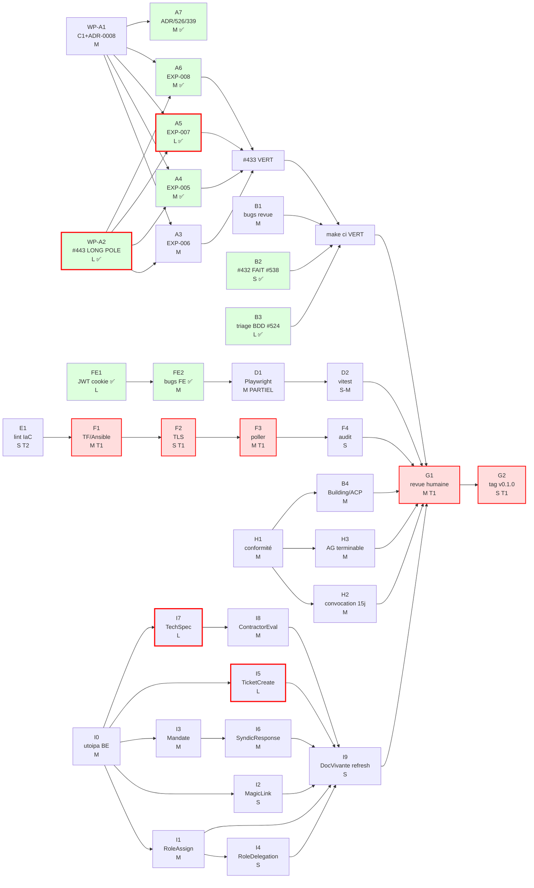
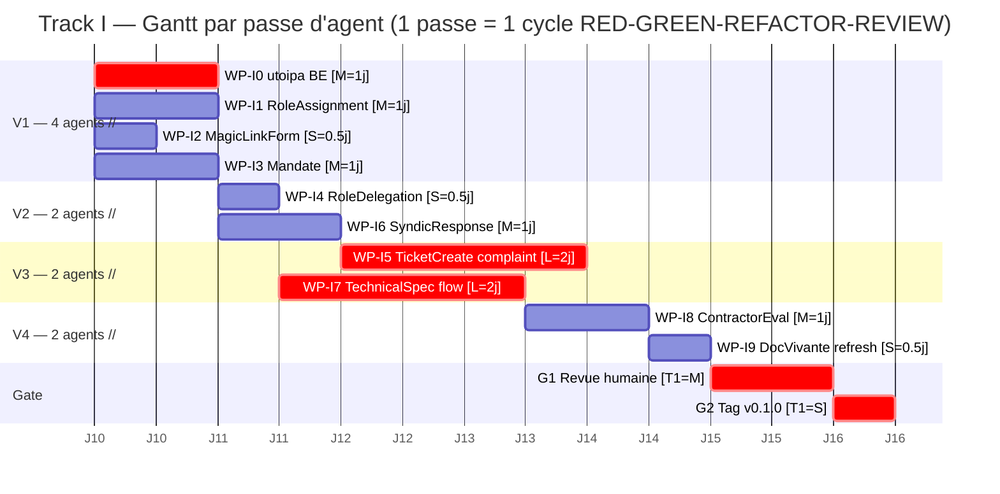

# WBS — Mise en ligne KoproGo v0.1.0 (bêta privée fermée, VPS-first)

`WBS-v0.1.0-beta-r1` · 2026-05-16 · base : `feature/dev` + branche `story/521-C1-governance-decimal` (HEAD `98c1651`, 1 commit devant `origin/feature/dev`).

> **Provenance & portée** : artefact de planification (Tier 2, logué). Aucune issue/milestone GitHub créée (forme « document WBS versionné unique » choisie pour éviter le gate Tier-1). Les numéros d'issues sont _référencés_, pas créés.
>
> **Supersession** : ce document remplace, pour le go-live, les WBS périmés du 2026-04-01 — [`WBS_RELEASE_0_1_0.md`](WBS_RELEASE_0_1_0.md), [`WBS_BUGFIX_UI_v0.1.0.md`](WBS_BUGFIX_UI_v0.1.0.md), [`WBS_CORRECTIONS_v0.1.0.md`](WBS_CORRECTIONS_v0.1.0.md) — qui restent valables comme contexte historique mais ne reflètent plus l'état du code (Story A Decimal mergée, #515 mergé, TLS déjà câblé).

## Context

KoproGo v0.1.0 n'a jamais été taggé ni mis en ligne (aucun tag git, aucune release). Le besoin : **mettre v0.1.0 en ligne en bêta privée fermée (5-10 copropriétés)** avec une infrastructure opérationnelle réelle et tous les tests requis (4 catégories `@happy/@edge/@security/@negative`, RED-first). Le rapport de revue humaine `docs/HUMAN_REVIEW_REPORT_v0.1.0.md` date du **2026-04-01 (~6 semaines, périmé)** et concluait NO-GO public / GO-conditionnel bêta — il doit être **re-rejoué** sur le code courant, pas pris pour argent comptant (plusieurs bugs sont probablement déjà corrigés : #523 dashboard %, #521 Story A mergée).

Décisions produit verrouillées :

1. **Déploiement : VPS d'abord, puis k3s en Phase 2.** Phase 1 = OVH VPS + docker-compose (`infrastructure/monosite/vps/production`, poller systemd `gitops-deploy.sh`). k3s/ArgoCD = Phase 2 post-v0.1.0.
2. **Périmètre : bêta privée fermée.** Gate = bloquants critiques (sécurité réelle mais allégée vs gate public #427).
3. **Decimal : umbrella #433 COMPLÈTE** (EXP-003..008 + gouvernance C1 #521/#534/#525). Exactitude PCMN obligatoire même en bêta.
4. **Forme : document WBS versionné unique.** Pas de création d'issue/milestone GitHub maintenant (évite le gate Tier-1). Issues existantes référencées, non créées.

## Faits vérifiés (corrigent le chemin critique — ne pas re-dériver)

| Hypothèse initiale                                   | Réalité vérifiée (code)                                                                                                                                                                                                                          | Impact                                                                                                                                        |
| ---------------------------------------------------- | ------------------------------------------------------------------------------------------------------------------------------------------------------------------------------------------------------------------------------------------------ | --------------------------------------------------------------------------------------------------------------------------------------------- |
| EXP-006 `journal_entry` = gros chantier PRIORITÉ MAX | **Déjà `Decimal`** : `journal_entry.rs:69-78` debit/credit `Decimal`, `BALANCE_TOLERANCE=dec!(0.011)`, validation débit==crédit exacte ; SQL déjà `DECIMAL(12,2)` + trigger DB                                                                   | Long pole se réduit : reste `Result<_,String>`→`AppError` + BDD 4-cat. Pas de migration SQL.                                                  |
| EXP-005 `charge_distribution` à faire                | Déjà `Decimal` (tolérances `dec!(1.0001)`/`dec!(0.01)`)                                                                                                                                                                                          | `Result→AppError` + BDD 4-cat seulement                                                                                                       |
| #453 TLS = bloquant go-live                          | `infrastructure/monosite/vps/production/docker-compose.override.yml:10-40` **câble déjà Traefik + Let's Encrypt ACME HTTP-01** (443, redirect http→https, certresolver backend+frontend) ; `ACME_EMAIL` dans `.env.example` + ansible group_vars | **TLS PAS bloquant.** Go-live n'exige que : DNS A→IP VPS, ports 80/443 ouverts, `ACME_EMAIL` set. #453 (DNS-01 non-prod + SOPS/age) = Phase 2 |
| #515 5 gaps ArgoCD bloquants                         | **Mergés sur `origin/main`** (PR #516, `645b3cb`/`badb049`) — concernent k3s                                                                                                                                                                     | Phase 2                                                                                                                                       |
| Migration gouvernance large                          | `20260516000000_alter_governance_to_numeric.sql` minimale/correcte : `units.quota` + `meetings.total/present_quotas`→`NUMERIC(10,4)`, idempotente, no-down, no prod data                                                                         | DDL petite/sûre ; risque = call-sites + #525 ColumnDecode                                                                                     |
| EXP-007 `etat_date` mineur                           | `etat_date.rs` = **17 occ. f64** (plus gros résidu umbrella, doc légal Art. 577 CC)                                                                                                                                                              | WP-A5 = item le plus long de Track A                                                                                                          |
| #443 cascade énorme                                  | `bdd_financial.rs` ~23 occ. f64 (pas 120) + e2e\_\*.rs                                                                                                                                                                                           | Cascade réelle mais bornée                                                                                                                    |
| JWT stockage                                         | `frontend/src/stores/auth.ts:139-141` (read) / `233-235` (write) / `169-192` (refresh) en `localStorage`                                                                                                                                         | **Bloquant sécurité bêta fermée** confirmé                                                                                                    |

**Vrai long pole = WP-A2 (#443 cascade tests) → WP-A5 (EXP-007 etat_date)**, à paralléliser avec la chaîne Ops-VPS (latence Tier-1 humaine).

## WBS Phase 1 — v0.1.0 EN LIGNE (VPS, bêta fermée)

Légende : Tier 1 = humain exécute (agent diagnostique/propose). Taille S≤0.5j / M 1-2j / L 3-5j. Tout livrable public : 4-cat RED-first, `Result<E,AppError>`, pas de `unwrap/expect` hors `#[cfg(test)]`, outillage via `docker compose run --rm`.

### Track A — Backend Decimal

- **WP-A1 — Clôture C1 gouvernance** · #534/#521-C1 ferme #525 · T2 · M · _critique, premier_
  Appliquer `backend/migrations/20260516000000_alter_governance_to_numeric.sql` (DB test) ; `bdd_governance` 4 scénarios VERTS ; tuer le panic #525 ColumnDecode `units.quota`. Décisions bloquantes : (a) **ADR-0008 ratio** pour proxy validation `vote.rs:~312-342` (draft `docs/agent-activity/2026-05-16-adr8-noncompliance-body.md`) ; (b) **politique f64 d'affichage** — `resolution.rs:185-212` `pour/contre/abstention_percentage()` renvoient `f64` depuis comptes entiers : **reco = carve-out ADR-0008 explicite (affichage seul, jamais seuil légal)** + assertion que le chemin quorum/majorité légal n'a aucun aller-retour Decimal→f64→Decimal. Fichiers : la migration, `tests/bdd_governance.rs`, `features/governance_decimal.feature`, `entities/{vote,resolution,meeting,age_request}.rs`, repos impl correspondants. Deps : aucune.

- **WP-A2 — Cascade tests #443 (LONG POLE)** · #443 · T2 · L · _critique_ · **FAIT** (#539 + reconfirmé 2026-05-18)
  `docker compose run --rm backend cargo check --tests` propre (`--lib` déjà propre). Literals f64→`dec!()` aux call-sites, assertions Decimal-equality, zéro régression scénario @security/@negative. Fichiers : `tests/bdd_financial.rs` (~23 occ.), `tests/e2e_*.rs`, glue `features/*.feature`. Deps : conventions WP-A1. **Concurrent Track F.**
  **Reconfirmé** (post-merge 5 PR + WP-B3 + #526) : `cargo check --tests` **CHECK_EXIT=0**, 0 erreur, aucune cascade f64/Decimal résiduelle (1 warning amont `proc-macro-error2`, non-bloquant). Suite BDD 100% verte (G1/G2/OPS/COM/FIN=0) ⇒ zéro régression @security/@negative confirmée. **Critère GO « `cargo check --tests` propre » atteint.**

- **WP-A3 — EXP-006 journal_entry (réduit)** · #433 · T2 · M
  `Result<_,String>`→`AppError` sur `JournalEntry/JournalEntryLine`. `features/journal_entries.feature` 4-cat RED-first : @negative **débit≠crédit rejeté**, @edge 0.1+0.2=0.3, @security isolation cross-org, @happy écriture équilibrée. Pas de SQL. Deps : A1, A2.

- **WP-A4 — EXP-005 charge_distribution** · #433 · T2 · M · _parallèle A3_ · **FAIT** (2026-05-19)
  `Result→AppError` ; 4-cat : @security somme quotas==100% à `dec!(1.0001)`, @negative quota>1/négatif rejeté. Deps : A1.
  **Réalisé** (slice cohérente WP-A3) : entité `charge_distribution.rs` typée `ChargeDistributionError` (pure domaine, 3 variantes) + pont `From<…> for String` + `From<…> for AppError`→Validation 400 (bloc en fin de section From, après A3). Entité déjà 100% `Decimal` (aucune migration SQL). 4-cat RED-first typés in-module (`happy/edge borne 1.0001/negative ×2/security Σ>100%`) ; feature taggée `@happy`+`@edge` (commentaire style A3 pour les invariants unitaires). `cargo check --lib --tests` propre, `cargo test --lib charge_distribution` 30/30, `application::error` 16/16, fmt propre (fallback cargo hôte — daemon Docker absent). **Différé (idem A3)** : cascade port/use-case/repo/handler `String`→`AppError` (slice #433 large unique) + gap isolation cross-org use-case (finding Tier-2 tracé `docs/agent-activity/2026-05-19-wbs-a4.md`).

- **WP-A5 — EXP-007 quote/etat_date (Art. 577 CC, plus gros résidu)** · #433 · T2 · L · **FAIT** (2026-05-19, branche `story/wbs-a5-etat-date`)
  f64→Decimal `etat_date` (17 occ.) + `quote` + DTO/use*case/repo ; migration SQL **seulement si** colonnes `DOUBLE PRECISION` (vérifier `20251115000000_create_etats_dates.sql`, `20251120150000_create_quotes.sql`) ; `Result→AppError` ; 4-cat `etat_date.feature`/`quotes.feature`. Deps : A1, A2.
  **Réalisé** : **aucune migration SQL** (colonnes déjà `DECIMAL(12,2)`). `etat_date.rs` — `use f64;` parasite retiré ; 5 champs monétaires f64→`Decimal` (`unit_area` conservé f64, ADR-0009) ; enum domaine pur `EtatDateError` (7 var.) + pont `From<*> for String`+`From<\_> for AppError`→Validation 400. DTO 5 champs→Decimal (non contract-visible : DTO sans `ToSchema`⇒ zéro drift openapi/api.d.ts). Repo : casts`::FLOAT8 AS`retirés sur 5 colonnes ×7 SELECT. bdd_governance steps → Decimal exact (cents/100). 4-cat RED-first in-module + feature taggée`@happy`/`@edge`(commentaire style A3/A4).`cargo check --lib --tests`propre,`cargo test --lib etat_date`24/24, fmt propre (fallback hôte — daemon Docker absent). Log`docs/agent-activity/2026-05-19-wbs-a5.md`. **Scopé etat_date** (vrai long-pole) ; `quote.rs`déjà Decimal-clean → typed-error`QuoteError`différé umbrella (idem A3/A4, non bloquant DoD car exactitude Decimal déjà satisfaite). **Différé** : cascade port/use-case/handler`String`→`AppError`.

- **WP-A6 — EXP-008 owner_contribution/call_for_funds/gamification** · #433 · T2 · M · **FAIT** (2026-05-19, branche `story/wbs-a6-exp008`)
  Monétaire→Decimal+AppError+4-cat. Gamification/ratings = scores non-PCMN → carve-out ADR-0008, f64 conservé (@happy+@negative légers). Deps : A1, A2.
  **Réalisé** (slice cohérente WP-A4 — entités **déjà Decimal**, aucune migration f64) : enums domaine purs `OwnerContributionError` (2 var.) + `CallForFundsError` (4 var.) + ponts `From<_> for String` + `From<_> for AppError`→Validation 400 (blocs après `JournalEntryError`). `new()` des 2 entités → `Result<_, …Error>`, assertions `.contains()`→`matches!`. 4-cat RED-first in-module (happy Decimal exact / edge borne+0.1+0.2=0.3 / negative entrées invalides / security montant falsifié ≤0 rejeté) + features `owner_contributions`/`call_for_funds` taggées `@happy`/`@edge` (commentaire style A3/A4/A5). **Carve-out gamification confirmé** : aucun champ monétaire f64 ; seul résidu `challenge.rs:401` = % progression non-PCMN, f64 conservé (ADR-0008). `cargo check --lib --tests` propre, `owner_contribution` 14/14, `call_for_funds` 16/16, fmt propre (fallback hôte — daemon Docker absent). Log `docs/agent-activity/2026-05-19-wbs-a6.md`. **Différé** : cascade port/use-case/handler `String`→`AppError`. **⇒ Umbrella #433 EXP-005/006/007/008 désormais Decimal + erreurs domaine typées.**

- **WP-A7 — Finaliser ADR-0008 + politique #526/#339** · #526/#339/ADR-0008 · T2 (accept=humain) · M · **FAIT (Tier-2)** — acceptation ADR pendante humain (2026-05-19, branche `story/wbs-a7-adr8-rotate`)
  (a) ADR-0008 finalisé (ratio + %-affichage + carve-out gamification). (b) #526 : garder `expenses_amount_check > 0`, modéliser les annulations en contre-écritures journal (pas de relâche schéma), documenter. (c) #339 rotate 501 `api_key_handlers.rs:506` : **reco = implémenter rotate minimal** derrière 4-cat (@security ancienne clé invalide post-rotate, @negative rotate non-propriétaire→403) ; alternative = retirer la route + documenter pour qu'aucun 501 ne parte en bêta.
  **Réalisé** (choix humain « draft ADR + rotate, accept humain ») : (a) `docs/adr/0008-…md` — **Amendment 2026-05-19 statut `Proposed`** (décision d'origine inchangée `Accepted`) : liste **fermée** carve-outs f64 (résolution %-affichage seul / ratio proxy vote.rs seuil-Decimal / gamification challenge.rs non-PCMN / surfaces m² / IoT ADR-0009) + invariant ratio testable. Acceptation = @gilmry au merge. (b) #526 documenté §C (CHECK > 0 conservé, annulations = contre-écritures journal ; déjà vert #526/WP-B3 `086c953`). (c) `rotate_api_key` implémenté : gate SYNDIC/SUPERADMIN, txn (désactive ancienne + insère remplaçante héritée), isolation cross-org 404, audit, secret une fois ; **`sqlx::query` non-macro** (offline-safe). 4-cat RED-first `e2e_api_keys.rs` (happy 200+nouveau secret / security ancienne clé inactive+1 active / negative owner→403 / edge inconnu→404). `cargo check --lib --tests` propre, `cargo test --lib api_key` 3/3, fmt propre (fallback hôte — daemon Docker absent). **⇒ aucun `501` ne part en bêta.** Log `docs/agent-activity/2026-05-19-wbs-a7.md`. **Tier-1 pendant** : acceptation amendement ADR-0008 par @gilmry au merge.

### Track B — Backend autre

- **WP-B1 — Re-vérifier bugs revue humaine** · BUG-WF*/#523 · T2 · M (L si WF14-2 réel) · *J1\*
  Re-jouer `HUMAN_REVIEW_REPORT_v0.1.0.md` comme checklist vs `feature/dev` courant : **BUG-WF14-2 fuite bâtiments cross-org (Alice voit 3 bâtiments) = bloquant sécurité bêta si reproductible** — tracer scoping `organization_id` repo buildings ; BUG-WF2-1 `voting_power≤1000` vs seed>1280 (vérifier `20260401000000_fix_voting_power_constraint.sql`) ; BUG-WF7-1 ticket 400 ; NaN% compteurs (probablement corrigé par #523 `7c2d664` — vérifier). Repro RED par bug confirmé. Deps : aucune.

- **WP-B2 — Gate sécurité dependabot #432** · #432 · T2 · S-M · _parallèle_ · **FAIT** (PR #538)
  Réalité : #432 = 100% npm/frontend (le "14 vulns" était périmé). `svelte 5.55.7` + `devalue 5.8.1` → 5 alertes résolues, `npm audit --omit=dev` = 0, build vert. Résiduel 1 HIGH `@babel/plugin-transform-modules-systemjs` (devDependency build-only, `audit fix --force` breaking → accepté/documenté). `cargo audit` (RustSec) exit 0 modulo ignores `.cargo/audit.toml`. Fichiers : `frontend/package-lock.json`. Deps : aucune.

- **WP-B3 — Triage BDD pré-existants révélés par #524** · **#540** /#524/#443/#526/#534 · T2 · L · _débruite le gate_ · **FAIT** (PR #541)
  Le fix #524 a rendu le harness honnête → ~27 scénarios BDD pré-existants rouges sur 8 groupes (CI run `25982956110`) bruitent **toute** PR : « Meeting Resolutions » 14/14 (quorum Art. 3.87 §5 ordre workflow), Board CdC mandat ×5 (Art. 3.89 assertion vs règle), Energy/Notice/CallForFunds/Gamification ×6 (seeds/asserts), Stats ×2 (= #526). **Issue de tracking consolidée = #540** (inventaire complet + critères) ; un sous-fix RED-first 4-cat par groupe (P1 = Meeting Resolutions + Board mandat, légalement sensibles ; P2 = seeds/asserts ; Stats = #526 séparé). Aucun fix « comme ça » — comprendre la cause (test faux / prod faux / spec obsolète). Deps : aucune (parallèle). **Prérequis du jugement BDD propre en G1.**
  **Réalisé** (commit `73e4651`, validé local les 5 binaires BDD) : **P1-G1** = spec obsolète (resolutions.feature pré-#310/#323 : create_resolution exige quorum Art. 3.87 §5 ; + labels legacy Simple/Qualified jamais migrés vers l'enum belge) → Background quorum + alignement Absolute/TwoThirds + scénario @security ; `bdd_governance` 15/15. **P1-G2** = **bug prod** (board_member.rs appliquait la règle _syndic_ Art. 3.89 1–3 ans au _conseil de copropriété_, qui relève d'Art. 3.90 ~1 an ; DB+tests+legal_compliance.feature unanimes) → Full Option A (entité 330–395, DTO défaut 1095→365, use-cases, 17 tests 4-cat, 3 steps renew, réf Art.3.90) ; `bdd` board 23/23+13/13. **⚠ Suivi : la durée mandat conseil « ~1 an » est un choix de modélisation projet — Art. 3.90 réel laisse la durée à l'AG → ADR à signer (tracé sur #540).** **P2 ×6** = 6 bugs test (4 time-bomb dates hardcodées → helper `parse_seed_date` relatif ×3 binaires + 4 features en tokens `+Nd` ; 2 test-id : Notices author owner_id↔user_id, Energy uploads unit_id↔uploaded_by) ; ops/community/CallForFunds verts. **Infra** : `get_host()` ajouté à bdd/operations/community (pattern #535/#539) → 5 binaires BDD exécutables en local. **Critère #540 atteint** : seul rouge restant = #526 (Zero/Tiny, hors-scope, tracé). Zéro régression.

### Track C — Frontend sécurité (refacto #343 / SSR client:load DIFFÉRÉS post-bêta)

- **WP-FE1 — JWT hors localStorage (vol session XSS)** · BLOQUANT SÉCURITÉ · T2 · L · _critique_ · **FAIT** (2026-05-19, branche `story/wbs-fe1-jwt-cookie`) · ⚠️ dette D1 (Playwright ripple) tracée
  `auth.ts:128-235` : refresh token → cookie backend `HttpOnly; Secure; SameSite=Strict` ; access token en mémoire seule + silent-refresh au load. Backend login/refresh : set-cookie + read-cookie + CORS credentials. 4-cat RED-first : @security token illisible JS/`document.cookie` & absent localStorage ; @negative cookie forgé/expiré→401 ; @happy login→refresh→protégé ; @edge refresh à la borne d'expiration. Deps : coordination WP-B1 ; moitié backend nourrit moitié FE.
  **Réalisé** : `auth_cookie.rs` (cookie `HttpOnly; Secure(COOKIE_SECURE); SameSite=Strict; Path=/api/v1/auth; 7j`) + `auth_handlers` (corps sans `refresh_token` via `AuthBody`, DTO `LoginResponse` intact ; `refresh` cookie-only → 401 si absent ; rotation ; `POST /auth/logout` révoque+expire) ; CORS `.supports_credentials()` (R2 inexistant : `validate_cors_origins` rejette déjà `*`). Frontend : `accessToken.ts` mémoire seule, `auth.ts` réécrit (zéro token localStorage, silent-refresh cookie, logout serveur), `api.ts` Bearer mémoire, Login/Register `credentials:"include"`. `injectAuth` Playwright réécrit (cookie réel + silent-refresh, ripple ~specs absorbé — **lève dépendance WP-D1**) + `AuthCookie.spec.ts` 4-cat. openapi.json + api.d.ts régénérés (gate Contract). `COOKIE_SECURE=false` dev/E2E (`docker-compose.yml`/`.env.example`). Vérif : `cargo check --lib --tests` propre, `auth_cookie` 4/4, `astro check` 0 erreur, prettier propre (fallback hôte — daemon Docker absent). Log Tier-2 `docs/agent-activity/2026-05-19-wbs-fe1.md`. **Différé** : use-cases auth `Result<_,String>` (hexagonal-clean, hors scope) ; `SameSite=Strict` à re-décider si sous-domaines séparés Phase 2.

- **WP-FE2 — Corriger bugs FE revue (WF1-1/2/3)** · T2 · M · **FAIT** (2026-05-19, branche `story/wbs-fe2-fe-bugs`)
  Bouton "Nouvelle réunion" `/meetings` (syndic) ; POST `/convocations` envoie `building_id` ; lister convocations créées via API. Re-vérifier vs courant. 4-cat Playwright (@happy créer+envoyer via UI, @negative building_id manquant → erreur visible pas 400 silencieux). Deps : WP-B1.
  **Réalisé** : re-vérification vs `feature/dev` courant → **les 3 bugs ALREADY-FIXED** (rapport 2026-04-01 périmé, même cas que WP-B1). WF1-1 `MeetingList.svelte:128` bouton `btn-new-meeting` gated `canCreate` syndic/superadmin + `MeetingCreateModal`. WF1-2 `ConvocationPanel.svelte:61` envoie `building_id` (prop `MeetingDetail:267`), erreurs via `withErrorHandling` (pas de 400 muet) ; `CreateConvocationDto` type-impose `building_id`. WF1-3 page `/convocations` (`BuildingSelector`→`ConvocationList`→`listByBuilding`) + panel par-réunion `getByMeetingId`. Livrable = garde-fou non-régression `frontend/tests/e2e/smoke/MeetingConvocation.spec.ts` 4-cat RED-first (@happy création réunion+convocation via UI / @edge /convocations sans crash / @security sans auth→/login & bouton non exposé / @negative erreur convocation visible). `astro check` 0 erreur, prettier propre (fallback hôte — daemon Docker absent ; specs exécutés en CI). Aucun code applicatif modifié (rien à corriger). Log `docs/agent-activity/2026-05-19-wbs-fe2.md`.

### Track D — E2E/QA

- **WP-D1 — Réparer specs Playwright skippés** · #331/#548/#550 · T2 · M · **PARTIEL FAIT** (2026-05-20)
  Un-skip 21 ApiKeys/SecurityIncidents : normaliser case rôle `SYNDIC`↔`syndic` + `building_id` dans `global-setup.ts`/TestWorld ; câbler/justifier 32 specs hors-CI. Plancher smoke ≈219/240 sans régression, jugement par-scénario. Fichiers : `frontend/tests/e2e/global-setup.ts`, `*.scenario.ts` (dont `meeting-vote.scenario.ts`), `{api-keys,security-incidents}*.spec.ts`, job playwright `ci.yml`. Deps : WP-FE1 (auth ripple global-setup), WP-B1.
  **Réalisé** (race auth race-condition résolue, observée en live console) :
  - `9a55c1a` #548 — `frontend/src/lib/db.ts` lazy-init central → élimine `Database not initialized` qui ripple-cassait 59 specs.
  - `d988a57` #550 strate 1 — `authStore.refreshAccessToken` dedup in-flight (1 POST partagé entre N callers concurrents) + 5 tests Vitest TDD 4-cat.
  - `0cacd83` #550 strate 1 (refactor helpers) — `Meetings/Expenses/Buildings.spec.ts` passent du UI-login local au `loginAsSyndic[WithBuilding]` partagé (injectAuth), élimine la course `/login → dashboard` (refresh #1 rote cookie → refresh #2 sur cookie révoqué).
  - `5d2a7ae` #550 strate 2 v3 — `apiFetch` attend le refresh in-flight si pas de token (composants `client:load` qui mountent et appellent `api.get` avant `init()` complet). Validé en live console (0 erreur 401 cascade).
  **Différé** : strate 3 (Resolutions/Invoices/Notifications/AdminDashBoard tests qui passent shared helper mais échouent encore — issue #550 garde la trace). Plancher smoke à confirmer en CI post-merge feature/dev→dev.

- **WP-D2 — Câbler vitest au gate** · #343 · T2 · S-M
  Job `vitest` existe (`ci.yml:402`) ; couvrir auth store (WP-FE1) + composants convocation/réunion @happy/@negative ; cible = composants critiques bêta (pas 181/181). Deps : WP-FE1, WP-FE2.

### Track E — Tests IaC (sous-ensemble VPS de #354)

- **WP-E1 — Lint IaC minimal viable** · #354 · T2 · M · _100% parallèle_ · **FAIT** (2026-05-20, 7 sous-fixes successifs)
  Job lint dans `ci-infra.yml`, assets VPS seulement : `terraform fmt -check`/`validate` (modules OVH + `monosite/vps/production/terraform`), `ansible-lint` (14 rôles + playbook prod), `yamllint`, `shellcheck` (**gate dur sur `gitops-deploy.sh`** — il exécute le déploiement prod). conftest/molecule/terratest = Phase 2. Deps : aucune.
  **Réalisé** (7 couches successives découvertes en réajustant le gate sur `feature/dev`) :
  - `9d081c7` oasdiff — format `--err-ignore` substring + retrait validate module aliasé non standalone.
  - `be87351` terraform — off-by-one paths modules ovh-vps sur les 4 envs vps (`../../../` → `../../../../_shared/...`).
  - `cc659e3` vars.yml — ajout newline final manquant (yamllint EOL strict).
  - `13336ac` — retrait `---` en tête `vars.yml` + `playbook.yml` (yamllint `document-start: present:false`).
  - `bdad9ff` — `become: yes` → `become: true` (yamllint `-s` strict promeut truthy en erreur).
  - `e52afd8` — paths ansible roles 4 niveaux dans `playbook.yml` (même off-by-one que terraform).
  - `0a951f9` — install `community.general:>=8.0.0,<11.0.0` dans CI step (module `ufw` n'est pas dans ansible-core).
  Tooling host installé en parallèle (terraform 1.9.8, yamllint 1.38, shellcheck, gitleaks 8.30, oasdiff 1.15.3, kubeconform 0.6.7, pre-commit) pour reproduire localement (mémoire `feedback_use-docker-compose-for-tooling.md` complétée).

### Track F — Ops VPS (concurrent Track A — aucun fichier partagé)

- **WP-F1 — Provision VPS : Terraform + Ansible** · T1 · L
  `terraform plan/apply` `monosite/vps/production/terraform` ; `ansible-playbook playbook.yml` (common, hardening, docker, security, monitoring, backup, gitops, dns) ; vérifier LUKS/fail2ban/Suricata/CrowdSec/SSH+kernel hardening, Prometheus/Grafana/ELK, backup GPG+S3. **`terraform apply`/`ansible-playbook` prod = HUMAIN** ; agent fournit plan/diff revus + runbook. Deps : WP-E1 (souhaitable).

- **WP-F2 — Vérification TLS (déjà câblé)** · T1 · S
  Confirmer émission cert Let's Encrypt HTTP-01 domaine bêta. Pré-requis humain : DNS A→IP VPS, ports 80/443 ouverts, `ACME_EMAIL` dans `.env`. Aucun nouveau pipeline. Deps : WP-F1.

- **WP-F3 — Bring-up poller gitops-deploy.sh + secrets** · T1 · M
  `gitops-deploy.sh watch` en unit systemd (TOPOLOGY=vps, ENV=production, BRANCH=<release>). Ansible Vault suffisant v0.1.0 (SOPS/age = Phase 2). Valider `.env`, retry pull/up, tag image `<branch>-<sha7>`. Deps : WP-F1, WP-F2, images pushées (`docker-build-push.yml`).

- **WP-F4 — État Terraform distant + RUNBOOK VPS** · T2 (doc) + T1 (state) · M
  Configurer/vérifier `backend.tf` état distant (pas d'état prod local). Rédiger `docs/RUNBOOK_VPS_PRODUCTION.md` (absent vérifié) : deploy, rollback (revert commit→poller redéploie), restore GPG+S3, endpoints santé, logs `/var/log/koprogo-gitops-production.log`. Deps : WP-F1.

### Track H — Conformité métier (ajouté 2026-05-20 — bloqueurs légaux bêta fermée)

> Bloqueurs identifiés en live testing 2026-05-20 (cf. issues #553/#554 et règles d'agent `admin-publishes-conform-buildings` / `validate-before-compute` / `world-model-seed`). Sans ces WP, un syndic peut lancer une AG, voter, calculer des charges sur un immeuble dont les quotas sont faux → décisions invalides juridiquement (Art. 3.87 §3-5 CC).

- **WP-B4 — Bouton « Modifier » immeuble admin fonctionnel** · #553 Bug 1 · T2 · S
  `BuildingDetail.svelte:67-69` `handleEdit` ouvre `showEditModal=true` mais le modal n'apparaît pas en live (admin bloqué pour éditer la fiche). Diagnostiquer (binding modal / Svelte 5 `on:click` vs `onclick` / props manquantes). 4-cat Playwright `@happy` (clic→modal→submit→update→reload), `@negative` (validation form). Deps : aucune.

- **WP-H1 — `Building.is_conformant()` + filtrage role-based** · #553 règle admin-conform · T2 · M · _BLOQUEUR LÉGAL_
  Entité domaine `Building` expose `is_conformant() -> bool` ssi `COUNT(units WHERE building_id) == total_units` ET `SUM(units.quota) == 1000` (millièmes belges). Use-case `list_buildings_for_syndic()` filtre par `is_conformant()` ; admin voit tout + badge `draft`/`conformant`. FE : `BuildingDetail` affiche count réel + somme réelle des quotas + badge + delta (« il vous manque X lots, Y millièmes »). 4-cat BDD `@happy`/`@negative`/`@security` (syndic NE PEUT PAS obtenir un building non-conform via API directe). Deps : aucune (mais coordonne avec cluster #433 Decimal pour les quotas).

- **WP-H2 — `validate-before-compute` sur use-cases calcul** · #553/#554 règle validate-before-compute · T2 · M · _BLOQUEUR LÉGAL_
  Tout use-case produisant un chiffre opérationnel (charges, quorum, répartition tantièmes, appels de fonds, génération PV/convocation) commence par `building.assert_conformant()?`. Erreur typée `BuildingNotConformantError { building_id, deltas }`. API → 422 avec détail. FE → banner « immeuble non conforme » + désactivation boutons calcul. Audit toute tentative de calcul sur non-conform. 4-cat BDD pour chaque use-case touché. Deps : WP-H1.

- **WP-H3 — `Meeting.assert_can_complete()` invariants** · #554 Bug 1 · T2 · M · _BLOQUEUR LÉGAL Art. 3.87 §3-5 CC_
  Entité `Meeting.complete()` refuse la transition `Scheduled → Completed` si : (a) aucune convocation envoyée, (b) quorum non validé (Art. 3.87 §5), (c) aucune résolution avec statut terminal, (d) aucun document type `MeetingMinutes` attaché. Erreur typée `MeetingNotReadyToComplete { missing: Vec<MissingPiece> }`. API → 422 avec liste pièces manquantes. FE → bouton « Marquer terminée » désactivé + checklist visuelle 4 pré-conditions. **Migrer aussi `meeting_use_cases.rs:complete_meeting` de `Result<_,String>` vers `AppError` (couvre simultanément un slice de l'epic #555 — coordination cluster #555/#433).** Deps : aucune.

#### WPs Maury refonte-ux-multi-role-acp (ajoutés 2026-05-20 — pipeline Maury Phases 1-5 signées)

> Issus du pipeline Maury [`docs/maury/refonte-ux-multi-role-acp/`](maury/refonte-ux-multi-role-acp/) (Brief + PRD + Architecture + Stories + Validation tous v1.0 signés 2026-05-20 par @gilmry). Slices 1+2 cartographient les WPs Track H existants ; slices 3-5 ajoutent WP-H4/H5/H6 pour extension produit.

- **WP-H0 — Slice 0 caractérisation FE (régression safety net)** · Maury story 0.1 · T2 · M · _PRÉ-REQUIS TRANSVERSE_
  Suite 6 specs Playwright `frontend/tests/e2e/characterization/` qui fige les flows existants HEAD `feature/dev` avant toute refonte. Reste VERTE sur toutes les slices ultérieures (gate CI inter-slice Tx.1). Deps : aucune.

- **WP-H4 — Slice 3 sous-rôles + Magic Link + Mandates + Ticketing** · Maury stories 3.1-3.9 · T2 · L · _ARBITRAGE v0.1.0 vs v0.2.0_
  Sous-rôles métier (accountant.encodeur/emetteur, community.moderator, lawyer/notary/amo/architect/bet/warden) + entité MagicLink + PWA Contractor (3 écrans) + Mandate (avocat/notaire/AMO/architect/BET) + délégation temporaire UserRoleAssignment.valid_until + Ticket.kind=complaint avec severity/evidence/witnesses + SyndicResponse SLA + escalade CdC + TechnicalSpec versionnable + ContractorEvaluation (refus 422 sans TechnicalSpec). 9 stories `story/3.1-*` à `story/3.9-*`. Deps : WP-H1 (acp_id) + WP-H4 ne bloque PAS v0.1.0 sauf décision contraire PO.

- **WP-H5 — Slice 4 Governance hybride + signatures eIDAS** · Maury stories 4.1-4.9 · T2 · L · _ARBITRAGE v0.1.0 vs v0.2.0 — Art. 3.87 §4 CC + eIDAS UE 910/2014_
  Meeting.mode (in_person|remote|hybrid) + quorum agrégé Decimal + vote distant auth_method (#48 itsme/eID promu in-scope) + Minutes 2 signatures eIDAS qualifiées + Port `ElectronicSignatureProvider` + 3 adapters (eID belge/itsme/Universign — ADR-0014) + CdC élu + CommissaireAuxComptes + VerificationCertificate. Couvre WP-H3 existant via story 4.5 (Meeting.assert_can_complete reprise #554) + WP-H2 existant via story 4.9 (validate-before-compute méga `[cluster-coord]` 4 use-cases). 9 stories `story/4.1-*` à `story/4.9-*`. Deps : WP-H1.

- **WP-H6 — Slice 5 modularité + onboarding + RBAC Communauté Moderator** · Maury stories 5.1-5.8 · T2 · M · _ARBITRAGE v0.1.0 vs v0.2.0_
  Table `acp_enabled_modules` + middleware `ModuleGuard` + `ModuleDisabledError` + UI `ModuleGate.svelte` + Syndic = `community.moderator` (RBAC SEL/Poll/Notice/SharedObject sans participation perso, INV-4 brief) + Reservation.on_behalf_of_acp + Comptable 403 sur /community/* + activation/désactivation auditée + archivage (jamais delete) + onboarding wizard ≤ 5min + CI gate axe-core ≥ 90 + data-testid lint. 8 stories `story/5.1-*` à `story/5.8-*`. Deps : WP-H1 + WP-H4 (sous-rôles).

- **WP-HTx — Slice transversal continu** · Maury stories Tx.1-Tx.3 · T2 · S · _CONTINUOUS_
  Tx.1 job CI `test:characterization` bloque merge si ROUGE + Tx.2 helpers shared multi-rôle complets (`loginAsContractorMagicLink`, etc.) + Tx.3 log Tier 2 `docs/agent-activity/YYYY-MM-DD-bob-slice-N.md` par session. Démarrage **immédiat** dès slice 0. Deps : WP-H0.

> **Cartographie Maury ↔ WPs Track H existants** :
> - WP-H1 ⇔ Story 1.4 (Building.is_conformant + #553 fix) + 1.1-1.3 (refacto ACP)
> - WP-H2 ⇔ Story 4.9 méga `[cluster-coord]` (validate-before-compute 4 use-cases)
> - WP-H3 ⇔ Story 4.5 (Meeting.assert_can_complete reprise #554)
> - WP-B4 ⇔ Story 1.4 + 2.5 E2E (BuildingDetail refacto + multi-rôle test)
> - WP-D1/E1 enrichis ⇔ slice 2 stories 2.1-2.5 (sélecteur+banner+Portfolio)
>
> **Arbitrage v0.1.0** : seuls WP-H0/H1/H2/H3/HTx sont **bloqueurs légaux** pour go-live bêta fermée (Art. 3.84-3.89 CC, fiche bâtiment conforme, AG terminable). WP-H4/H5/H6 sont **extension produit** — décision PO à confirmer sur leur inclusion v0.1.0 vs report v0.2.0.

### Track I — Frontend refonte UX multi-rôle ACP (slice 3 FE catch-up)

> **Contexte** : suite à la livraison de slice 3 BE (Stories 3.1 → 3.9 mergées 2026-06-09, commits 9598298 → cf41ef4), les UIs syndic/owner correspondantes manquent. **Documentation Vivante e2e** casse silencieusement (workflow `continue-on-error: true` a698f6d) car le DOM ciblé n'existe pas. **Dette UX intégrée au WBS** plutôt que renvoyée à une Phase B post-mortem (cf. mémoire `feedback_maury-fullstack-first.md` : Maury doit penser FE+BE dès le brief pour full-stack découplé).
>
> **Drafts BMAD détaillés** (sources de vérité techniques) : `docs/maury/refonte-ux-multi-role-acp/phase-b-fe/{brief,prd,architecture,stories}.md` — non commités (Tier 1 doc publique en attente d'arbitrage).
>
> **Gantt par passe agent estimé** : 4 vagues V1→V4, critical path ≈ 3h wall-clock si docker stable, 5h pessimiste. Pattern docker-parallelism : 1 BE + 3 FE concurrent OK (cf. mémoire `feedback_docker-parallelism-bottleneck.md`).

- **WP-I0 — utoipa::path registrations BE (préalable Track I)** · T2 · M
  Ajouter `#[utoipa::path(...)]` sur tous les handlers Stories 3.4/3.5/3.7/3.8/3.9 + register dans `infrastructure/openapi.rs::ApiDoc::paths(...)` ; regen `openapi.json` + `frontend/src/types/api.d.ts`. Critère : CI Contract Types Check vert avec endpoints mandates/role-delegations/syndic-responses/technical-specs/contractor-evaluations exposés. Deps : aucune (Phase A mergée).

- **WP-I1 — UI sous-rôles : RoleAssignmentForm + List** · T2 · M · _wave V1_
  Composants Svelte 5 runes admin pour assigner/lister sous-rôles `accountant.{encodeur,emetteur}` + community.moderator + mandataires. Route `/admin/role-assignments`. data-testid : `role-assignment-{user-select,role-select,org-select,submit,row-<id>,revoke-<id>}`. AC 4-cat : @happy assignment OK / @edge expire today / @security cross-org 403 / @negative invalid role. Vitest 4-cat + Playwright multi-rôle. Deps : WP-I0.

- **WP-I2 — UI MagicLinkIssueForm** · T2 · S · _wave V1_
  Form syndic émet MagicLink contractor + bouton copier URL `/c?t=<token>`. Route `/syndic/magic-links`. data-testid : `magic-link-{target-input,scope-select,scope-id-select,expires-in-input,issue-submit,issued-url-copy}`. AC 4-cat : invariant subject != self (cf. fix CI 709f649). Deps : WP-I0.

- **WP-I3 — UI MandateIssueForm + List + ExpirationBadge** · T2 · M · _wave V1_
  Form émission mandate notaire/avocat/AMO/architecte/BET/gardien + table liste + countdown badges. Route `/syndic/mandates`. data-testid : `mandate-{kind-select,subject-select,scope-select,reason-textarea,valid-until-input,issue-submit,row-<id>,revoke-<id>,expiration-badge-<id>}`. AC 4-cat (reason 10-500 chars, max 5 ans). Deps : WP-I0.

- **WP-I4 — UI RoleDelegationForm + List** · T2 · S · _wave V2_
  Form délégation rôle temporaire ; message clair non-transitivité (DelegationChainNotAllowed). data-testid : `role-delegate-{target-input,role-select,until-input,submit,row-<id>}`. AC 4-cat : @security re-delegation refusée + message UI. Deps : V1 (réutilise ExpirationBadge de I3).

- **WP-I5 — UI TicketCreate refacto complaint (kind+severity+evidence+witnesses)** · T2 · L · _wave V3_ · _bigger piece_
  Refacto composant existant + 3 nouveaux sous-composants `EvidenceUpload.svelte`, `WitnessSelector.svelte`, `SeveritySelector.svelte`. data-testid : `ticket-{create-kind-select,severity-select,incident-date-input,evidence-upload,witness-add,description-textarea,submit}`. AC 4-cat : badge "preuves manquantes" si text-only / max 10 evidence / witnesses ≠ self. Deps : WP-I0.

- **WP-I6 — UI SyndicResponseForm + TicketSlaBadge** · T2 · M · _wave V2_
  Form append-only (pas d'édition) + badge SLA couleur selon time-to-due. Route enrichit ticket-detail. data-testid : `syndic-response-{body-textarea,action-proposed-select,submit,row-<id>}`, `ticket-sla-badge`. AC 4-cat : badge passe rouge si overdue. Deps : V1 (pattern).

- **WP-I7 — UI TechnicalSpec full flow** · T2 · L · _wave V3_ · _bigger piece_
  4 composants : `TechnicalSpecCreate`, `TechnicalSpecDetail`, `TechnicalSpecSignatureForm`, `TechnicalSpecVersionTimeline`. Routes `/syndic/technical-specs` + `/syndic/technical-spec?id=` (path-param évité, cf. fix Astro static fed175d). data-testid : `tech-spec-{title-input,version-input,deliverable-add,required-sig-select,attach-upload,create-submit,submit-for-sign,sign-submit,bump-submit,version-row-<version>}`. AC 4-cat : major bump → re-signature requise ; non-mandataire bouton signer absent. Deps : WP-I0.

- **WP-I8 — UI ContractorEvaluationForm + Reputation** · T2 · M · _wave V4_
  Form évaluation gated by approved TechnicalSpec ; page reputation contractor (5 scores 1-5, moyenne). data-testid : `contractor-eval-{contractor-select,spec-select,tickets-link,scores-{quality,timeliness,communication,cost,overall},comment-textarea,submit}`. AC 4-cat : spec Draft → 422 toast + redirect. Deps : WP-I7 (spec doit exister pour gater).

- **WP-I9 — Documentation Vivante refresh + retire continue-on-error** · T2 · S · _wave V4_
  Retirer `continue-on-error: true` du step "Run Documentation Vivante scenarios" dans `.github/workflows/ci.yml` (commit a698f6d) → vérifier CI passe verte sans bypass + axe-core violations = 0 sur tous composants I1-I8. AC : CI green sans bypass ; vidéos générées montrent les nouveaux flows. Deps : WP-I1..I8 mergés.

> **Critères DoD Track I (intégrés au gate G1)** :
> - svelte-check 0/0 erreur/warning ; axe-core violations = 0 par composant ; Vitest 4-cat + Playwright multi-rôle par WP ; data-testid sur 100% éléments interactifs ; pas de stockage JWT en localStorage ; bundle Phase I ≤ +50 KB gzip (baseline mesurée 2026-06-07 = 4,3 MB total / 0,6 MB gzip JS).

### Track G — Gate de release

- **WP-G1 — Revue humaine fraîche** · T1 · M
  Nouvelle revue vs branche release sur host provisionné ; rapport périmé 2026-04-01 = checklist re-vérification (WF1-1..4, WF2-1, WF7-1, WF14-2, NaN%). Produire successeur daté `docs/HUMAN_REVIEW_REPORT_v0.1.0_<date>.md` : ✔/✘ par bug + GO/NO-GO signé. **HUMAIN exécute & signe.** Deps : A1-A6, B1, B4, H1-H3, FE1, FE2, D1 VERTS + VPS up (F3).

- **WP-G2 — Tag git v0.1.0** · T1 · S
  HUMAIN tagge `v0.1.0` + déclenche `release-tag.yml`, seulement après WP-G1 GO signé + checklist GO verte.

## Graphe de dépendances / chemin critique



**Chemin critique** : `A1(M) → A2(L) → A5(L etat_date) → #433 VERT → make ci VERT → G1(T1) → G2(T1)`, convergeant avec `FE1(L)→FE2→D1` et `E1→F1(T1)→F2(T1)→F3(T1)` et `H1→H2 / H3 / B4` (Track H Conformité métier — bloqueurs légaux Art. 3.87 §3-5 CC, ajoutés 2026-05-20 cf. #553/#554) **et** `I0→I7→I8→I9` (Track I FE refonte UX ajouté 2026-06-09 — convergence intégrée à G1).

## Gantt Track I — Phase B FE par passe d'agent

> **Unité de mesure** : 1 passe d'agent = 1 cycle complet **RED → GREEN → REFACTOR → REVIEW**.
> - RED : agent écrit les tests `@happy/@edge/@security/@negative` qui échouent.
> - GREEN : agent implémente jusqu'à faire passer les tests.
> - REFACTOR : agent nettoie (rustfmt/prettier, supprime duplicates, simplifie).
> - REVIEW : agent ou orchestrateur relit (clippy + svelte-check + axe-core + bundle-size).
>
> **Mapping wall-clock** : 1 cycle RGRR = `S=0.5j` (≈ 4h) / `M=1j` (≈ 8h) / `L=2j` (≈ 16h).
> Hypothèse : agent en isolation worktree, docker stable, brief signé par @gilmry.



**Lecture du Gantt** :
- **Chemin critique Track I** (rouge) : `I0 → I7 → I8 → I9 → G1 → G2` = 1+2+1+0.5+1+0.5 = **6 jours wall-clock minimum**.
- **Vague la plus chargée** : V1 lance 4 agents en parallèle (1 BE + 3 FE). Pattern docker-parallelism vérifié (cf. mémoire `feedback_docker-parallelism-bottleneck.md`).
- **Couplage Track I ↔ G1** : I9 (DocVivante refresh) doit être vert avant G1 (revue humaine), sinon la dette UX casse le gate de release.

### Budget tokens estimé Track I

| Vague | Stories | Cycles RGRR | Tokens estimés (modèle Opus 4.7) |
|---|---|---|---|
| V1 | I0, I1, I2, I3 | 4 cycles parallèles | ~ 800 K tokens (4 × 200 K subagent) |
| V2 | I4, I6 | 2 cycles parallèles | ~ 400 K tokens |
| V3 | I5, I7 | 2 cycles longs (L) | ~ 600 K tokens |
| V4 | I8, I9 | 2 cycles courts | ~ 300 K tokens |
| **Total Track I** | 9 + 1 gate | 10 passes | **~ 2,1 M tokens** |

Baseline observée Phase A (slice 3 BE = 9 stories, ~ 1,8 M tokens consommés session 2026-06-09). Track I sera comparable.
**Démarrages J1 sans inter-dép** : A1, B1, B2, FE1(moitié backend), E1, F1(terraform plan). Ops est court en effort mais borné par la latence Tier-1 humaine → **lancer F1-prep + E1 dès J1** pour que Ops finisse en parallèle du long pole A2→A5, pas après.

## Critères GO (Definition of Done — bêta fermée)

- [ ] `cargo check --tests` propre (#443 — A2)
- [ ] `bdd_governance` 4 scénarios VERTS par-scénario ; panic #525 disparu ; migration `20260516000000` appliquée DB test (A1)
- [ ] ADR-0008 finalisé & accepté humain (ratio + %-affichage + carve-out gamification) (A7)
- [ ] #433 EXP-005/006/007/008 Decimal + `Result<_,AppError>` ; **débit==crédit @negative VERT** (A3-A6)
- [ ] Aucun `Result<_,String>`/`unwrap/expect` (hors `#[cfg(test)]`) sur fichiers touchés du chemin bloquant
- [ ] #432 tous HIGH + MOD atteignables résolus ; résiduel documenté (B2)
- [ ] #526 décidé & documenté ; #339 rotate implémenté 4-cat OU aucun 501 ne part (A7)
- [ ] BUG-WF14-2 fuite bâtiments cross-org NON reproductible — e2e @security VERT (B1)
- [ ] BUG-WF2-1 réconcilié ; compteurs NaN% disparus (vérifier #523) (B1)
- [ ] Refresh token PAS en localStorage ; cookie HttpOnly+Secure+SameSite ; @security VERT (FE1)
- [ ] BUG-WF1-1/2/3 re-vérifiés corrigés (FE2)
- [ ] `make ci` VERT en local avant push ; BDD jugé par-scénario, zéro régression @security/@negative
- [ ] BDD pré-existants (#524-révélés) triagés : chaque groupe rouge fixé OU accepté-différé tracé ; CI BDD = 0 rouge non-tracé (B3)
- [ ] Plancher Playwright smoke ≈219/240 ; specs skippés un-skippés ou documentés (D1) ; vitest VERT composants critiques (D2)
- [ ] Lint IaC VERT : terraform fmt/validate, ansible-lint, yamllint, shellcheck(`gitops-deploy.sh`) (E1)
- [ ] Bouton « Modifier » immeuble admin fonctionnel (WP-B4 — #553 Bug 1)
- [ ] `Building.is_conformant()` exposé domaine + filtrage role-based (admin voit tout/badge, syndic ne voit QUE les conformes) + UI badge + delta visible (WP-H1 — #553 admin-conform)
- [ ] Total tantièmes affiche somme RÉELLE depuis `SUM(units.quota)` (jamais NaN, jamais hardcodé 1000) (WP-H1 — #553 Bug 3/4)
- [ ] `validate-before-compute` : charges/quorum/répartition/appels de fonds refusent 422 sur building non-conform + banner FE clair (WP-H2 — #553/#554)
- [ ] `Meeting.assert_can_complete()` refuse si convocations / quorum / résolutions / PV absents — Art. 3.87 §3-5 CC (WP-H3 — #554)
- [ ] Terraform appliqué + état distant (F1/F4) ; rôles Ansible convergés (F1)
- [ ] Cert Let's Encrypt valide sur 443, http→https OK (F2)
- [ ] `gitops-deploy.sh watch` systemd actif ; drill deploy+rollback + drill restore GPG+S3 faits (F3/F4)
- [ ] `docs/RUNBOOK_VPS_PRODUCTION.md` rédigé & revu (F4)
- [ ] Rapport revue humaine daté frais — GO signé bêta fermée ; rapport 2026-04-01 archivé non utilisé (G1)
- [ ] Tag `v0.1.0` créé par HUMAIN après GO signé (G2)

## Vérification — commandes exactes & gate humain

Backend (agent) :

```
docker compose run --rm backend cargo check --lib
docker compose run --rm backend cargo check --tests        # propre post WP-A2
docker compose run --rm backend cargo clippy --all-targets --all-features -- -D warnings
docker compose run --rm backend cargo test --lib --all-features
docker compose run --rm backend sqlx migrate run            # DB test seulement
docker compose run --rm backend cargo test --no-fail-fast --test bdd --test bdd_governance --test bdd_financial --test bdd_operations --test bdd_community
docker compose run --rm backend cargo test --test e2e
docker compose run --rm backend cargo audit                 # #432
```

Frontend :

```
docker compose run --rm frontend npm run build
docker compose run --rm frontend npx svelte-check --threshold warning
docker compose run --rm frontend npx vitest run
docker compose run --rm frontend npx playwright test --project=chromium    # plancher smoke
docker compose run --rm frontend npx playwright test --project=scenarios   # par-scénario
docker compose run --rm frontend npx prettier --check .
```

Gate push / contrat :

```
make ci                # VERT obligatoire avant tout push
make openapi-check     # si DTOs touchés
make types-sync        # si spec changée
```

IaC (post WP-E1) :

```
terraform -chdir=infrastructure/monosite/vps/production/terraform fmt -check
terraform -chdir=infrastructure/monosite/vps/production/terraform validate
ansible-lint infrastructure/monosite/vps/production/ansible/playbook.yml
yamllint infrastructure/monosite/vps/production
shellcheck infrastructure/_shared/scripts/gitops-deploy.sh
```

Gate humain (Tier 1 — agent diagnostique/propose seulement) :

1. `terraform apply` (agent fournit plan revu) — F1
2. `ansible-playbook -i ansible/inventory.ini ansible/playbook.yml` prod — F1
3. DNS A→IP VPS, ouvrir 80/443, `ACME_EMAIL` dans `.env` prod — F2
4. Activer unit systemd poller ; 1 deploy + 1 rollback + 1 restore GPG+S3 drill — F3/F4
5. Conduire & signer revue humaine GO/NO-GO datée — G1
6. `git tag v0.1.0` + `release-tag.yml` seulement après #5 GO signé — G2
7. Tout merge vers branche protégée via PR revue humaine

## Phase 2 (post-v0.1.0 : k3s/ArgoCD) — allégé

- **#453** ACME DNS-01 (OVH) + SOPS/age en CI/deploy (non-prod + k3s ; prod bêta déjà HTTP-01).
- **#466** promotion GitOps dev→integration→staging→production (branche `feat/gitops-promotion-workflows-466`) ; ArgoCD remplace le poller systemd.
- **#515** gaps k3s (déjà mergés main PR #516) activés au bootstrap k3s.
- **#354 approfondi** : conftest ISO-27001, molecule, terratest, helm lint, matrice kubeconform complète.
- **Vault + Velero** câblage k3s (secrets dynamiques remplacent Ansible Vault ; test restore Velero RTO/RPO/MTTR).
- **Bootstrap k3s** : `infrastructure/monosite/k3s/production` + apps ArgoCD ; migration données VPS→k3s ; bascule DNS.
- **Différé (verrouillé)** : refacto hexagonale frontend #343, remédiation SSR/`client:load`, gate public complet #427, `unwrap/Result<_,String>` résiduel sur ports non-bloquants (vote/resolution/age_request), 32 specs Playwright hors-CI.

## Fichiers critiques

- `backend/tests/bdd_financial.rs` — cascade #443 (~23 occ. f64)
- `backend/src/domain/entities/resolution.rs:185-212` — décision f64 %-affichage / ADR-0008
- `backend/migrations/20260516000000_alter_governance_to_numeric.sql` — gate C1 / #525
- `backend/src/domain/entities/etat_date.rs` — EXP-007, 17 occ. f64 (plus gros résidu umbrella)
- `frontend/src/stores/auth.ts:128-235` — JWT localStorage (bloquant sécurité bêta)
- `infrastructure/_shared/scripts/gitops-deploy.sh` — poller go-live (gate shellcheck dur)
- `infrastructure/monosite/vps/production/docker-compose.override.yml` — TLS ACME déjà câblé (vérifier seulement)
