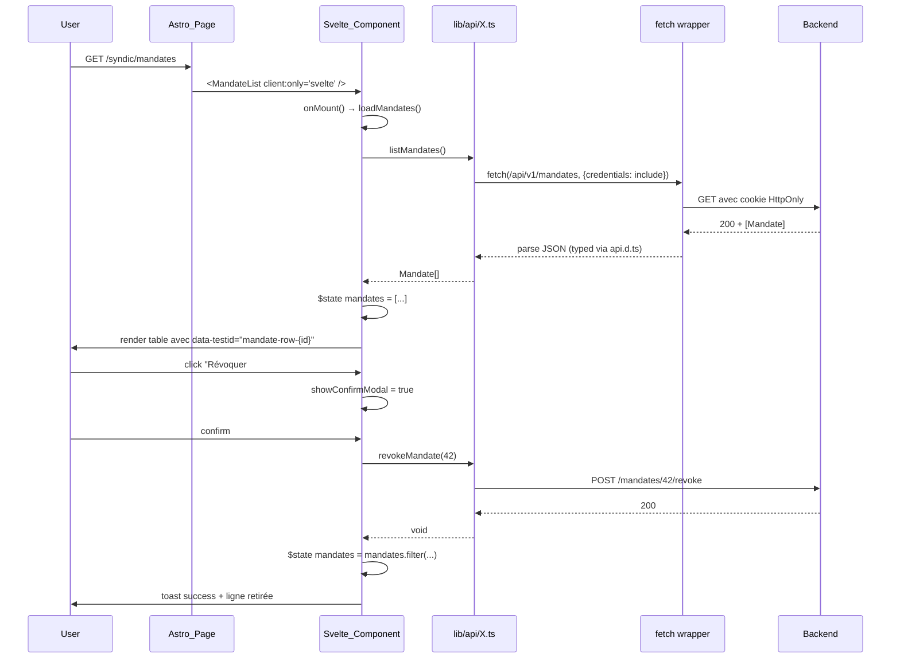

# Architecture FE — Phase B catch-up (refonte UX multi-rôle ACP)

## Méthode Maury — Phase TOGAF C

**GATE de signature humaine** : à signer par @gilmry après PRD, avant ouverture stories.

---

## 1. Stack confirmé (héritage Phase 1)

- **Astro 5** avec `output: "static"` — pas d'adapter SSR (cf. fix CI `fed175d` Phase A : pour routes dynamiques type `[id].astro`, utiliser query param OU `getStaticPaths` sentinel).
- **Svelte 5** runes EXCLUSIVEMENT : `$state`, `$derived`, `$effect`, `$props`, `$bindable`. **Aucun** `import { writable } from "svelte/store"`. Aucun `$:` reactive block.
- **Tailwind 4** utility-first.
- **Vitest 1.x** + `@testing-library/svelte` (installé) pour unit tests composants.
- **Playwright 1.60+** + `--project=scenarios` pour Documentation Vivante e2e.
- **axe-core via `@axe-core/playwright`** pour a11y CI (à câbler en Story B9 ou avant).
- **Astro pages** pour routing + `client:only="svelte"` pour mount pure-client (pattern Story 3.3 PWA Contractor `/c.astro`).

## 2. Component tree Phase B (Mermaid)

```mermaid
graph TD
    subgraph "lib/components/admin/"
        A1[RoleAssignmentForm]
        A2[RoleAssignmentList]
    end

    subgraph "lib/components/syndic/"
        S1[MagicLinkIssueForm]
        S2[MandateIssueForm]
        S3[MandateList]
        S4[RoleDelegationForm]
        S5[RoleDelegationList]
        S6[SyndicResponseForm]
        S7[SyndicResponseList]
        S8[TechnicalSpecCreate]
        S9[TechnicalSpecDetail]
        S10[TechnicalSpecSignatureForm]
        S11[TechnicalSpecVersionTimeline]
        S12[ContractorEvaluationForm]
    end

    subgraph "lib/components/tickets/ (refacto B5)"
        T1[TicketCreate REFACTO]
        T2[SeveritySelector NEW]
        T3[EvidenceUpload NEW]
        T4[WitnessSelector NEW]
        T1 --> T2
        T1 --> T3
        T1 --> T4
    end

    subgraph "lib/components/shared/ (atomiques réutilisables)"
        AT1[ExpirationBadge]
        AT2[SlaBadge]
        AT3[SignatureForm]
        AT4[ScoreInput]
        AT5[ContractorReputation]
    end

    %% Réutilisations
    S3 --> AT1
    S5 --> AT1
    S2 --> AT1
    S9 --> AT3
    S10 --> AT3
    S12 --> AT4
    AT5 --> AT4
    S6 --> AT2
    S7 --> AT2

    %% Pages Astro consommatrices
    P1[/admin/role-assignments.astro] --> A1
    P1 --> A2
    P2[/syndic/magic-links.astro] --> S1
    P3[/syndic/mandates.astro] --> S2
    P3 --> S3
    P4[/syndic/role-delegations.astro] --> S4
    P4 --> S5
    P5[/tickets/new.astro] --> T1
    P6["/tickets/[id].astro (refacto)"] --> S6
    P6 --> S7
    P7[/syndic/technical-specs.astro] --> S8
    P8[/syndic/technical-spec.astro?id=] --> S9
    P8 --> S10
    P8 --> S11
    P9[/syndic/contractor-evaluations.astro] --> S12
    P10["/contractors/[id]/reputation.astro"] --> AT5

    classDef new fill:#dfd,stroke:#080
    classDef refacto fill:#fdf,stroke:#808
    classDef atomic fill:#ddf,stroke:#008
    classDef page fill:#fff8c8,stroke:#888
    class A1,A2,S1,S2,S3,S4,S5,S6,S7,S8,S9,S10,S11,S12,T2,T3,T4 new
    class T1 refacto
    class AT1,AT2,AT3,AT4,AT5 atomic
    class P1,P2,P3,P4,P5,P6,P7,P8,P9,P10 page
```

**Légende couleurs** : vert = nouveau, violet = refacto, bleu = atomique réutilisable, jaune = page Astro.

## 3. Data flow type-safe (API → state → DOM)



**Invariants du flow** :
- **Pas de SSR data fetching** : Astro `output: "static"` → mount client `client:only="svelte"` + `onMount` async.
- **Type safety end-to-end** : `api.d.ts` regen depuis `openapi.json` (Story B0) → `api_module` import les types → `Svelte_Component` reçoit `Mandate` typé → assertions exhaustives.
- **Credentials cookie HttpOnly** : `fetch(..., { credentials: "include" })` (cohérent WP-FE1).

## 4. State management — Svelte 5 runes patterns

### 4.1 Pattern de base : composant form

```typescript
<script lang="ts">
  import type { components } from "$lib/types/api";

  type Mandate = components["schemas"]["Mandate"];
  type IssueMandateRequest = components["schemas"]["IssueMandateRequest"];

  let { onCreated }: { onCreated: (mandate: Mandate) => void } = $props();

  // Form state — runes locales
  let form = $state<IssueMandateRequest>({
    subject_user_id: "",
    kind: "notary",
    scope_kind: "building",
    scope_id: "",
    reason: "",
    valid_until: "",
  });

  let submitting = $state(false);
  let error = $state<{ message: string; field?: string } | null>(null);

  // Validation côté UI (mirror invariants BE)
  let reasonValid = $derived(form.reason.length >= 10 && form.reason.length <= 500);
  let validUntilValid = $derived(
    form.valid_until !== "" && new Date(form.valid_until) > new Date()
  );
  let canSubmit = $derived(
    reasonValid && validUntilValid && form.subject_user_id !== "" && form.scope_id !== "" && !submitting
  );

  async function handleSubmit(e: Event) {
    e.preventDefault();
    if (!canSubmit) return;
    submitting = true;
    error = null;
    try {
      const created = await issueMandate(form);
      onCreated(created);
    } catch (err) {
      error = mapErrorToUi(err);
    } finally {
      submitting = false;
    }
  }
</script>
```

### 4.2 Pattern listing + revoke

```typescript
<script lang="ts">
  let mandates = $state<Mandate[]>([]);
  let loading = $state(true);
  let revokingId = $state<string | null>(null);

  $effect(() => {
    void loadMandates();
  });

  async function loadMandates() {
    loading = true;
    try {
      mandates = await listMandates();
    } finally {
      loading = false;
    }
  }

  async function handleRevoke(id: string) {
    revokingId = id;
    try {
      await revokeMandate(id);
      mandates = mandates.filter(m => m.id !== id);
    } finally {
      revokingId = null;
    }
  }
</script>
```

### 4.3 Pattern atomique réutilisable : ExpirationBadge

```typescript
<script lang="ts">
  let { validUntil }: { validUntil: string } = $props();

  let now = $state(new Date());

  // Rafraîchit la couleur toutes les minutes (badges live)
  $effect(() => {
    const intv = setInterval(() => { now = new Date(); }, 60_000);
    return () => clearInterval(intv);
  });

  let daysRemaining = $derived(
    Math.ceil((new Date(validUntil).getTime() - now.getTime()) / (1000 * 60 * 60 * 24))
  );

  let level = $derived(
    daysRemaining < 0 ? "expired" :
    daysRemaining <= 7 ? "urgent" :
    daysRemaining <= 30 ? "soon" : "fresh"
  );

  let label = $derived(
    daysRemaining < 0 ? "Expiré" :
    daysRemaining === 0 ? "Expire aujourd'hui" :
    daysRemaining === 1 ? "Expire demain" :
    `Expire dans ${daysRemaining} jour${daysRemaining > 1 ? 's' : ''}`
  );

  let classes = $derived({
    fresh:   "bg-green-100 text-green-800 border-green-300",
    soon:    "bg-orange-100 text-orange-800 border-orange-300",
    urgent:  "bg-red-100 text-red-800 border-red-300",
    expired: "bg-gray-200 text-gray-700 border-gray-300",
  }[level]);
</script>

<span
  data-testid="expiration-badge"
  class={`inline-flex items-center gap-1 px-2 py-1 rounded border text-xs font-medium ${classes}`}
  aria-label={label}
>
  {#if level === "urgent"}
    <svg aria-hidden="true" width="12" height="12" viewBox="0 0 12 12">
      <!-- icone warning -->
    </svg>
  {/if}
  {label}
</span>
```

## 5. Pages Astro Phase B — routing strategy

```
frontend/src/pages/
├── admin/
│   └── role-assignments.astro     # B1
├── syndic/
│   ├── magic-links.astro           # B2
│   ├── mandates.astro              # B3
│   ├── role-delegations.astro      # B4
│   ├── contractor-evaluations.astro# B8
│   ├── technical-specs.astro       # B7 — liste
│   └── technical-spec.astro        # B7 — détail via ?id=<uuid> (PAS [id].astro)
├── tickets/
│   ├── new.astro                   # B5 refacto
│   └── [id].astro                  # B6 refacto (ticket-detail)
└── contractors/
    └── [id]/
        └── reputation.astro        # B8 reputation publique
```

**Pourquoi query param `?id=` au lieu de `[id].astro` pour `technical-spec.astro`** : Astro `output: "static"` + dynamic routes exigerait `getStaticPaths()` — impossible car les specs sont créées à la volée. Solution déjà appliquée Phase A (fix CI `fed175d` pour `/c?t=<token>` au lieu de `/c/[token].astro`). On reproduit ce pattern pour cohérence.

**Pour `/contractors/[id]/reputation.astro`** : id = `contractor_user_id`. Si on garde dynamic route, il faut `getStaticPaths()` qui peut retourner sentinel + reading dans component via `window.location.pathname`. Alternative : `?id=` query. Décision : `?id=` pour cohérence Track I.

## 6. API client pattern — `lib/api/X.ts`

```typescript
// frontend/src/lib/api/mandates.ts (exemple B3)

import { api } from "../api";
import type { components, paths } from "../types/api";

type Mandate = components["schemas"]["Mandate"];
type IssueMandateRequest = paths["/mandates"]["post"]["requestBody"]["content"]["application/json"];
type IssueMandateResponse = paths["/mandates"]["post"]["responses"]["201"]["content"]["application/json"];

export async function issueMandate(req: IssueMandateRequest): Promise<Mandate> {
  return api.post<Mandate>("/mandates", req);
}

export async function listMandates(): Promise<Mandate[]> {
  return api.get<Mandate[]>("/mandates");
}

export async function getMandate(id: string): Promise<Mandate> {
  return api.get<Mandate>(`/mandates/${encodeURIComponent(id)}`);
}

export async function revokeMandate(id: string): Promise<void> {
  await api.post<void>(`/mandates/${encodeURIComponent(id)}/revoke`, {});
}
```

**Invariants** :
- Types importés depuis `api.d.ts` regen — pas de duplicat de définition.
- Pas de `cast as` — si TypeScript râle, c'est que B0 n'a pas posé le bon utoipa schema.
- `api.{get,post}` est le wrapper existant `frontend/src/lib/api.ts` (déjà géré : credentials, refresh token, error handling).

## 7. A11y pattern library (WCAG 2.1 AA — mémoire `a11y-wcag-aa-baseline`)

### 7.1 Pattern label/input/error

```svelte
<div class="form-group">
  <label for={`${id}-input`} class="block text-sm font-medium mb-1">
    {label}
    {#if required}<span aria-label="obligatoire" class="text-red-600">*</span>{/if}
  </label>
  <input
    id={`${id}-input`}
    bind:value
    type="text"
    data-testid={`${id}-input`}
    aria-describedby={error ? `${id}-error` : `${id}-help`}
    aria-invalid={!!error}
    aria-required={required}
    class="w-full min-h-[44px] px-3 py-2 border rounded-md
           focus-visible:outline focus-visible:outline-2
           focus-visible:outline-offset-2 focus-visible:outline-sky-600"
  />
  {#if helpText && !error}
    <p id={`${id}-help`} class="text-xs text-gray-500 mt-1">{helpText}</p>
  {/if}
  {#if error}
    <p id={`${id}-error`} role="alert" class="text-sm text-red-600 mt-1">{error}</p>
  {/if}
</div>
```

### 7.2 Pattern modal/dialog (focus trap)

```svelte
<script lang="ts">
  let dialogEl: HTMLDialogElement;

  $effect(() => {
    if (open) {
      dialogEl?.showModal();
    } else {
      dialogEl?.close();
    }
  });

  function handleKeydown(e: KeyboardEvent) {
    if (e.key === "Escape") onClose();
  }
</script>

<dialog
  bind:this={dialogEl}
  aria-labelledby={titleId}
  aria-modal="true"
  on:keydown={handleKeydown}
  class="rounded-lg shadow-xl p-6 max-w-md backdrop:bg-black/50"
>
  <h2 id={titleId} class="text-lg font-semibold mb-4">{title}</h2>
  <slot />
</dialog>
```

### 7.3 Pattern aria-live submit feedback

```svelte
<div role="status" aria-live="polite" aria-atomic="true" class="sr-only">
  {#if submitting}Envoi en cours…{/if}
  {#if success}Mandate créé avec succès.{/if}
</div>
```

### 7.4 Pattern atomique avec couleur ET texte (INV-FE9)

NE PAS faire :
```svelte
<!-- ❌ Mauvais : seulement la couleur indique le statut -->
<span class="bg-red-500 rounded-full w-3 h-3"></span>
```

FAIRE :
```svelte
<!-- ✅ Bon : couleur + texte + icône -->
<span class="inline-flex items-center gap-1 px-2 py-1 bg-red-100 text-red-800 rounded">
  <svg aria-hidden="true">...</svg>
  Expiré
</span>
```

## 8. Testing strategy

### 8.1 Niveaux de test (memory `fe-refactor-test-driven`)

1. **Caractérisation** : tests AVANT refacto (e.g. `TicketCreate.svelte` Story B5). But : régression safety net.
2. **Unit Vitest 4-cat** : `@happy/@edge/@security/@negative` par composant Svelte.
3. **E2E Playwright multi-rôle** : ≥ 2 acteurs distincts dans le scénario `@happy` (mémoire `multirole-narrative-scenarios`).
4. **A11y via axe-core** : 0 violation en CI (job dédié dans `ci.yml`).

### 8.2 Structure des fichiers tests

```
frontend/src/lib/components/syndic/MandateIssueForm.svelte
frontend/src/lib/components/syndic/MandateIssueForm.test.ts      # Vitest 4-cat
frontend/tests/e2e/refonte-ux/phase-b-fe/mandate-issue.spec.ts   # Playwright multi-rôle
```

### 8.3 Pattern multi-rôle e2e

```typescript
test("@happy syndic émet mandate notaire → notaire le voit dans son dashboard", async ({
  page,
  request,
  browser,
}) => {
  // Seed : 1 syndic + 1 notaire (user role=notary)
  const seed = await seedSyndicNotary(request);

  // Acteur 1 : Syndic émet
  await humanLogin(page, seed.syndicEmail, "test123");
  await page.goto("/syndic/mandates");
  await page.getByTestId("mandate-new-button").click();
  await page.getByTestId("mandate-subject-select").click();
  await page.getByTestId(`mandate-subject-option-${seed.notaryUserId}`).click();
  await page.getByTestId("mandate-kind-select").selectOption("notary");
  await page.getByTestId("mandate-scope-type-radio-building").click();
  await page.getByTestId("mandate-scope-id-select").selectOption(seed.buildingId);
  await page.getByTestId("mandate-reason-textarea").fill("Procuration vente Lot A2");
  await page.getByTestId("mandate-valid-until-input").fill("2027-06-09");
  await page.getByTestId("mandate-issue-submit").click();
  await expect(page.getByTestId(`mandate-row-`).first()).toBeVisible();
  await stepPause(page);

  // Acteur 2 : Nouveau context navigateur = Notaire
  const notaryCtx = await browser.newContext();
  const notaryPage = await notaryCtx.newPage();
  await humanLogin(notaryPage, seed.notaryEmail, "test123");
  await notaryPage.goto("/dashboard");
  await expect(
    notaryPage.getByTestId("active-mandates-section")
  ).toContainText("Procuration vente Lot A2");
  await finalPause(notaryPage);
});
```

## 9. Bundle strategy + budget

### 9.1 Mesure baseline (2026-06-07)

| Asset | Taille brute | Gzip |
|---|---|---|
| `dist/` total | 4,3 MB | — |
| JS chunks total | ~1,5 MB | ~0,6 MB |
| `i18n.BXGM2Cp5.js` | 439 KB | ~120 KB |
| `Layout.css` | 93 KB | ~15 KB |
| HTML moyenne page | 10-30 KB | 5-8 KB |
| Service Worker (Workbox) | 180 KB | ~50 KB |

### 9.2 Budget Phase B (NFR-B3)

**≤ +50 KB gzip cumulé** sur l'i18n+page commune.

**Estimation par story** :
- B0 (BE wiring) : 0 KB (pas FE).
- B1 (RoleAssignment) : ~6 KB gzip (2 composants + atomique).
- B2 (MagicLinkForm) : ~4 KB gzip.
- B3 (Mandate) : ~7 KB gzip (3 composants + ExpirationBadge réutilisé).
- B4 (RoleDelegation) : ~3 KB gzip (réutilise ExpirationBadge).
- B5 (TicketCreate refacto) : ~10 KB gzip (le plus gros — refacto + 3 atomiques).
- B6 (SyndicResponse) : ~5 KB gzip.
- B7 (TechSpec flow) : ~10 KB gzip (4 composants + SignatureForm).
- B8 (ContractorEval) : ~5 KB gzip.
- B9 (CI) : 0 KB (workflow seulement).

**Total estimé : ~50 KB gzip** — pile au budget. Si dépassement → lazy-loading des composants admin/syndic via `import()` dynamic dans les pages.

### 9.3 Code-splitting strategy

Astro fait du code-splitting automatique par page. Chaque page Astro Phase B charge UNIQUEMENT ses composants Svelte mountés via `client:only`. Pas d'eager-loading global.

**Sauf** atomiques `lib/components/shared/*` qui peuvent être inlinés dans plusieurs pages — Vite dedupe automatiquement.

## 10. Risques techniques (mitigations)

| ID | Risque | Mitigation |
|---|---|---|
| **RT-1** | Docker instable casse les passes agents | Restart Docker Desktop + 12-16 GB RAM. Fallback partiel host cargo si MinGW dlltool OK. |
| **RT-2** | Astro `output: "static"` + dynamic routes → exception sur `[id].astro` | Tous les routes B7/B8 utilisent query param `?id=` (cohérent fix `fed175d`). |
| **RT-3** | MultiSelect (deliverables, required_signatures) — Svelte 5 runes pattern à valider | POC rapide en début Story B7 ; fallback chip-input pattern éprouvé. |
| **RT-4** | A11y axe-core ralentit CI Playwright | Whitelister les pages Phase B uniquement (pas tout le repo). |
| **RT-5** | Bundle Phase B explose au-delà 50 KB | Lazy-loading dynamic import des pages admin/syndic ; mesure bundle avant/après chaque story. |
| **RT-6** | utoipa::path manquant → cast manuel | Story B0 OBLIGATOIRE en V1 préalable, pas de raccourci. |
| **RT-7** | Subagent worktree commit sur mauvaise branche (mémoire `subagent-worktree-git-salvage`) | Brief explicite "commit main checkout si stale base" ; orchestrateur salvage + cherry-pick. |
| **RT-8** | Multi-rôle e2e > 5min/scénario | Réutiliser `humanLogin` + `stepPause` existants ; éviter re-creation users à chaque test. |

## 11. Gate signature

```
SIGNED-BY:  @____________
DATE:       2026-__-__
NEXT-PHASE: Stories FE (stories.md) — débloquée par signature Architecture
WBS_REF:    docs/WBS_GO_LIVE_v0.1.0.md Track I (intégration confirmée)
```
