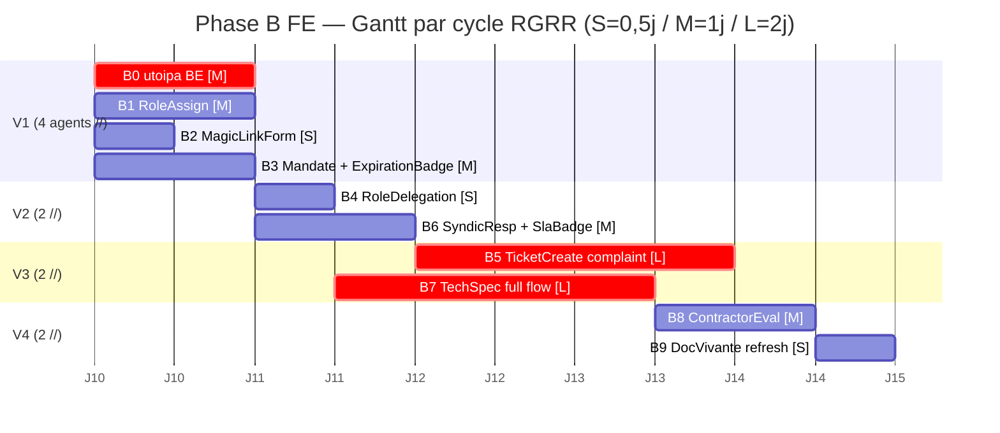

# Stories — Phase B FE catch-up (refonte UX multi-rôle ACP)

## Méthode Maury — Phase TOGAF D

**GATE de signature humaine** : à signer par @gilmry après architecture FE. Une fois signé, les agents Phase B sont briefés depuis ces stories (chaque story est autoportante).

> Format aligné `docs/maury/refonte-ux-multi-role-acp/stories.md` slice 3 BE (parent). Chaque story Phase B est **briefable directement** sans relire brief/prd/architecture : Goal, AC 4-cat détaillées, data-testid exhaustifs, fichiers exhaustifs, notes anti-pattern.

---

## Slice 4 (Phase B) — Frontend refonte UX multi-rôle ACP (FE catch-up Stories 3.1→3.9 BE)

### Story B0 — utoipa::path BE registrations + regen `openapi.json` + `api.d.ts`

- **Goal** : Ajouter `#[utoipa::path(...)]` sur tous les handlers Stories 3.4 (Mandate), 3.5 (RoleDelegation), 3.7 (SyndicResponse), 3.8 (TechnicalSpec), 3.9 (ContractorEvaluation) ; les enregistrer dans `backend/src/infrastructure/openapi.rs::ApiDoc::paths(...)` ; regen `docs/api/openapi.json` + `frontend/src/types/api.d.ts`. **Préalable obligatoire** à toutes les autres stories B1-B9 (sinon les modules `frontend/src/lib/api/*.ts` doivent caster manuellement).
- **Parent BE stories** : 3.4 (`237c81e`), 3.5 (`edf171f`), 3.7 (`62570fb`), 3.8 (`d820c39`), 3.9 (`c53a7e1`)
- **User journey** : transparent côté user — c'est du BE wiring qui débloque la suite. Critère = CI Contract Types Check vert.
- **FR/INV** : FR-B0 (préalable) ; respect contract anti-drift entre BE et FE.
- **Effort** : M (≈ 1j wall-clock) — mécanique mais 5 handlers × ~5 endpoints = ~25 utoipa::path à écrire correctement.
- **Wave** : V1 (en parallèle de B1/B2/B3 — indépendant).
- **Deps** : aucune (Phase A déjà mergée sur feature/dev `cf41ef4`).
- **Agent type** : `general-purpose`, isolation `worktree` OK (BE-only, pas de race condition FE).
- **AC 4-cat** :
  - `@happy` : `make api-docs` produit un openapi.json contenant les paths `/mandates`, `/mandates/{id}`, `/role-delegations`, `/role-delegations/{id}`, `/tickets/{id}/syndic-responses`, `/technical-specs`, `/technical-specs/{id}/signatures`, `/contractor-evaluations`, `/contractor-evaluations/{id}` + leurs DTOs request/response avec `utoipa::ToSchema` déjà présents.
  - `@edge` : un handler dont l'URL contient `{id}` ET un query param → utoipa génère bien les 2 paramètres. Un handler avec body `web::Json<DTO>` → schema $ref correct dans openapi.
  - `@security` : tous les `responses(...)` listent les codes 403 (`response_immutable`, `mandate_expired`, `magic_link_invalid`, etc.) avec schema d'erreur typed (`ErrorResponse` avec champs `error: String, kind: String`).
  - `@negative` : tests `cargo run --bin export_openapi` ne crashe pas sur des paths mal annotés ; CI Contract Types Check `git diff --exit-code frontend/src/types/api.d.ts` vert.
- **data-testid** : — (backend wiring uniquement).
- **Files** (exhaustive) :
  - `backend/src/infrastructure/web/handlers/mandate_handlers.rs` (ajout `#[utoipa::path(...)]` sur 4 handlers : `issue_mandate`, `list_mandates`, `get_mandate`, `revoke_mandate`)
  - `backend/src/infrastructure/web/handlers/role_delegation_handlers.rs` (3 handlers : `delegate_role`, `revoke_delegation`, `list_delegations`)
  - `backend/src/infrastructure/web/handlers/syndic_response_handlers.rs` (2 handlers : `respond_to_ticket`, `list_responses_for_ticket`)
  - `backend/src/infrastructure/web/handlers/technical_spec_handlers.rs` (6 handlers : `create_spec`, `bump_spec`, `submit_for_signatures`, `sign_spec`, `get_spec`, `list_specs`)
  - `backend/src/infrastructure/web/handlers/contractor_evaluation_handlers.rs` (3 handlers : `create_evaluation`, `get_evaluation`, `list_for_contractor`)
  - `backend/src/infrastructure/openapi.rs` (enregistrer les ~25 handlers dans `ApiDoc::paths(...)`)
  - `docs/api/openapi.json` (regen via `make api-docs`)
  - `frontend/src/types/api.d.ts` (regen via `npm run types:generate`)
- **ADR refs** : —
- **Cluster coord** : #555 (Result/AppError) déjà OK sur ces handlers. Pas d'impact #433 (rien de monétaire).
- **Notes pour l'agent** :
  - Pattern utoipa éprouvé : voir `backend/src/infrastructure/web/handlers/magic_link_handlers.rs` (Story 3.2, déjà correctement annoté — fix lint `IssueMagicLinkRequest`/`IssueMagicLinkResponse`/`PublicScopePayload` ont `utoipa::ToSchema`).
  - **Anti-pattern** : ne PAS oublier `request_body` quand le handler a un body JSON, sinon openapi-typescript régénère un POST sans body et le FE casse.
  - **Gotcha #1** : `responses((status = 403, body = ErrorResponse))` exige que `ErrorResponse` ait `#[derive(utoipa::ToSchema)]` — vérifier `backend/src/application/error.rs`.
  - **Gotcha #2** : `path = "/mandates/{id}"` doit matcher EXACTEMENT le `#[get("/mandates/{id}")]` actix — sinon CI Contract Types fail.
  - Validation locale : `docker compose run --rm --no-deps backend sh -c "SQLX_OFFLINE=true cargo run --bin export_openapi > /tmp/openapi.fresh.json" && diff docs/api/openapi.json /tmp/openapi.fresh.json` → diff vide attendu après commit.

---

### Story B1 — `RoleAssignmentForm.svelte` + `RoleAssignmentList.svelte` (UI sous-rôles Story 3.1)

- **Goal** : Composants Svelte 5 runes pour assigner et lister les sous-rôles `accountant.encodeur` / `accountant.emetteur` / `community.moderator` + mandataires (lawyer/notary/amo/architect/bet/warden). Form admin + table liste avec action révoquer. Route Astro `/admin/role-assignments`.
- **Parent BE story** : 3.1 — Sous-rôles métier (`9598298`)
- **User journey** : "En tant qu'Admin superadmin (ou Syndic pour son organization), je veux pouvoir assigner un sous-rôle à un user existant en sélectionnant son user, le rôle, et son organization-cible, pour matérialiser la séparation des pouvoirs comptables (encodeur/émetteur INV-10) et déléguer la modération communauté."
- **FR/INV** : FR-B1 ; INV-FE1 (data-testid), INV-FE2 (a11y), INV-FE5 (pas JWT localStorage), INV-10 BE (séparation pouvoirs préservée).
- **Effort** : M (≈ 1j wall-clock) — 2 composants Svelte 5 + 1 page Astro + 1 client API + tests Vitest 4-cat + e2e Playwright multi-rôle.
- **Wave** : V1 (parallèle avec B0/B2/B3).
- **Deps** : **B0 mergé** (api.d.ts doit avoir `POST /users/{user_id}/role-assignments` typé).
- **Agent type** : `general-purpose`, isolation `worktree` (FE-only, pas de contention BE).
- **AC 4-cat** :
  - `@happy` : Admin login → `/admin/role-assignments` → click "Nouvelle assignation" → modal avec 3 selects (user autocomplete, role enum dropdown, organization scope select) → submit → toast "Sous-rôle assigné" → modal ferme → nouvelle row visible dans liste avec colonnes [User, Role, Org, Assigned at, Actions]. Le row a `data-testid="role-assignment-row-{id}"` pour assert e2e.
  - `@edge` : `valid_until` égal à la date du jour minuit (cas limite TZ) → backend renvoie 201 + toast warning jaune "Cette assignation expire aujourd'hui" + persist OK. UI : `<ExpirationBadge daysRemaining={0} />` affiche "Expire aujourd'hui" en orange.
  - `@security` : Syndic d'org A tente assignation dans org B (en bidouillant le `organization_id` via DevTools) → backend renvoie 403 → toast erreur typée (extrait `kind: "forbidden"`) → toast affiche "Vous n'êtes pas autorisé à modifier cette organisation" PAS le message technique brut. Aucune information cross-org leakée dans le DOM.
  - `@negative` : User pas authentifié arrive sur `/admin/role-assignments` → redirect 302 → `/login?next=/admin/role-assignments` (pattern existant `AppLayout`). User authentifié sans rôle `superadmin` → page renvoie `<Forbidden />` avec message "Accès réservé aux superadmin" + lien retour dashboard. Submit avec role invalide (= dropdown manipulé via DevTools pour valeur custom) → backend 422 → message inline sous le champ role : "Sous-rôle inconnu : `<role>`".
- **data-testid** (exhaustive, stables i18n-safe) :
  - Form :
    - `role-assignment-new-button` (CTA ouvrir modal)
    - `role-assignment-user-select` (autocomplete user)
    - `role-assignment-user-option-{userId}` (chaque suggestion)
    - `role-assignment-role-select` (dropdown rôle)
    - `role-assignment-org-select` (dropdown organization)
    - `role-assignment-valid-until-input` (datepicker optionnel — null = permanent)
    - `role-assignment-submit` (bouton submit dans le modal)
    - `role-assignment-cancel` (bouton fermer modal)
  - List :
    - `role-assignment-list` (table conteneur)
    - `role-assignment-row-{id}` (chaque ligne)
    - `role-assignment-revoke-{id}` (bouton révoquer)
    - `role-assignment-expiration-badge-{id}` (badge expiration si valid_until)
  - Errors :
    - `role-assignment-error-{field}` (erreur sous chaque field invalid)
- **Files** (exhaustive) :
  - `frontend/src/lib/components/admin/RoleAssignmentForm.svelte` (NEW — modal form, 4-cat tests Vitest in-file)
  - `frontend/src/lib/components/admin/RoleAssignmentForm.test.ts` (NEW — 4 tests `@testing-library/svelte`)
  - `frontend/src/lib/components/admin/RoleAssignmentList.svelte` (NEW — table + revoke action)
  - `frontend/src/lib/components/admin/RoleAssignmentList.test.ts` (NEW)
  - `frontend/src/lib/api/role_assignments.ts` (NEW — `createRoleAssignment`, `listForUser`, `revokeAssignment` + types réutilisés depuis `api.d.ts`)
  - `frontend/src/pages/admin/role-assignments.astro` (NEW — page admin, gate `superadmin` via middleware existant)
  - `frontend/src/lib/components/global/AdminNav.svelte` (REFACTO — ajout lien "Rôles" pointant `/admin/role-assignments`)
  - `frontend/tests/e2e/refonte-ux/phase-b-fe/role-assignment.spec.ts` (NEW — 4 scénarios `@happy/@edge/@security/@negative` multi-rôle)
- **A11y checklist (INV-FE2 + memory `a11y-wcag-aa-baseline`)** :
  - [ ] Modal a `role="dialog"` + `aria-labelledby` pointant le titre.
  - [ ] Focus trap (Esc ferme + Tab cyclique dans le modal).
  - [ ] Au mount du modal, focus initial sur premier input.
  - [ ] Tous inputs ont `<label for>` lié.
  - [ ] Erreurs annoncées via `aria-live="polite"` et liées via `aria-describedby`.
  - [ ] Boutons et selects respectent tap target ≥ 44 × 44 px (Tailwind `min-h-[44px]`).
  - [ ] Focus visible (`focus-visible:outline-2 focus-visible:outline-offset-2`).
  - [ ] axe-core : 0 violation (CI vérifie via `@axe-core/playwright`).
- **Wireframe ASCII** :
  ```
  ┌────────────────────────────────────────────────────────┐
  │ Admin > Gestion des rôles                              │
  │                                                        │
  │ [+ Nouvelle assignation] (CTA primary)                 │
  │                                                        │
  │ ┌──────────────────────────────────────────────────┐  │
  │ │ User           │ Role            │ Org    │ Exp │  │
  │ ├────────────────┼─────────────────┼────────┼─────┤  │
  │ │ Pierre Dupont  │ acct.encodeur   │ ACP A  │ ∞   │  │
  │ │ Marie Martin   │ community.mod.  │ ACP A  │ 7j  │  │
  │ │ ...            │ ...             │ ...    │ ... │  │
  │ └──────────────────────────────────────────────────┘  │
  └────────────────────────────────────────────────────────┘

  Modal "Nouvelle assignation" :
  ┌────────────────────────────────────────────┐
  │ Nouvelle assignation                    [×]│
  │                                            │
  │ User       [ Pierre Dupont           ▼ ]   │
  │ Rôle       [ accountant.encodeur     ▼ ]   │
  │ Organisation [ ACP Tilleuls           ▼ ]   │
  │ Expire le  [ ____-__-__ (optionnel)    ]   │
  │                                            │
  │           [ Annuler ]  [ Assigner ]        │
  └────────────────────────────────────────────┘
  ```
- **ADR refs** : — (réutilise patterns existants `AppLayout` + modal `Dialog.svelte`).
- **Cluster coord** : `data-testid` sur 100% (memory `data-testid-systematic`). Pas d'impact #555/#433.
- **Notes pour l'agent** :
  - Pattern Svelte 5 runes : voir `frontend/src/components/global/ContextBanner.svelte` pour `$state`/`$effect`/`$props` propres (Story 2.3 mergée).
  - **Anti-pattern** : NE PAS utiliser `import { writable } from "svelte/store"` — runes only.
  - **Gotcha #1** : l'autocomplete user appelle `GET /users?search=` qui n'existe peut-être pas — vérifier. Sinon fallback sur liste paginée simple `GET /users`.
  - **Gotcha #2** : le toast existant utilise `import { addToast } from "$lib/stores/toast"`. Vérifier l'API (probablement `addToast({ type: 'success', message: '...' })`).
  - Validation : `npm run test:unit -- RoleAssignment` doit afficher 8/8 pass (4 par composant). `npx playwright test role-assignment` doit afficher 4/4 pass.

---

### Story B2 — `MagicLinkIssueForm.svelte` (UI émission MagicLink Story 3.2)

- **Goal** : Form syndic pour émettre un MagicLink contractor sur un ticket / quote / invoice / contractor_evaluation. Affiche le token retourné une seule fois + bouton "Copier l'URL `/c?t=<token>`" prêt à coller dans email/SMS pour le contractor. Route `/syndic/magic-links`.
- **Parent BE story** : 3.2 — MagicLink (`d08407c`)
- **User journey** : "En tant que Syndic, après qu'un contractor a accepté un ticket, je veux pouvoir lui envoyer un lien d'accès sans qu'il ait à se créer un compte. Je sélectionne le contractor (déjà user dans le système), le scope (ce ticket précis), une durée (par défaut 7 jours), je clique 'Émettre', et je récupère l'URL `/c?t=<token>` que je copie dans mon mail."
- **FR/INV** : FR-B2 ; INV-FE1, INV-FE2, INV-FE5 ; INV-13 BE (subject ≠ issuer — cf. fix CI `709f649`), INV-17 BE (token single-use).
- **Effort** : S (≈ 0,5j) — 1 form composant + 1 page Astro + 1 client + tests.
- **Wave** : V1 (parallèle B0/B1/B3).
- **Deps** : **B0 mergé** (`api.d.ts` doit avoir `POST /magic-links`).
- **Agent type** : `general-purpose`, isolation `worktree`.
- **AC 4-cat** :
  - `@happy` : Syndic → `/syndic/magic-links` → form avec 4 fields (subject user autocomplete, scope_kind dropdown [ticket, quote, invoice, contractor_evaluation], scope_id autocomplete filtré par scope_kind, expires_in_seconds slider 60s→30j default 7j). Submit → backend 201 → écran récapitulatif avec : URL `/c?t=<token>` complète dans un `<input readonly>` + bouton `[Copier]` + alerte "Ce token ne sera plus jamais affiché, copiez-le maintenant" + bouton `[Émettre un nouveau lien]` pour reset. Token copié → toast success.
  - `@edge` : `expires_in_seconds` aux bornes : slider à 60s (1 min) → submit OK ; slider à 60×60×24×30 (30 j) → submit OK. Tentative POST manuel via DevTools avec `expires_in_seconds = 59` → backend 422 → message inline sous slider "Durée minimale : 1 minute".
  - `@security` : Syndic tente sélectionner subject = self (son propre user_id) → backend 422 `MagicLinkSelfIssue` → message clair "Vous ne pouvez pas vous émettre un lien à vous-même" (pas une trace stack). Token affiché disparaît dès qu'un nouveau form est ouvert (pas de mémorisation en `localStorage`). Le copy-to-clipboard utilise l'API `navigator.clipboard.writeText` (pas un trick `document.execCommand` legacy).
  - `@negative` : scope_id inconnu (autocomplete vide pour ce scope_kind) → bouton submit disabled + helper text "Aucun ticket trouvé". Submit avec token expiré côté Syndic (session morte) → 401 → redirect /login.
- **data-testid** (exhaustive) :
  - Form :
    - `magic-link-target-input` (autocomplete user / contractor)
    - `magic-link-target-option-{userId}`
    - `magic-link-scope-select` (dropdown scope_kind)
    - `magic-link-scope-id-select` (autocomplete filtré)
    - `magic-link-scope-id-option-{id}`
    - `magic-link-expires-in-input` (slider, value en secondes)
    - `magic-link-expires-in-display` (label "7 jours")
    - `magic-link-issue-submit` (CTA)
  - Result screen :
    - `magic-link-issued-url-copy` (bouton copy)
    - `magic-link-issued-url-input` (input readonly affichant `/c?t=<token>`)
    - `magic-link-issued-warning` (alerte "Ne sera plus affiché")
    - `magic-link-issue-reset` (bouton "Émettre un nouveau lien")
- **Files** (exhaustive) :
  - `frontend/src/lib/components/syndic/MagicLinkIssueForm.svelte` (NEW)
  - `frontend/src/lib/components/syndic/MagicLinkIssueForm.test.ts` (NEW — 4-cat)
  - `frontend/src/lib/api/magic_links.ts` (REFACTO — étend Story 3.2 `tryGetOrganizationName` pattern : ajout `issueMagicLink({ subject_user_id, scope_kind, scope_id, expires_in_seconds })`)
  - `frontend/src/pages/syndic/magic-links.astro` (NEW)
  - `frontend/src/lib/components/global/SyndicNav.svelte` (REFACTO — ajout lien "Liens magiques")
  - `frontend/tests/e2e/refonte-ux/phase-b-fe/magic-link-issue.spec.ts` (NEW — 4 scénarios, dont multi-rôle : Syndic émet → contractor ouvre `/c?t=<token>` → écran 1 PWA visible (Story 3.3 mergée))
- **A11y checklist** :
  - [ ] Slider `expires_in_seconds` a aria-valuemin/max/now + label associé.
  - [ ] Bouton copy a `aria-label="Copier le lien magique"`.
  - [ ] Alerte warning a `role="alert"` + `aria-live="assertive"`.
  - [ ] Input readonly token a `aria-label` + couleur contrastée pour montrer qu'il est read-only.
  - [ ] axe-core 0 violation.
- **Wireframe ASCII** :
  ```
  Form initial :
  ┌────────────────────────────────────────────────────────┐
  │ Émettre un lien magique                                │
  │                                                        │
  │ Destinataire   [ Jean Plombier (contractor)         ▼] │
  │ Type ressource [ Ticket                              ▼]│
  │ Ressource      [ #42 Fuite cuisine                  ▼] │
  │ Validité       [─────────●───────] 7 jours             │
  │                  1 min            30 j                 │
  │                                                        │
  │ [Émettre]                                              │
  └────────────────────────────────────────────────────────┘

  Result screen (après submit OK) :
  ┌────────────────────────────────────────────────────────┐
  │ ✅ Lien émis                                            │
  │                                                        │
  │ ⚠ Ce lien ne sera plus jamais affiché. Copiez-le      │
  │   maintenant et envoyez-le au destinataire.           │
  │                                                        │
  │ ┌──────────────────────────────────────────┐ [Copier]  │
  │ │ https://koprogo.tld/c?t=abc...           │           │
  │ └──────────────────────────────────────────┘           │
  │                                                        │
  │ Expire le 2026-06-16 à 17h45.                          │
  │                                                        │
  │ [Émettre un nouveau lien]                              │
  └────────────────────────────────────────────────────────┘
  ```
- **ADR refs** : —
- **Cluster coord** : Memory `data-testid-systematic` (B2 pose précédent magic-link-* qui sera réutilisé par B0 si on a besoin de modifier l'API). #555 NA.
- **Notes pour l'agent** :
  - **Gotcha #1** : `navigator.clipboard.writeText` requiert HTTPS ou localhost en dev — vérifier `<script>` fallback `document.execCommand` quand `!window.isSecureContext` (mais log un warning).
  - **Gotcha #2** : le token brut ne doit JAMAIS persister en `localStorage` / `sessionStorage` — uniquement dans un `$state` local du composant qui disparaît au unmount.
  - **Gotcha #3** : pour l'autocomplete user filtré "contractor", `GET /users?role=contractor` est ce qu'on veut — vérifier que ce filtre existe. Sinon fallback liste complète avec coloring `Contractor`.
  - Validation : reproduire le test e2e Story 3.3 (`pwa-contractor.spec.ts`) en partant d'une émission UI au lieu de seed direct.

---

### Story B3 — `MandateIssueForm.svelte` + `MandateList.svelte` + `ExpirationBadge.svelte` (UI Mandate Story 3.4)

- **Goal** : Form syndic pour émettre un Mandate (avocat / notaire / AMO / architecte / BET / gardien) + table liste avec révocation + composant atomique réutilisable `ExpirationBadge` qui affiche "Expire dans N jours" avec coloring (vert > 30j, orange ≤ 30j, rouge ≤ 7j, gris = expiré). Route `/syndic/mandates`.
- **Parent BE story** : 3.4 — Mandate (`237c81e`)
- **User journey** : "En tant que Syndic, j'ai un mandat juridique à émettre vers un Notaire pour une vente d'unit. Je sélectionne le user notaire (déjà créé en amont), le kind=`notary`, le scope=`Building #X`, je rédige une raison de 10-500 chars (motif juridique), je choisis la date de fin (max 5 ans), je clique 'Émettre'. Le mandate apparaît dans la table avec un badge 'Expire dans 12 mois' en vert. Je peux le révoquer plus tôt depuis cette table."
- **FR/INV** : FR-B3 ; INV-FE1, INV-FE2, INV-FE5 ; INV-14 BE (validity max 5 ans), INV-15 BE (subject ≠ issuer).
- **Effort** : M (≈ 1j) — 3 composants Svelte 5 + page + client + tests.
- **Wave** : V1 (parallèle B0/B1/B2).
- **Deps** : **B0 mergé** (`api.d.ts` a `POST /mandates`).
- **Agent type** : `general-purpose`, isolation `worktree`.
- **AC 4-cat** :
  - `@happy` : Syndic → `/syndic/mandates` → bouton "Nouveau mandat" → modal form → submit notary Building-scope reason="Procuration vente Lot A2" valid_until=2027-06-09 → toast success → modal ferme → row dans la table avec colonnes [Subject, Kind, Scope, Reason (truncated 50 chars + tooltip), Émis le, Expire, Actions] + `<ExpirationBadge daysRemaining={365}>` vert.
  - `@edge` : valid_until exactement = today + 5 ans (max) → 201 ; today + 5 ans + 1j → 422 backend → message inline "Durée maximale 5 ans". Mandate déjà au 30e jour avant expiration → badge passe à orange + filtre rapide "Expire bientôt" possible.
  - `@security` : Syndic tente kind invalide via DevTools (modifier `<option value="hacker">` → soumettre) → backend 422 `MandateInvalidKind` → message inline rouge "Kind invalide". Tentative subject=self (sélecteur affiche son propre user ?) → bouton submit disabled + helper text "Vous ne pouvez pas vous mandater vous-même".
  - `@negative` : reason < 10 chars → submit disabled + counter "9/500 (min 10)" rouge. reason > 500 chars → counter rouge, submit disabled. Pas de scope sélectionné → submit disabled.
- **data-testid** (exhaustive) :
  - Form :
    - `mandate-new-button`
    - `mandate-subject-select` + `mandate-subject-option-{userId}`
    - `mandate-kind-select` + `mandate-kind-option-{kind}` (lawyer, notary, amo, architect, bet, warden)
    - `mandate-scope-type-radio-{building|acp}`
    - `mandate-scope-id-select` + `mandate-scope-id-option-{id}`
    - `mandate-reason-textarea` (avec compteur live `mandate-reason-counter`)
    - `mandate-valid-until-input`
    - `mandate-issue-submit`
    - `mandate-cancel`
  - List :
    - `mandate-list` (table)
    - `mandate-row-{id}` (ligne)
    - `mandate-row-subject-{id}`
    - `mandate-row-kind-{id}`
    - `mandate-row-scope-{id}`
    - `mandate-row-reason-{id}` (tooltip-able)
    - `mandate-expiration-badge-{id}` (atomique `<ExpirationBadge>`)
    - `mandate-revoke-{id}` (bouton)
    - `mandate-revoke-confirm` (modal confirm)
  - Errors :
    - `mandate-error-{field}`
- **Files** (exhaustive) :
  - `frontend/src/lib/components/syndic/MandateIssueForm.svelte` (NEW)
  - `frontend/src/lib/components/syndic/MandateIssueForm.test.ts` (NEW)
  - `frontend/src/lib/components/syndic/MandateList.svelte` (NEW — table)
  - `frontend/src/lib/components/syndic/MandateList.test.ts` (NEW)
  - `frontend/src/lib/components/shared/ExpirationBadge.svelte` (NEW — atomique réutilisable B3+B4+B6)
  - `frontend/src/lib/components/shared/ExpirationBadge.test.ts` (NEW — 4-cat coverage des seuils 30/7/0/passé)
  - `frontend/src/lib/api/mandates.ts` (NEW — `issueMandate`, `listMandates`, `getMandate`, `revokeMandate`)
  - `frontend/src/pages/syndic/mandates.astro` (NEW)
  - `frontend/src/lib/components/global/SyndicNav.svelte` (REFACTO — ajout "Mandats")
  - `frontend/tests/e2e/refonte-ux/phase-b-fe/mandate-issue.spec.ts` (NEW — 4 scénarios + multi-rôle : Syndic émet → Notaire login → voit son mandate dans `/dashboard` section "Mandats actifs")
- **A11y checklist** :
  - [ ] `mandate-reason-textarea` lié à `mandate-reason-counter` via `aria-describedby`.
  - [ ] `ExpirationBadge` n'utilise pas que la couleur — ajoute un texte (`Expire dans 7 jours`) + icône (`<svg aria-hidden="true">`).
  - [ ] Modal `mandate-revoke-confirm` a `aria-modal="true"` + focus trap.
  - [ ] Pour daltoniens : palette `green-600/orange-500/red-600` avec contraste WCAG AA validé.
- **Wireframe ASCII** :
  ```
  ┌─────────────────────────────────────────────────────────────────┐
  │ Syndic > Mandats juridiques                  [+ Nouveau mandat] │
  │                                                                 │
  │ Filtres : [Tous ▼] [Kind ▼] [Expire bientôt □]                  │
  │                                                                 │
  │ ┌─────────────────────────────────────────────────────────────┐ │
  │ │Subject       │Kind   │Scope        │Émis le  │Expire        │ │
  │ ├──────────────┼───────┼─────────────┼─────────┼──────────────┤ │
  │ │M. Notaire    │notary │Building #42 │2026-06  │● 12 mois     │ │
  │ │Me. Avocat    │lawyer │ACP Tilleuls │2026-05  │● 7 jours [⚠]│ │
  │ │AMO Sàrl      │amo    │Building #38 │2026-04  │○ Expiré     │ │
  │ └─────────────────────────────────────────────────────────────┘ │
  └─────────────────────────────────────────────────────────────────┘
  ```
- **ADR refs** : nouveau composant atomique `ExpirationBadge` → candidat à la lib `lib/components/shared/` réutilisable B3, B4, B6 — pas un ADR mais documenter dans le composant.
- **Cluster coord** : `ExpirationBadge` réutilisé par **B4** (RoleDelegation) et **B6** (SyndicResponse SLA). Coordonner avec B4/B6 pour cohérence palette.
- **Notes pour l'agent** :
  - **Anti-pattern** : NE PAS dupliquer la logique countdown dans chaque composant — extraire dans `lib/utils/dateBadge.ts` une fonction `expirationStatus(validUntil: Date): { daysRemaining: number, level: "fresh" | "soon" | "urgent" | "expired" }`.
  - **Gotcha #1** : timezone — `valid_until` est `TIMESTAMPTZ` UTC backend ; le badge affiche en TZ locale user. Utiliser `Intl.RelativeTimeFormat` pour "dans 12 mois" / "dans 7 jours".
  - **Gotcha #2** : le compteur de chars pour reason doit décompter les caractères Unicode (pas bytes) — `Array.from(str).length` ou `[...str].length`.
  - Validation locale : `npm run test:unit -- Mandate` 12/12 pass. e2e : `npx playwright test mandate-issue` 4/4.

---

### Story B4 — `RoleDelegationForm.svelte` + `RoleDelegationList.svelte` (UI Story 3.5)

- **Goal** : Form pour déléguer temporairement un rôle (Syndic délègue à Owner Pierre pour 7j ; ou Board member délègue à un autre Owner). Le form refuse explicitement la re-délégation par un user dont le rôle source est lui-même délégué (non-transitivité, INV BE). Route `/syndic/role-delegations`.
- **Parent BE story** : 3.5 — Role delegation (`edf171f`)
- **User journey** : "En tant que Syndic en vacances, je délègue mon rôle syndic à mon assistant Pierre (Owner board_member) pour 7 jours. Pendant cette fenêtre, Pierre voit dans son menu les actions syndic (créer AG, valider devis). À J+8, le rôle expire automatiquement et Pierre revient à son rôle nominal Owner."
- **FR/INV** : FR-B4 ; INV-FE1, INV-FE2, INV-FE5 ; INV-8 BE (délégation non transitive, max 90j).
- **Effort** : S (≈ 0,5j) — réutilise `ExpirationBadge` de B3.
- **Wave** : V2 (dépend de V1).
- **Deps** : **B0 mergé** + **B3 mergé** (réutilise `ExpirationBadge`).
- **Agent type** : `general-purpose`, isolation `worktree`.
- **AC 4-cat** :
  - `@happy` : Syndic → `/syndic/role-delegations` → "Nouvelle délégation" → modal → user=Pierre Dupont, role=syndic, organization_id (filtré sur les org du Syndic actuel), valid_until=today+7j → submit → toast → row visible avec `<ExpirationBadge daysRemaining={7} level="soon" />` orange.
  - `@edge` : valid_until = today + 90j (max) → OK ; today + 91j → 422 backend "Durée max 90 jours" → message inline.
  - `@security` : Owner Pierre (qui a reçu une délégation syndic via cette UI) se connecte → voit le menu syndic actif → tente d'aller sur `/syndic/role-delegations` (héritage role) → la page affiche les délégations EXISTANTES en read-only avec un BANNER persistant en haut : "Vous avez reçu ce rôle par délégation. Vous ne pouvez pas re-déléguer (non-transitivité INV-8)." Le bouton "Nouvelle délégation" est ABSENT côté DOM (pas juste disabled). Backend POST tenté manuellement → 403 `DelegationChainNotAllowed` → toast erreur clair.
  - `@negative` : valid_until < now → submit disabled + helper "Date d'expiration doit être future". User cible inconnu → autocomplete vide.
- **data-testid** (exhaustive) :
  - Form :
    - `role-delegate-new-button` (CTA, ABSENT si user a hérité son rôle par délégation)
    - `role-delegate-target-input` + `role-delegate-target-option-{userId}`
    - `role-delegate-role-select` + options
    - `role-delegate-org-select`
    - `role-delegate-until-input` (datepicker)
    - `role-delegate-submit`
    - `role-delegate-cancel`
  - List :
    - `role-delegation-list`
    - `role-delegation-row-{id}`
    - `role-delegation-expiration-badge-{id}` (réutilise `ExpirationBadge`)
    - `role-delegation-revoke-{id}`
  - Banner non-transitivité :
    - `role-delegate-non-transitive-banner` (présent si user a hérité)
  - Errors :
    - `role-delegate-error-{field}`
- **Files** :
  - `frontend/src/lib/components/syndic/RoleDelegationForm.svelte` (NEW)
  - `frontend/src/lib/components/syndic/RoleDelegationForm.test.ts` (NEW)
  - `frontend/src/lib/components/syndic/RoleDelegationList.svelte` (NEW)
  - `frontend/src/lib/components/syndic/RoleDelegationList.test.ts` (NEW)
  - `frontend/src/lib/api/role_delegations.ts` (NEW)
  - `frontend/src/pages/syndic/role-delegations.astro` (NEW)
  - `frontend/src/lib/components/global/SyndicNav.svelte` (REFACTO — ajout "Délégations")
  - `frontend/tests/e2e/refonte-ux/phase-b-fe/role-delegation.spec.ts` (NEW — multi-rôle : Syndic délègue → Pierre login → voit menu syndic + banner non-transitivité → tente re-déléguer → 403)
- **A11y checklist** :
  - [ ] Banner non-transitivité a `role="alert"` + `aria-live="polite"`.
  - [ ] axe-core 0 violation.
- **Notes pour l'agent** :
  - Pour détecter "user a hérité son rôle par délégation" : appel `GET /me/active-delegations` (à ajouter si pas existant — peut-être nécessite store global session). Si pas faisable simplement, fallback : afficher TOUJOURS le banner sur cette page, juste avec wording adapté.

---

### Story B5 — `TicketCreate.svelte` refacto complaint + 3 sous-composants (UI Story 3.6)

- **Goal** : **REFACTO** du composant existant `TicketCreate.svelte` pour exposer la dichotomie Request / Complaint + severity + incident_date + upload de preuves (`EvidenceUpload.svelte`) + sélection témoins (`WitnessSelector.svelte`) + sélection severity (`SeveritySelector.svelte`). Maintenir compat avec parcours Request existant (kind par défaut).
- **Parent BE story** : 3.6 — Ticket complaint (`2142019`)
- **User journey @happy** : "En tant qu'Owner victime d'une nuisance (tapage nocturne récurrent), je crée un Ticket de type Complaint avec severity=High, incident_date=la nuit dernière, j'uploade 3 photos+1 vidéo audio comme preuves, je sélectionne 2 témoins (mes voisins de palier qui ont signé la pétition), je rédige description. Le ticket est créé en backend + notification au Syndic + au Conseil de copropriété (CdC) qui voient le dossier complet pour leur instruction (memory `world-model-seed`)."
- **User journey @edge text-only** : "Owner crée Complaint sans preuves visuelles (juste textuelle) → ticket créé mais badge UI 'Preuves manquantes — votre dossier est plus solide avec des photos/vidéos/témoins'."
- **FR/INV** : FR-B5 ; INV-FE1, INV-FE2, INV-FE3 (numbers), INV-FE5 ; INV-24 BE (immutability 5min — pas testé ici, c'est BE), max 10 evidence files (10 MB each), max 10 witnesses.
- **Effort** : L (≈ 2j) — **plus grosse story B**. Refacto composant existant + 3 nouveaux atomiques + tests + e2e.
- **Wave** : V3 (séquentiel critique).
- **Deps** : **B0 mergé** ; **PAS de dépendance B1/B2/B3** (parcours user Owner, pas Syndic).
- **Agent type** : `general-purpose`, isolation `worktree`.
- **AC 4-cat** :
  - `@happy` : Owner → `/tickets/new` → form avec NOUVEAU dropdown "Type" [Request, Complaint]. Si Complaint sélectionné → la zone `<SeveritySelector>` apparaît (Low/Normal/High/Critical), `<input incident_date>` apparaît, `<EvidenceUpload max=10 acceptedMime="image/*,video/*,application/pdf">`, `<WitnessSelector source="ownersOfBuilding" max=10>`. Upload 3 photos drag&drop → preview thumbnails + barre progression. Sélection 2 témoins (chip-input). Submit → 201 → redirect `/tickets/{id}` avec badge "Complaint - High" + nombre de preuves "3 preuves, 2 témoins".
  - `@edge` : Submit Complaint text-only (0 evidence, 0 witness) → 201 + banner orange "Preuves manquantes — votre dossier est plus solide avec ..." MAIS PAS bloquant. Submit avec exactement 10 evidence → OK ; 11 → upload 11e refusé client-side avec message "Maximum 10 preuves". Fichier > 10 MB → refusé avec message "Taille max 10 MB". Witness = self → bouton "Ajouter" disabled sur sa propre row + helper text "Vous ne pouvez pas vous lister comme témoin".
  - `@security` : Owner tente uploader exécutable `.exe` ou JS → refusé client-side via `accept="image/*,video/*,application/pdf"` ET backend rejette aussi via MIME inspection. Submit Complaint avec `kind="complaint"` MAIS sans severity (via DevTools) → backend 422 → message inline rouge.
  - `@negative` : description trop courte (< 20 chars) → submit disabled + counter rouge. incident_date dans le futur → submit disabled + message "La date d'incident ne peut être dans le futur".
- **data-testid** (exhaustive) :
  - Form principal :
    - `ticket-create-kind-select` (Request | Complaint)
    - `ticket-create-title-input`
    - `ticket-create-description-textarea` + `ticket-create-description-counter`
    - `ticket-create-category-select` (Plumbing, Electrical, etc.)
    - `ticket-create-priority-select`
    - `ticket-create-submit`
  - SeveritySelector (visible si kind=Complaint) :
    - `ticket-severity-radio-low` / `-normal` / `-high` / `-critical`
    - `ticket-incident-date-input`
  - EvidenceUpload :
    - `ticket-evidence-upload` (dropzone)
    - `ticket-evidence-file-input` (hidden file input)
    - `ticket-evidence-preview-{index}` (thumbnail)
    - `ticket-evidence-remove-{index}` (bouton ×)
    - `ticket-evidence-count` (compteur "3/10")
    - `ticket-evidence-error` (zone erreur upload)
  - WitnessSelector :
    - `ticket-witness-search` (autocomplete owners of building)
    - `ticket-witness-option-{userId}`
    - `ticket-witness-chip-{userId}` (chip ajouté)
    - `ticket-witness-remove-{userId}` (bouton × sur chip)
    - `ticket-witness-count`
- **Files** (exhaustive) :
  - `frontend/src/lib/components/tickets/TicketCreate.svelte` (**REFACTO** — ajouter kind/severity conditional sections, garder compat Request)
  - `frontend/src/lib/components/tickets/TicketCreate.test.ts` (REFACTO — étendre tests Vitest)
  - `frontend/src/lib/components/tickets/SeveritySelector.svelte` (NEW)
  - `frontend/src/lib/components/tickets/SeveritySelector.test.ts` (NEW — 4-cat)
  - `frontend/src/lib/components/tickets/EvidenceUpload.svelte` (NEW — drag&drop, multi-file, preview)
  - `frontend/src/lib/components/tickets/EvidenceUpload.test.ts` (NEW)
  - `frontend/src/lib/components/tickets/WitnessSelector.svelte` (NEW)
  - `frontend/src/lib/components/tickets/WitnessSelector.test.ts` (NEW)
  - `frontend/src/lib/api/tickets.ts` (REFACTO — étendre `createTicket` avec kind/severity/incident_date/evidence_attachments/witnesses)
  - `frontend/src/lib/utils/fileUpload.ts` (NEW — utilitaire upload S3/MinIO presigned URL)
  - `frontend/src/pages/tickets/new.astro` (REFACTO — mounting du TicketCreate refacto)
  - `frontend/tests/e2e/refonte-ux/phase-b-fe/ticket-complaint.spec.ts` (NEW — multi-rôle : Owner crée complaint → Syndic ouvre dans son dashboard et voit le dossier complet preuves+witnesses)
- **A11y checklist** :
  - [ ] EvidenceUpload : drop zone a `role="button"` + `aria-label="Glissez-déposez des preuves ou cliquez"` + supporte navigation clavier (Enter active le file input).
  - [ ] Preview thumbnails ont `alt` descriptif (nom du fichier).
  - [ ] Progress bars uploads ont `<progress>` + `aria-valuenow`.
  - [ ] SeveritySelector : `<fieldset><legend>` + radio group + `aria-required`.
  - [ ] WitnessSelector : chip-input pattern a aria-live pour annoncer ajout/retrait.
  - [ ] axe-core 0 violation.
- **Wireframe ASCII** : (omis pour concision — pattern standard form vertical)
- **ADR refs** : ADR-0012 (Navigation contextualisée) — TicketCreate doit respecter le contexte ACP/Building courant (memory `validate-before-compute`).
- **Cluster coord** : Pas d'impact #555 (pure FE). Coordonner avec WP-H4 si extension produit "communauté" intersecte.
- **Notes pour l'agent** :
  - **Pattern dropzone** : utiliser `ondrop` + `ondragover.preventDefault` natifs Svelte 5 — pas de lib externe.
  - **Anti-pattern** : NE PAS uploader les fichiers à la submission finale — upload en streaming dès drag&drop (UX latence faible). Retourner les URLs S3 dans `form.evidence_attachments`.
  - **Gotcha #1** : MIME inspection client-side ≠ sécurité — backend doit valider aussi (déjà OK Story 3.6).
  - **Gotcha #2** : Multi-rôle e2e doit utiliser un Owner ET un syndic — pas le même user (memory `multirole-narrative-scenarios`).
  - **Gotcha #3** : EvidenceUpload doit nettoyer ses `URL.createObjectURL` blobs au unmount (`$effect` cleanup) sinon memory leak.
  - Validation : `npm run test:unit -- ticket` toute la suite reste verte (rétrocompat Request) + 4 nouveaux composants 4-cat. e2e 4 scénarios.

---

### Story B6 — `SyndicResponseForm.svelte` + `TicketSlaBadge.svelte` (UI Story 3.7)

- **Goal** : Form append-only (pas d'édition) pour qu'un Syndic réponde à un ticket + badge SLA visible sur ticket-detail qui passe vert→orange→rouge selon time-to-due. Réutilise `ExpirationBadge` pattern de B3 mais avec sémantique SLA spécifique.
- **Parent BE story** : 3.7 — SyndicResponse + SLA (`62570fb`)
- **User journey** : "En tant que Syndic, je vois la liste de mes tickets dans `/syndic/dashboard` triés par SLA proche. Je clique le ticket #42 critical (SLA 24h, restant 3h → badge rouge). J'ouvre le ticket detail. Je clique "Répondre" — un form append-only s'ouvre : body, action_proposed (schedule_inspection / request_quote / closed_no_action / escalated_board / other). Je submit. La response apparaît dans la conversation chronologique. Le badge SLA passe au vert (action prise dans la fenêtre)."
- **FR/INV** : FR-B6 ; INV-FE1, INV-FE2, INV-FE5 ; INV-23 BE (append-only).
- **Effort** : M (≈ 1j).
- **Wave** : V2 (dépend de V1 pour pattern).
- **Deps** : **B0 mergé**.
- **Agent type** : `general-purpose`, isolation `worktree`.
- **AC 4-cat** :
  - `@happy` : Syndic → ticket #42 detail → SLA badge "Échéance dans 3h" rouge → click "Répondre" → form append-only avec textarea body (10-5000 chars) + dropdown action_proposed → submit → POST → response affichée dans la conversation chronologique avec timestamp et badge "Syndic". SLA badge passe au vert "Réponse postée à T-3h ✓".
  - `@edge` : Réponse postée à exactement `sla_due_at - 1s` → SLA still satisfied → badge vert. Réponse postée à `sla_due_at + 1s` → badge restera rouge "Hors SLA". Badge couleur change live si la page reste ouverte (rafraîchissement périodique).
  - `@security` : Aucun bouton "Edit" / "Delete" sur les responses précédentes (UI confirme append-only). Tentative PATCH manuelle DevTools → backend 403 `ResponseImmutable` → toast erreur. Owner du ticket voit les responses syndic mais ne peut pas en créer (button "Répondre" absent côté DOM si rôle != syndic/superadmin).
  - `@negative` : body < 10 chars → submit disabled + counter rouge. body > 5000 chars → counter rouge. action_proposed = "unknown" → impossible via UI (dropdown), via DevTools → 422.
- **data-testid** :
  - Form :
    - `syndic-response-body-textarea` + `syndic-response-body-counter`
    - `syndic-response-action-proposed-select` + options
    - `syndic-response-submit`
  - Read-only conversation :
    - `syndic-response-list`
    - `syndic-response-row-{id}` (chaque réponse passée)
    - `syndic-response-row-author-{id}`
    - `syndic-response-row-action-{id}` (badge action_proposed)
    - `syndic-response-row-timestamp-{id}`
  - SLA badge :
    - `ticket-sla-badge` (sur ticket-detail)
    - `ticket-sla-due-tooltip` (au hover : "Échéance 2026-06-10 14h30 (severity=critical → SLA 24h)")
- **Files** :
  - `frontend/src/lib/components/syndic/SyndicResponseForm.svelte` (NEW)
  - `frontend/src/lib/components/syndic/SyndicResponseForm.test.ts` (NEW)
  - `frontend/src/lib/components/syndic/SyndicResponseList.svelte` (NEW — read-only conversation)
  - `frontend/src/lib/components/shared/SlaBadge.svelte` (NEW — atomique réutilisable, sœur de `ExpirationBadge` mais sémantique SLA)
  - `frontend/src/lib/components/shared/SlaBadge.test.ts` (NEW)
  - `frontend/src/lib/api/syndic_responses.ts` (NEW)
  - `frontend/src/pages/tickets/[id].astro` (REFACTO — ajouter `<SyndicResponseList>` + `<SyndicResponseForm>` conditional + `<SlaBadge>`)
  - `frontend/tests/e2e/refonte-ux/phase-b-fe/syndic-response-sla.spec.ts` (NEW — multi-rôle : Owner crée Complaint → Syndic répond → Owner voit la réponse)
- **A11y checklist** :
  - [ ] `<SlaBadge>` n'utilise pas que la couleur — texte "Dans 3h" + icône.
  - [ ] aria-live="polite" sur le compteur réponses pour annoncer ajout.
  - [ ] axe-core 0 violation.
- **ADR refs** : —
- **Cluster coord** : Memory `data-testid-systematic`.
- **Notes pour l'agent** :
  - **Gotcha** : SLA badge couleur doit rafraîchir live — utiliser `$effect` avec `setInterval(60000)` pour re-calculer toutes les minutes. Cleanup via return function.
  - Validation : `SyndicResponseForm` 4 tests + `SlaBadge` 4 tests + e2e 4 scénarios.

---

### Story B7 — TechnicalSpec full flow (4 composants — UI Story 3.8)

- **Goal** : Workflow complet de TechnicalSpec : créer une spec versionnée (sémantique semver) → soumettre pour signatures → faire signer par les mandataires requis → bump version si majeure. UI = 4 composants Svelte 5 + 1 atomique `SignatureForm` réutilisable. Routes `/syndic/technical-specs` (liste) + `/syndic/technical-spec?id=` (détail — query param car Astro static).
- **Parent BE story** : 3.8 — TechnicalSpec versionnable (`d820c39`)
- **User journey** :
  - Syndic crée v1.0.0 d'une spec pour travaux de toiture (deliverables, required_signatures=[Syndic, Amo]). Spec est en Draft.
  - Syndic clique "Soumettre pour signatures" → status PendingSignatures + notifications envoyées aux mandataires (BE side, hors scope FE).
  - AMO log in → voit dans son dashboard "Specs en attente de signature" → click la spec → SignatureForm → click "Signer" avec rappel de son mandate_id actif (Story 3.4) → backend valide → status → Approved (toutes signatures reçues).
  - Plus tard, le Syndic veut modifier les deliverables → "Nouvelle version" → bump 1.0.0 → 1.1.0 (minor) → modifie deliverables → submit → nouvelle spec Draft, ancienne Superseded. Signatures de 1.0.0 valides pour 1.1.0 (minor bump). Bump major (2.0.0) → re-signature requise (warning UI).
- **FR/INV** : FR-B7 ; INV-FE1, INV-FE2, INV-FE3, INV-FE5 ; INV BE TechnicalSpec (semver strict, signatures unique par (user,role), bump major invalide signatures).
- **Effort** : L (≈ 2j) — gros : 4 composants Svelte + 1 atomique + 2 routes Astro + tests.
- **Wave** : V3 (séquentiel critique).
- **Deps** : **B0 mergé**.
- **Agent type** : `general-purpose`, isolation `worktree`.
- **AC 4-cat** :
  - `@happy` : voir user journey complet ci-dessus. Au final : version 1.1.0 Approved, version 1.0.0 Superseded, timeline visible.
  - `@edge` : version semver strict — input "v1.0.0" rejeté (pas de prefix v), "1.0.0-rc1" rejeté (pas de pre-release), "1.0" rejeté (3 segments obligatoires). Bump major sur v1.5.7 → v2.0.0 → message clair "Toutes les signatures précédentes seront invalidées. Confirmer ?" + bouton confirm. Le timeline affiche les versions précédentes en grisé/Superseded.
  - `@security` : Owner non-mandaté tente d'aller sur `/syndic/technical-spec?id=X` directement → la page renvoie soit Forbidden si pas de rôle, soit la page detail en read-only sans bouton "Signer". Le bouton "Signer" n'apparaît QUE si le current user a un rôle inclus dans `required_signatures` ET a un mandate actif (si rôle = Amo/Lawyer/Architect/etc.).
  - `@negative` : Tentative créer spec sans deliverables (vide) → 422 → message inline "Au moins 1 deliverable requis". description < 50 chars → counter rouge + submit disabled. Bump avec version inférieure (1.0.0 → 0.9.0) → 422.
- **data-testid** (exhaustive) :
  - TechnicalSpecCreate :
    - `tech-spec-title-input`
    - `tech-spec-description-textarea` + counter
    - `tech-spec-version-major-input` / `-minor-input` / `-patch-input` (ou single string avec validation)
    - `tech-spec-deliverable-row-{index}` (chaque ligne)
    - `tech-spec-deliverable-input-{index}` (input texte d'une deliverable)
    - `tech-spec-deliverable-add` (bouton +)
    - `tech-spec-deliverable-remove-{index}`
    - `tech-spec-required-sig-select` (multi-select)
    - `tech-spec-attach-upload` (réutilise pattern EvidenceUpload de B5 simplifié)
    - `tech-spec-create-submit`
  - TechnicalSpecDetail :
    - `tech-spec-detail-title`
    - `tech-spec-detail-version`
    - `tech-spec-detail-status-badge` (Draft/PendingSign/Approved/Superseded)
    - `tech-spec-deliverable-list-{index}`
    - `tech-spec-attachment-{index}` (lien download)
    - `tech-spec-submit-for-sign` (button — Draft only)
    - `tech-spec-bump-button` (button — déclenche modal new version)
    - `tech-spec-signatures-list`
    - `tech-spec-signature-row-{userId}-{role}`
  - TechnicalSpecSignatureForm :
    - `tech-spec-sign-mandate-info` (texte "Vous signez en tant que `<role>` via mandat #{mandateId} actif jusqu'au {date}")
    - `tech-spec-sign-submit`
  - TechnicalSpecVersionTimeline :
    - `tech-spec-timeline`
    - `tech-spec-version-row-{version}` (ligne par version, Superseded grisée)
  - SignatureForm (atomique réutilisable) :
    - `signature-confirm-checkbox`
    - `signature-sign-button`
- **Files** :
  - `frontend/src/lib/components/syndic/TechnicalSpecCreate.svelte` (NEW)
  - `frontend/src/lib/components/syndic/TechnicalSpecCreate.test.ts` (NEW)
  - `frontend/src/lib/components/syndic/TechnicalSpecDetail.svelte` (NEW)
  - `frontend/src/lib/components/syndic/TechnicalSpecDetail.test.ts` (NEW)
  - `frontend/src/lib/components/syndic/TechnicalSpecSignatureForm.svelte` (NEW)
  - `frontend/src/lib/components/syndic/TechnicalSpecSignatureForm.test.ts` (NEW)
  - `frontend/src/lib/components/syndic/TechnicalSpecVersionTimeline.svelte` (NEW)
  - `frontend/src/lib/components/shared/SignatureForm.svelte` (NEW — atomique)
  - `frontend/src/lib/api/technical_specs.ts` (NEW)
  - `frontend/src/pages/syndic/technical-specs.astro` (NEW — liste)
  - `frontend/src/pages/syndic/technical-spec.astro` (NEW — détail, lit id depuis `Astro.url.searchParams.get('id')`)
  - `frontend/tests/e2e/refonte-ux/phase-b-fe/technical-spec-flow.spec.ts` (NEW — multi-rôle 3 acteurs : Syndic crée + soumet → AMO signe → Syndic bump v1.1.0)
- **A11y checklist** :
  - [ ] Modal de confirmation bump major a `aria-modal="true"` + focus trap.
  - [ ] Timeline a `role="list"` avec `<li>` par version.
  - [ ] axe-core 0 violation.
- **Wireframe ASCII** (détail) :
  ```
  ┌────────────────────────────────────────────────────────────┐
  │ Travaux toiture immeuble                v1.1.0  [APPROVED] │
  │                                                            │
  │ Description :                                              │
  │   Réfection complète couverture ardoise...                 │
  │                                                            │
  │ Deliverables :                                             │
  │  1. Démontage couverture existante                         │
  │  2. Pose voligeage neuf                                    │
  │  3. Pose ardoise + zinguerie                               │
  │                                                            │
  │ Signatures requises : Syndic, AMO                          │
  │  ✓ Syndic Maury (2026-06-09)                              │
  │  ✓ AMO Dupont (2026-06-10 via mandate #42)                │
  │                                                            │
  │ [ Nouvelle version (bump) ]                                │
  │                                                            │
  │ Historique :                                               │
  │  ● v1.1.0 (Approved) — 2026-06-10                         │
  │  ○ v1.0.0 (Superseded) — 2026-06-09                       │
  └────────────────────────────────────────────────────────────┘
  ```
- **ADR refs** : à créer post-Story (proposition) : ADR sur semver strict (refus de pre-release dans le contexte juridique copro).
- **Cluster coord** : Pattern `SignatureForm` réutilisable potentiellement (futur : PV AG, mandats notariés).
- **Notes pour l'agent** :
  - **Gotcha #1** : la route détail `/syndic/technical-spec?id=` est en query param (Astro static — cf. fix CI `fed175d` `/c?t=<token>`). Évite `[id].astro` qui demanderait getStaticPaths.
  - **Gotcha #2** : SignatureForm est l'atomique le plus sensible légalement — ajouter checkbox "J'ai lu et j'approuve les deliverables ci-dessus" RPGD-style avant le bouton "Signer".
  - **Gotcha #3** : Multi-rôle e2e CRUCIAL ici — 3 acteurs (Syndic + AMO + observer Owner). Voir mémoire `multirole-narrative-scenarios`.

---

### Story B8 — `ContractorEvaluationForm.svelte` + `ContractorReputation.svelte` (UI Story 3.9)

- **Goal** : Form évaluation contractor après prestation (5 scores 1-5 + comment) **gated by approved TechnicalSpec** : impossible d'évaluer un contractor sans TechnicalSpec préalable signée. Page reputation contractor publique (au sein de l'org) avec moyennes 5 scores.
- **Parent BE story** : 3.9 — ContractorEvaluation (`c53a7e1`)
- **User journey** : "En tant que Syndic, après la fin des travaux toiture, je veux évaluer le contractor X. Je vais sur `/syndic/contractor-evaluations` → 'Nouvelle évaluation' → sélectionne contractor X → sélectionne la TechnicalSpec applicable (filtre auto sur status=Approved) → lie 0-N tickets motivant l'éval → saisis 5 scores 1-5 (quality, timeliness, communication, cost_compliance, overall) → comment 10-2000 chars → submit. Plus tard, un autre Syndic peut consulter la reputation contractor X qui agrège les scores moyens."
- **FR/INV** : FR-B8 ; INV-FE1, INV-FE2, INV-FE5 ; INV-21 BE (TechnicalSpec préalable obligatoire), INV-24 BE (append-only).
- **Effort** : M (≈ 1j).
- **Wave** : V4 (dépend de B7).
- **Deps** : **B0 mergé** + **B7 mergé** (TechnicalSpec doit exister pour gater).
- **Agent type** : `general-purpose`, isolation `worktree`.
- **AC 4-cat** :
  - `@happy` : Syndic → form → contractor=X, spec=Y (filter status=Approved), tickets=[#42, #43] (autocomplete tickets du building), scores=4/5/3/5/4, comment "Très professionnel, travail soigné". Submit → 201 → row dans la liste.
  - `@edge` : 0 tickets liés → autorisé. spec au seuil Approved (status passe juste à Approved → eval possible immédiatement, pas de délai).
  - `@security` : evaluator=contractor (i.e. le user X évalue lui-même) → backend 422 `EvaluatorIsContractor` → message clair UI "Un contractor ne peut pas s'évaluer lui-même". Bouton submit désactivé côté UI si contractor sélectionné = current user. Aucun bouton "Edit" sur les évaluations existantes (append-only).
  - `@negative` : spec sélectionnée est en Draft/PendingSign/Superseded → submit disabled + helper text "La fiche technique doit être Approuvée". score = 0 ou 6 → impossible via UI (range 1-5). comment < 10 chars → counter rouge.
- **data-testid** :
  - Form :
    - `contractor-eval-contractor-select` + options
    - `contractor-eval-spec-select` (filtré sur Approved)
    - `contractor-eval-tickets-link` (multi-autocomplete tickets)
    - `contractor-eval-scores-quality` (radio 1-5 ou slider)
    - `contractor-eval-scores-timeliness`
    - `contractor-eval-scores-communication`
    - `contractor-eval-scores-cost`
    - `contractor-eval-scores-overall`
    - `contractor-eval-comment-textarea` + counter
    - `contractor-eval-submit`
  - List :
    - `contractor-eval-list`
    - `contractor-eval-row-{id}`
  - Reputation page :
    - `contractor-reputation-name`
    - `contractor-reputation-avg-quality` (e.g. "4.2/5")
    - `contractor-reputation-avg-timeliness`
    - `contractor-reputation-avg-communication`
    - `contractor-reputation-avg-cost`
    - `contractor-reputation-avg-overall`
    - `contractor-reputation-count` (nombre d'évaluations)
    - `contractor-reputation-eval-row-{id}` (chaque éval anonymisée ou pas selon politique)
- **Files** :
  - `frontend/src/lib/components/syndic/ContractorEvaluationForm.svelte` (NEW)
  - `frontend/src/lib/components/syndic/ContractorEvaluationForm.test.ts` (NEW)
  - `frontend/src/lib/components/shared/ContractorReputation.svelte` (NEW)
  - `frontend/src/lib/components/shared/ContractorReputation.test.ts` (NEW)
  - `frontend/src/lib/components/shared/ScoreInput.svelte` (NEW — radio 1-5 atomique réutilisable)
  - `frontend/src/lib/api/contractor_evaluations.ts` (NEW)
  - `frontend/src/pages/syndic/contractor-evaluations.astro` (NEW)
  - `frontend/src/pages/contractors/[id]/reputation.astro` (NEW — public à l'org)
  - `frontend/tests/e2e/refonte-ux/phase-b-fe/contractor-eval.spec.ts` (NEW — multi-rôle : Syndic A évalue, Syndic B consulte reputation)
- **A11y checklist** :
  - [ ] ScoreInput : `<fieldset><legend>Quality</legend>` + 5 radios ARIA + couleur ≠ unique indicateur.
  - [ ] Reputation : statistique annoncée via aria-label.
  - [ ] axe-core 0 violation.
- **Notes pour l'agent** :
  - **Gotcha** : Pour `contractor-eval-spec-select`, filtre côté FE après `GET /technical-specs?status=approved&contractor_eligible=true` (si filter existe — sinon filter post-fetch).

---

### Story B9 — Documentation Vivante refresh + retire `continue-on-error`

- **Goal** : Retirer `continue-on-error: true` du step "Run Documentation Vivante scenarios" dans `.github/workflows/ci.yml` (ajouté par commit a698f6d en Phase A pour décorréler dette FE) → confirmer CI passe verte sans bypass. Confirme que les 8 nouveaux flows Phase B (B1-B8) génèrent des vidéos exploitables comme Documentation Vivante.
- **Parent BE stories** : toutes Stories 3.1→3.9.
- **User journey** : "En tant que Maintainer, je consulte les vidéos générées dans l'artifact CI `playwright-report/` pour vérifier que chaque flow critique est démontrable visuellement. Une vidéo cassée = un signal réel, pas un bruit ignoré."
- **FR/INV** : SCB1 (cf. PRD) ; respect du contract Maury "Documentation Vivante = signal".
- **Effort** : S (≈ 0,5j) — retrait config + observer + ajustements mineurs spec.
- **Wave** : V4 (après B1-B8 mergés).
- **Deps** : **B1..B8 toutes mergées + CI verte**.
- **Agent type** : `general-purpose`, isolation `worktree`.
- **AC 4-cat** :
  - `@happy` : Retire `continue-on-error: true` ligne workflow → push → CI step "Run Documentation Vivante scenarios" passe avec status success (pas warning). Artifact `playwright-report/` contient 8 videos (1 par flow Phase B) + les anciennes scenarios déjà existantes.
  - `@edge` : Si une vidéo nouvelle Phase B échoue (flaky timing), le job échoue → bloquant. Pas de "@wip" en Phase B finale.
  - `@security` : Aucun screenshot ne contient d'identifiant sensible (JWT/cookie). Vérifier visuellement.
  - `@negative` : Si un seed contractor n'est pas en place côté backend, la vidéo plante propre avec un message d'erreur user-friendly (pas un screenshot vide). Ajouter teardown idempotent.
- **data-testid** : — (CI config).
- **Files** :
  - `.github/workflows/ci.yml` (REFACTO — retirer `continue-on-error: true` ligne 591ish + retirer le commentaire Phase A/B obsolète)
  - `frontend/tests/e2e/refonte-ux/` (vérifier toutes les `.spec.ts` Phase B `test.use(devices['Pixel 7'])` au top-level — cf. fix `4de8f0d`)
  - `frontend/playwright.config.ts` (vérifier `--project=scenarios` configuration)
- **A11y checklist** :
  - [ ] Ajouter `@axe-core/playwright` au job scenarios + asserter 0 violation sur les composants Phase B.
- **Notes pour l'agent** :
  - Ce n'est PAS une story de code — c'est une story de signal. La valeur est de retirer le bypass et constater que CI tient.
  - Si CI casse → retour B1..B8 selon le composant fautif (debug video).

---

## Définition of Done globale (DoD) Phase B

Pour merger la Phase B sur `dev` (puis `main`), l'ensemble des stories B0→B9 doit satisfaire :

- [ ] **B0-B9** toutes mergées sur `feature/dev` avec CI verte par commit (pas de cumulatif).
- [ ] **svelte-check 0 erreur 0 warning** sur tout le repo `frontend/`.
- [ ] **axe-core violations = 0** sur chaque composant Phase B en CI (`@axe-core/playwright`).
- [ ] **Vitest 4-cat** par composant Phase B : `@happy` + `@edge` + `@security` + `@negative` (memory `feedback_tdd-bdd-four-categories`).
- [ ] **Playwright multi-rôle** par WP (au moins 1 acteur ≠ dans le scénario `@happy`, memory `multirole-narrative-scenarios`).
- [ ] **data-testid 100%** sur tous éléments interactifs (memory `data-testid-systematic`).
- [ ] **Aucun stockage JWT** en `localStorage` (cohérent WP-FE1 = mergé Phase 1).
- [ ] **Bundle Phase B cumulé ≤ +50 KB gzip** sur l'i18n+page commune (baseline 4,3 MB total mesurée 2026-06-07).
- [ ] **Documentation Vivante CI verte sans `continue-on-error`** (DoD propre via B9).
- [ ] **Wireframe approuvé @gilmry** par story (revue UX rapide avant agent — éviter à refaire).

## Gantt par passe d'agent (résumé visuel — détails dans WBS_GO_LIVE Track I)



**Critical path Phase B** : `B0 → B7 → B8 → B9 = 1 + 2 + 1 + 0,5 = 4,5j` (alimente convergence WBS-G1).

## Gate signature stories

```
SIGNED-BY:  @____________
DATE:       2026-__-__
NEXT:       Agents Phase B briefés depuis ces stories (chaque story est self-contained)
PRÉ-REQUIS: signature brief.md, prd.md, architecture.md
```
