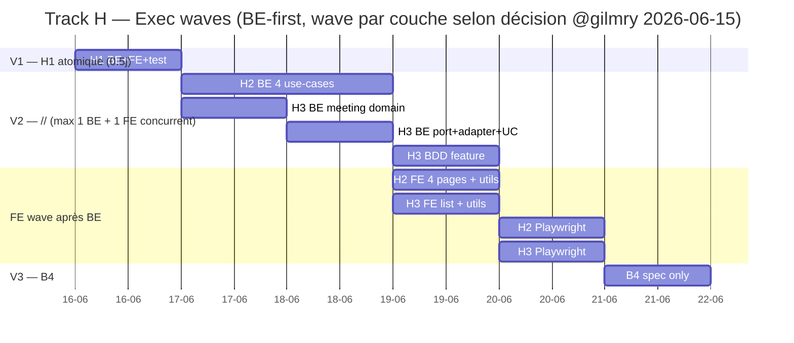

# Stories Track H — Bloqueurs légaux v0.1.0

> Phase D TOGAF — stories self-contained briefables par un agent fresh sans contexte session. Chaque story = goal + parent CC/Maury + user journey + AC 4-cat détaillées + data-testid exhaustifs + Files exhaustifs + a11y + wireframe + notes anti-pattern + cluster coord BE+FE.

## Plan d'exécution (waves)

| Wave | Story | Couche | Déps | Wall-clock (mémoire docker-parallelism) |
|---|---|---|---|---|
| V1 séq | **H1** — BuildingNotConformantError typée + 422 mapping + ConformityBanner FE | BE+FE atomique | aucune | 0.5j |
| V2 // (max 1 BE + 1 FE concurrent) | **H2** — validate-before-compute 4 use-cases + ConformityBanner sur 4 pages | BE-heavy + FE | H1 | 1.5j |
| V2 // | **H3** — Meeting.assert_can_complete + MissingInvariantsList FE | BE-heavy + FE | aucune (H3 indép. H1/H2) | 1.5j |
| V3 séq | **B4** — Regression spec building-edit-modal | FE only | aucune | 0.25j |

Critical path : H1 → H2 (1.5j BE + 1j FE wave 4 pages) → B4 = ~3-3.5j wall-clock.

## Légende AC

- `@happy` chemin nominal end-to-end multi-rôle quand applicable
- `@edge` borne (limite numérique, état frontière)
- `@security` impossibilité de bypass / RBAC / cross-org / tampering
- `@negative` défaillance correcte (erreur typée, pas panic, message utilisateur i18n)

---

## Story H1 — `BuildingNotConformantError` typée + ConformityBanner FE

### Goal

Livrer l'erreur typée `BuildingNotConformantError { quota_basis }` avec mapping `AppError → 422`, le From<> bridge pour legacy `Result<_, String>`, et le composant FE atomique `ConformityBanner` rendu sur la fiche immeuble. **Inclut bug fix domain critique** : `building.rs:213` `is_conformant` doit utiliser `self.total_tantiemes` au lieu de la constante `CONFORMANT_QUOTA_TOTAL = dec!(1000)`. Aujourd'hui tout building avec acte de base ≠ 1000 (10000 fréquent en BE) est mal classifié non-conforme. Préparer le terrain de H2 (qui utilisera ces 3 briques).

### Parent

- Code Civil Art. 3.84 (composition copropriété stricte).
- Maury Story 1.4 (Building.is_conformant existant, gap erreur typée).
- WBS WP-H1, FR-H1 PRD, INV-H1/H2/H3/H6.

### User journey

#### Acteur 1 — Admin garant conformité (cas building millièmes)

1. Admin crée building "Drift Manor" avec `total_units=10, total_tantiemes=1000`, crée 9 units avec quotas qui somment à 997.5.
2. Va sur `/building-detail?id=drift_manor`.
3. Voit `<ConformityBanner>` rouge en haut de la fiche : « ⚠️ Drift Manor n'est pas conforme — 1 lot manquant, somme des quotas en deçà de 2.5 / 1000 (acte de base). Contactez l'admin. »
4. Voit `<ConformityBadge>` (existant) avec details delta.
5. Boutons « Nouvelle dépense », « Générer appel de fonds » sont disabled + aria-disabled.

#### Acteur 1bis — Admin garant conformité (cas building 10000)

1. Admin crée building "Big Tower 182" avec `total_units=182, total_tantiemes=10000` (acte de base à 10000), crée 181 units avec quotas qui somment à 9975.
2. Va sur `/building-detail?id=big_tower_182`.
3. Voit `<ConformityBanner>` rouge : « ⚠️ Big Tower 182 n'est pas conforme — 1 lot manquant, somme des quotas en deçà de 25 / 10000 (acte de base). »
4. **Important** : avant le bug fix Story H1, ce building était considéré non-conforme MÊME si les 182 lots sommaient correctement à 10000 (car la constante 1000 vs 10000 différait). Après fix, building 10000 conforme = OK.

#### Acteur 2 — Syndic tentative bypass via API

1. Syndic login.
2. Force `POST /api/v1/expenses { building_id: "drift_manor", amount: 100, ... }` via curl.
3. Backend → use-case → `building.assert_conformant(metrics)?` → 422.
4. Body :
   ```json
   {
     "error": { "code": "BUILDING_NOT_CONFORMANT", "details": { "building_id": "...", "units_delta": 1, "quota_delta": "2.5" } }
   }
   ```
5. `security_incident` row insérée type `BUILDING_NOT_CONFORMANT`.

### AC détaillées 4-cat

#### `@happy`

- AC-H1.h1 — Domain `Building::assert_conformant(metrics)` retourne `Ok(())` quand `metrics.units_count == self.total_units && metrics.quota_sum == Decimal::from(self.total_tantiemes)`. **Le total cible est lu sur l'instance (acte de base), PAS sur une constante.**
- AC-H1.h1bis — Building 10000 millièmes : `total_tantiemes=10000`, units somment à 10000 → conforme. (Cas non couvert avant fix.)
- AC-H1.h2 — Test `cargo test --lib building::assert_conformant_tests::happy_returns_ok_when_conformant_1000` ET `happy_returns_ok_when_conformant_10000` GREEN.
- AC-H1.h3 — `From<BuildingNotConformantError> for AppError` retourne `AppError::Validation` avec `details.code == "BUILDING_NOT_CONFORMANT"` ET `details.quota_basis` = total_tantiemes du building.
- AC-H1.h4 — `From<BuildingNotConformantError> for String` retourne string structurée incluant quota_basis (pour use-cases legacy).
- AC-H1.h5 — FE `ConformityBanner` ne s'affiche PAS si `status.is_conformant === true`.
- AC-H1.h6 — Vitest `ConformityBanner.test.ts` happy : `<ConformityBanner status={ {is_conformant: true} } />` ne contient pas `[data-testid="conformity-banner"]`.
- AC-H1.h7 — FE banner affiche `quota_basis` dans le message (« 2.5 / 1000 » ou « 25 / 10000 »).

#### `@edge`

- AC-H1.e1 — Building 1000 : delta 0.1 fait fail (Decimal strict). `quota_sum == dec!(999.9)` → `Err` avec `quota_delta == dec!(0.1), quota_basis == 1000`.
- AC-H1.e1bis — Building 10000 : delta 0.1 fait fail aussi. `quota_sum == dec!(9999.9)` → `Err` avec `quota_delta == dec!(0.1), quota_basis == 10000`.
- AC-H1.e2 — Delta quota exactement 0 mais units_delta != 0 → `Err`.
- AC-H1.e3 — `assert_conformant` avec `total_units=0` (edge case build vide) → `Err` avec `units_delta=0` mais `quota_delta=Decimal::from(total_tantiemes)` (= total entier manquant).
- AC-H1.e4 — FE banner affiche unité au singulier si `units_delta == 1`, pluriel sinon (i18n FR/NL/EN/DE).
- AC-H1.e5 — Building avec `total_tantiemes=500` (cas exotique, acte ancien) → `assert_conformant` fonctionne aussi : la cible n'est jamais hard-codée.

#### `@security`

- AC-H1.s1 — Test `@security`: tampering metrics (forgé) ne masque pas la non-conformité côté domain (calcul pur, pas de trust externe). `BuildingMetrics` n'est pas signé : si attaquant remplace metrics légitimes par metrics conformes-mais-faux, le check passe, mais la query SQL en amont est la source de vérité — testée séparément.
- AC-H1.s2 — `AppError::Validation 422` n'expose PAS d'info sensible (pas de user_id, pas d'org_id sauf own).
- AC-H1.s3 — FE banner n'est PAS render-able par un utilisateur non-admin/non-syndic (RBAC frontend gate via route).
- AC-H1.s4 — Audit `security_incident` row créée pour chaque `From<BuildingNotConformantError> for AppError` exécuté.

#### `@negative`

- AC-H1.n1 — `assert_conformant` avec metrics empty (units_count=0, quota_sum=0) sur building total_units=10 → `Err` avec `units_delta=10`, `quota_delta=dec!(1000)`.
- AC-H1.n2 — `BuildingNotConformantError` Debug derives, peut être logué sans risque.
- AC-H1.n3 — FE banner avec `status.is_conformant=false` et `quota_delta="0"` et `units_delta=0` → ne render aucun `<li>` (cas impossible mais robust).

### data-testid

#### Backend (utoipa) — pas de testid mais ID error code

- Body error : `error.code = "BUILDING_NOT_CONFORMANT"`.
- Body details keys : `building_id`, `units_delta`, `quota_delta`.

#### Frontend (ConformityBanner + integration BuildingDetail)

- `conformity-banner` — root container `role="alert"` quand non-conforme.
- `conformity-banner-title` — strong title avec name.
- `conformity-units-delta` — li delta units (visible si !=0).
- `conformity-quota-delta` — li delta quota (visible si !=0). Attribut `data-basis` = `quota_basis` pour assertion test.
- `conformity-quota-basis` — span affichant `/ {quota_basis}` (1000, 10000, autre).
- `conformity-contact-admin` — paragraphe « contact admin ».
- Sur BuildingDetail (existant) : `expense-create-button`, `call-for-funds-create-button` reçoivent `disabled` + `aria-disabled` quand non-conforme.

### Files exhaustifs

#### Backend

- `backend/src/domain/entities/building.rs` (EDIT) :
  - **BUG FIX** : supprimer constante `CONFORMANT_QUOTA_TOTAL = dec!(1000)` (ligne 12).
  - **BUG FIX** : `is_conformant(&self, metrics)` utilise `self.total_tantiemes` (ligne 213-220).
  - **BUG FIX** : `compute_is_conformant(declared_units, total_tantiemes, metrics)` reçoit le param `total_tantiemes` (signature change).
  - **BUG FIX** : `quota_delta(&self, metrics)` devient méthode d'instance (utilise `self.total_tantiemes`, ligne 225-227).
  - **BUG FIX** : `validate_unit_shares_distribution(units, total_tantiemes)` reçoit total en param (ligne 235-255).
  - Ajout `BuildingNotConformantError { building_id, units_delta, quota_delta, quota_basis }`.
  - Ajout `Building::assert_conformant()` méthode + tests 4-cat inline (`#[cfg(test)] mod assert_conformant_tests`) couvrant cas 1000 ET 10000.
  - Mettre à jour TOUS les tests existants qui réfèrent `CONFORMANT_QUOTA_TOTAL` ou hard-code `1000`.
- `backend/src/application/error.rs` (EDIT) — Ajout `From<BuildingNotConformantError> for AppError` + `From<BuildingNotConformantError> for String` incluant `quota_basis` dans details.
- Audit call-sites :
  - `backend/src/domain/entities/charge_distribution.rs` ligne 179/197/213/225/etc. — hard-code `dec!(1000)` dans tests. Soit migrer paramétrable, soit garder pour tests qui modélisent acte 1000. À évaluer cas par cas, **NE PAS** refacto à l'aveugle.
  - Repository `building_metrics_repository_impl.rs` — vérifier que la query lit `total_tantiemes` aussi si nécessaire (pour DTO is_conformant).
- Pas de migration SQL nouvelle pour H1.

#### Frontend

- `frontend/src/lib/components/shared/ConformityBanner.svelte` (NEW) — composant atomique Svelte 5 runes.
- `frontend/src/lib/components/shared/ConformityBanner.test.ts` (NEW) — Vitest 4-cat (happy ne render pas si conforme / edge singulier-pluriel / security pas de info sensible / negative props inconsistents).
- `frontend/src/lib/utils/conformity.ts` (NEW) — Helpers `isConformityError()` + `showConformityToast()` + types `ConformityStatus` et `BuildingNotConformantPayload`.
- `frontend/src/lib/utils/conformity.test.ts` (NEW) — Vitest 4-cat.
- `frontend/src/lib/types/conformity.ts` (NEW) — Types TypeScript exportés.
- `frontend/src/components/BuildingDetail.svelte` (EDIT) — Import + render `<ConformityBanner>` + propagation `canCompute` aux boutons calcul.
- `frontend/src/locales/{fr,nl,en,de}.json` (EDIT) — Ajout clés `conformity.banner_title`, `conformity.units_missing`, `conformity.units_extra`, `conformity.quota_off`, `conformity.contact_admin`, `conformity.toast_title`, `conformity.toast_message`.

#### Tests E2E

- `frontend/tests/e2e/refonte-ux/track-h/conformity-banner-display.spec.ts` (NEW) — Playwright `@happy` admin voit banner sur Drift Manor, ne voit pas sur Conformant Towers.

### Wireframe ASCII

```
┌────────────────────────────────────────────────────────────┐
│ [BuildingDetail.svelte — admin view, acte de base 10000]   │
│                                                            │
│  Big Tower 182 — Bruxelles                   [Modifier]   │
│                                                            │
│  ┌──────────────────────────────────────────────────────┐ │
│  │ ⚠️ Big Tower 182 n'est pas conforme                  │ │
│  │   • 1 lot manquant                                    │ │
│  │   • Somme des quotas en deçà de 25 / 10000           │ │
│  │     (acte de base)                                    │ │
│  │   Contactez l'admin pour corriger.                   │ │
│  └──────────────────────────────────────────────────────┘ │
│                                                            │
│  Conformité : 🔴 Non conforme                              │
│  Lots : 181 / 182                                          │
│  Σ quotas : 9975 / 10000  (acte de base immeuble)          │
│                                                            │
│  [Nouvelle dépense] (disabled)  [Appel de fonds] (disabled)│
└────────────────────────────────────────────────────────────┘
```

### Notes anti-pattern

- **NE PAS** stocker `is_conformant` en colonne SQL (drift garanti — calcul à chaque lecture via `BuildingMetrics`).
- **NE PAS** hard-coder `dec!(1000)` comme cible — c'est l'acte de base, lu sur `self.total_tantiemes`. (Cf. bug fix story.)
- **NE PAS** garder la constante `CONFORMANT_QUOTA_TOTAL` "au cas où" — supprimer pour éviter régression silencieuse.
- **NE PAS** caser `assert_conformant` logique dans use-case (pure domain).
- **NE PAS** masquer le delta ou le `quota_basis` dans 422 — payload doit être exploitable (admin doit savoir quoi corriger et sur quelle base).
- **NE PAS** désactiver les boutons calcul côté FE sans check backend (defense-in-depth — backend reste source de vérité 422).
- **NE PAS** lever exception/panic dans `From<BuildingNotConformantError>` — fonction Convert pure.

### Cluster coord BE+FE

- BE drafte d'abord `BuildingNotConformantError` + `assert_conformant` + From<> (1 commit).
- FE drafte `ConformityBanner` + types + helpers (2 commits parallèles possibles).
- Integration BuildingDetail.svelte fait sur même commit que ConformityBanner (cohérence atomique).
- DoD H1 = BE commit + FE commit + Playwright spec + CI verte.

### DoD-H1

- [ ] **BUG FIX domain** : constante `CONFORMANT_QUOTA_TOTAL` supprimée, `is_conformant` utilise `self.total_tantiemes`. Tests 4-cat couvrent buildings 1000 ET 10000.
- [ ] Domain `Building::assert_conformant` + tests 4-cat verts (`cargo test --lib building`) avec 2 buildings de référence (acte 1000 + acte 10000).
- [ ] `From<BuildingNotConformantError> for AppError` + `for String` impléments + tests `cargo test --lib application::error`.
- [ ] FE `ConformityBanner.svelte` + Vitest 4-cat verts (cas affichage `quota_basis=1000` et `quota_basis=10000`).
- [ ] FE `conformity.ts` utils + Vitest 4-cat verts.
- [ ] BuildingDetail.svelte intègre ConformityBanner + propage disabled aux boutons calcul.
- [ ] i18n FR/NL/EN/DE clés ajoutées (le template texte interpole `{basis}` au lieu de hard-coder 1000).
- [ ] Playwright `conformity-banner-display.spec.ts` GREEN (project chromium, **pas testIgnore**) — couvre 2 buildings seedés (acte 1000 + acte 10000).
- [ ] Pas de nouvel `unwrap()` / `expect()` / `Result<_, String>` introduit (lint).
- [ ] `astro check` 0 erreur, `cargo check --lib --tests` 0 erreur, `make ci` GREEN.
- [ ] Audit grep `git grep "CONFORMANT_QUOTA_TOTAL"` → 0 résultat ; `git grep -E "dec!\\(1000\\)" backend/src/domain/entities/building.rs` → 0 résultat hors tests legitimes.

---

## Story H2 — `validate-before-compute` 4 use-cases + ConformityBanner sur 4 pages

### Goal

Câbler `Building::assert_conformant()?` dans les 4 use-cases identifiés (expense, call_for_funds, charge_distribution, etat_date) avec audit `security_incident`. Rendre `<ConformityBanner>` sur les 4 pages FE équivalentes (ExpenseList, CallForFundsList, ChargeDistributionPanel, EtatDatePage) avec désactivation des boutons calcul.

### Parent

- Code Civil Art. 3.85 (répartition charges sur quotas conformes), Art. 3.89 (transparence chiffres syndic).
- Maury Story 4.9 `[cluster-coord]` (signée 2026-05-20, exécution Track H).
- WBS WP-H2, FR-H2 PRD, INV-H4/H6.
- Mémoire `validate-before-compute`.

### User journey

#### Acteur 1 — Syndic via UI sur building non-conforme

1. Syndic ouvre `/expenses?building_id=drift_manor`.
2. Page rend `<ConformityBanner>` car building non-conforme.
3. Bouton « Nouvelle dépense » `disabled` + tooltip explicatif au hover.
4. Idem `/call-for-funds`, `/charge-distribution`, `/etats-dates`.

#### Acteur 2 — Syndic tente bypass via API

1. Force `POST /expenses` avec building_id non-conforme via curl.
2. Backend → use-case `create_expense` → charge metrics → `assert_conformant()?` → erreur.
3. Mapping `From<BuildingNotConformantError> for String` ou `for AppError` selon use-case → 422.
4. Audit `security_incident` row type `BUILDING_NOT_CONFORMANT`, user_id, target_building_id.

#### Acteur 3 — Admin corrige le drift

1. Admin ajoute le 10ème lot avec quota 2.5 (somme atteint 1000.0).
2. `assert_conformant` retourne maintenant Ok.
3. Syndic recharge la page → banner disparaît → boutons calcul ré-activés.

### AC détaillées 4-cat

#### `@happy`

- AC-H2.h1 — Sur building conforme, `create_expense`, `send_call_for_funds`, `compute_distribution`, `generate_etat_date` retournent 200 OK.
- AC-H2.h2 — BDD `validate_before_compute.feature` scenario `@happy` 4 use-cases × 4 actions = 4 scenarios GREEN.
- AC-H2.h3 — FE pages : si conforme, `<ConformityBanner>` non rendu, boutons enabled.

#### `@edge`

- AC-H2.e1 — Use-case appelé en parallèle (race condition) avec admin update building → second use-case voit nouvel état (pas cache stale).
- AC-H2.e2 — Building devient conforme entre check pre-conditions et insert : check à pre seulement (pas re-check à commit — risque race acceptable v0.1.0 bêta).
- AC-H2.e3 — Use-case `generate_etat_date` avec date past → ne déclenche pas conformance check (etat à un instant T historique).

#### `@security`

- AC-H2.s1 — `@security` test pour chaque use-case : payload conforme apparent + building_id réel non-conforme → 422 + audit.
- AC-H2.s2 — Cross-org building_id (syndic A vise building syndic B) → 404 NOT_FOUND avant assert_conformant (RBAC en amont, défense profondeur).
- AC-H2.s3 — Audit `security_incident` row : on ne logue PAS l'IP (GDPR), juste user_id + target_id + type + timestamp.
- AC-H2.s4 — `security_incident_repository.insert()` non-bloquant (async fire-and-forget) — si DB lente, le 422 part quand même.

#### `@negative`

- AC-H2.n1 — Use-case sur building inexistant → 404 (avant assert_conformant).
- AC-H2.n2 — Use-case sur building soft-deleted → 404.
- AC-H2.n3 — Toast 422 FE avec `details.code === "BUILDING_NOT_CONFORMANT"` → render `<ConformityToast>` avec deltas. Sinon fallback toast générique.

### data-testid

#### Backend

- Pour chaque use-case, error code `BUILDING_NOT_CONFORMANT` dans details.

#### Frontend

- `expense-create-button` `disabled` quand non-conforme.
- `call-for-funds-create-button` idem.
- `charge-distribution-compute-button` idem.
- `etat-date-generate-button` idem.
- Sur chaque page : `conformity-banner` rendu en haut.
- Toast 422 : `conformity-toast` racine + `conformity-toast-units` + `conformity-toast-quota`.

### Files exhaustifs

#### Backend

- `backend/src/application/use_cases/expense_use_cases.rs` (EDIT) — Ajout pre-check `assert_conformant` dans `create_expense` (et autres mutations si présentes).
- `backend/src/application/use_cases/call_for_funds_use_cases.rs` (EDIT) — Ajout pre-check dans `send_call_for_funds` + dans `create_call_for_funds` si génère contributions.
- `backend/src/application/use_cases/charge_distribution_use_case.rs` (EDIT) — Ajout pre-check dans `compute_distribution`.
- `backend/src/application/use_cases/etat_date_use_cases.rs` (EDIT) — Ajout pre-check dans `generate_etat_date`.
- `backend/src/application/ports/building_metrics_repository.rs` (lecture seule, déjà existant) — réutilisé.
- `backend/src/application/ports/security_incident_repository.rs` (lecture seule, déjà existant) — réutilisé.
- Middleware Actix `audit_conformance_middleware` (NEW OPTIONNEL) — Si simple, ajout 1 middleware qui inspecte response 422 + code → insert security_incident. Sinon : code dupliqué inline dans les 4 use-cases (préférence pragmatique). Choix agent.
- `backend/tests/features/validate_before_compute.feature` (NEW) — BDD 4-cat × 4 use-cases.
- `backend/tests/bdd_validate_before_compute.rs` (NEW si pas de runner unique) ou ajouter step definitions dans runner existant.
- `backend/migrations/YYYYMMDD_security_incident_track_h_types.sql` (NEW si CHECK constraint) — Ajout type `BUILDING_NOT_CONFORMANT`. Sinon skippé.

#### Frontend

- `frontend/src/components/expenses/ExpenseList.svelte` (EDIT) — Render `<ConformityBanner>` + `disabled` sur `expense-create-button`.
- `frontend/src/components/call-for-funds/CallForFundsList.svelte` (EDIT) — idem.
- `frontend/src/components/charge-distribution/ChargeDistributionPanel.svelte` (EDIT) — idem.
- `frontend/src/components/etat-date/EtatDatePage.svelte` (ou équivalent) (EDIT) — idem.
- `frontend/src/lib/utils/conformity.ts` (EDIT) — Ajout `showConformityToast()` + intégration toast global.
- `frontend/src/lib/api/expenses.ts` (EDIT si nécessaire) — Catch 422 BUILDING_NOT_CONFORMANT → `showConformityToast()`.
- `frontend/src/lib/api/call_for_funds.ts` idem.
- `frontend/src/lib/api/charge_distribution.ts` idem.
- `frontend/src/lib/api/etat_date.ts` idem.

#### Tests E2E

- `frontend/tests/e2e/refonte-ux/track-h/validate-before-compute.spec.ts` (NEW) — 4 scenarios multi-rôle : admin crée drift → syndic UI button disabled → syndic force API → toast 422 → admin corrige → syndic ré-utilise.

### Wireframe ASCII

```
┌────────────────────────────────────────────────────────────┐
│ [ExpenseList.svelte — syndic view, building drift]        │
│                                                            │
│  ┌──────────────────────────────────────────────────────┐ │
│  │ ⚠️ Drift Manor n'est pas conforme                    │ │
│  │   • 1 lot manquant                                    │ │
│  │   • Somme des quotas en deçà de 2.5 millièmes        │ │
│  │   Contactez l'admin pour corriger.                   │ │
│  └──────────────────────────────────────────────────────┘ │
│                                                            │
│  Dépenses                                                  │
│  ┌──────────────────────────────────────────────────────┐ │
│  │ [+ Nouvelle dépense]  (disabled, tooltip explicatif) │ │
│  └──────────────────────────────────────────────────────┘ │
│                                                            │
│  Table dépenses existantes... (visualisation OK)          │
└────────────────────────────────────────────────────────────┘
```

### Notes anti-pattern

- **NE PAS** sauter le pre-check dans 1 des 4 use-cases — défense profondeur exige tous.
- **NE PAS** caller `assert_conformant` sans charger `BuildingMetrics` (NotFound silencieux si query manque).
- **NE PAS** caller `assert_conformant` au sein d'une transaction qui mute (charger metrics avant lock).
- **NE PAS** refacto les use-cases legacy `Result<_, String>` vers `Result<_, AppError>` (hors scope, mémoire `validate-before-compute`).
- **NE PAS** afficher banner FE si l'utilisateur n'est pas syndic/admin (RBAC route en amont).
- **NE PAS** désactiver bouton FE sans le rendre cliquable pour focus / tooltip (mémoire a11y-wcag-aa-baseline — `disabled` ne doit pas masquer info au lecteur d'écran).

### Cluster coord BE+FE

- BE wave 1 agent séquentiel sur les 4 use-cases (mémoire `docker-parallelism-bottleneck` — caches partagés sérialisent quand même).
- FE wave : 4 EDITS de pages existantes parallèles si agents distincts (mais 1 agent FE suffit, plus simple).
- Tests BDD `validate_before_compute.feature` + Playwright `validate-before-compute.spec.ts` en fin de chaîne.
- DoD H2 = 4 use-cases verts BE + 4 pages verts FE + BDD + Playwright + CI verte.

### DoD-H2

- [ ] 4 use-cases (expense, call_for_funds, charge_distribution, etat_date) appellent `assert_conformant?` avant mutation/calcul.
- [ ] `cargo test --test bdd validate_before_compute` 16 scenarios GREEN (4 use-cases × 4-cat).
- [ ] 4 pages FE rendent `<ConformityBanner>` + boutons disabled si non-conforme.
- [ ] Toast 422 narratif `BUILDING_NOT_CONFORMANT` rendu via `showConformityToast()`.
- [ ] Audit `security_incident` row par tentative bypass (test BDD GREEN).
- [ ] Migration SQL appliquée (si CHECK type) ou skip documenté.
- [ ] Playwright `validate-before-compute.spec.ts` GREEN (project chromium).
- [ ] `make ci` GREEN. Pas de nouveau testIgnore.

---

## Story H3 — `Meeting::assert_can_complete()` Art. 3.87 §3-5 + MissingInvariantsList FE

### Goal

Implémenter `Meeting::assert_can_complete(checklist)` qui vérifie convocations envoyées + votes clôturés + présences + quorum + minutes draft. Mapper `MeetingNotCompletableError` vers 422. Render FE `<MissingInvariantsList>` + désactivation bouton « Clôturer » + toast 422 narratif.

### Parent

- Code Civil Art. 3.87 §3 (convocations 15j avant), §4 (votes valides quorum), §5 (présences enregistrées).
- Maury Story 4.5 (signée 2026-05-20, exécution Track H).
- WBS WP-H3, FR-H3 PRD, INV-H5/H6.

### User journey

#### Acteur 1 — Syndic tente clôture incomplet via UI

1. Syndic ouvre `/meeting-detail?id=ag_2026_q2`.
2. AG status = `Scheduled`. 2 résolutions encore `open` (votes pas clôturés). Convocations pas envoyées. Pas de minutes draft.
3. Bouton « Clôturer la réunion » affiche `<MissingInvariantsList>` en dessous avec 4 conditions manquantes.
4. Bouton `disabled` + `aria-disabled` + tooltip.

#### Acteur 2 — Syndic force clôture via API

1. Force `POST /meetings/<id>/complete` via curl.
2. Backend → `meeting.assert_can_complete(checklist)?` → 422 `MEETING_NOT_COMPLETABLE`.
3. Body :
   ```json
   {
     "error": {
       "code": "MEETING_NOT_COMPLETABLE",
       "details": {
         "meeting_id": "...",
         "missing": [
           {"type": "ConvocationsNotSent"},
           {"type": "VotesNotClosed", "open_resolutions": 2},
           {"type": "AttendanceNotRecorded"},
           {"type": "MinutesDraftMissing"}
         ]
       }
     }
   }
   ```
4. Audit `security_incident` row type `MEETING_NOT_COMPLETABLE`.

#### Acteur 3 — Syndic complète puis re-tente

1. Syndic envoie convocations → check 1 OK.
2. Clôture les 2 résolutions → check 2 OK.
3. Enregistre présences (10/10 propriétaires, somme quotas 1000) → check 3+4 OK.
4. Drafte minutes (texte) → check 5 OK.
5. Re-clique « Clôturer » → 200, status passe à `Completed`.
6. UI affiche flash success + redirige `/meetings` liste.

### AC détaillées 4-cat

#### `@happy`

- AC-H3.h1 — `Meeting::assert_can_complete(checklist)` avec tous bool/conditions OK retourne `Ok(())`.
- AC-H3.h2 — Use case `complete_meeting()` enchaîne assert_can_complete + complete_internal + save → status = `Completed`.
- AC-H3.h3 — BDD `meeting_complete.feature` scenario `@happy` GREEN (tous invariants présents).
- AC-H3.h4 — FE bouton « Clôturer » `enabled` quand checklist OK, `<MissingInvariantsList>` non rendu.
- AC-H3.h5 — Vitest `MissingInvariantsList.test.ts` : `<MissingInvariantsList invariants={[]} />` render `<ul>` vide (pas crash).

#### `@edge`

- AC-H3.e1 — Quorum exactement à la borne 50% (500/1000) → KO (Art. 3.87 §4 majorité SIMPLE = > 50%, pas ≥). `attended_quotas <= total_quotas / 2` rejette.
- AC-H3.e2 — Quorum 500.0001/1000 → OK.
- AC-H3.e3 — Convocations envoyées il y a 14j (Art. 3.87 §3 exige 15j) → KO sur date check (à inclure dans `convocations_sent` logique — checklist conserve bool simple, granularité date dans use-case loader). v0.1.0 simplification : `convocations_sent` = `sent_at IS NOT NULL` (pas de check 15j strict, reporté v0.2.0 avec issue tracée).
- AC-H3.e4 — 1 résolution status='cancelled' → ne compte pas dans open_resolutions.

#### `@security`

- AC-H3.s1 — Syndic forge param `attendees_count` ancien (déprécié) — use-case ignore le param, source de vérité = `checklist.attended_quotas` calculé DB-side.
- AC-H3.s2 — Cross-org meeting_id → 404 avant assert_can_complete.
- AC-H3.s3 — Audit `security_incident` MEETING_NOT_COMPLETABLE row par tentative bypass.
- AC-H3.s4 — FE bouton disabled + aria-disabled ne render PAS si user pas syndic/admin (RBAC).

#### `@negative`

- AC-H3.n1 — Meeting inexistant → 404 avant assert.
- AC-H3.n2 — Meeting déjà Completed → 422 (existing logique state machine `complete_internal()` détecte). Pas double-validation.
- AC-H3.n3 — Checklist avec total_quotas=0 (cas building soft-deleted entre meeting création et clôture) → KO quorum (0/0 = NaN... attention div by zero) → `assert_can_complete` doit gérer `total_quotas == dec!(0)` comme `QuorumNotReached`.

### data-testid

#### Frontend

- `meeting-complete-button` — bouton « Clôturer la réunion » (existant ou à ajouter).
- `meeting-complete-button-disabled-reason` — tooltip text quand disabled.
- `missing-invariants-list` — `<ul>` racine.
- `missing-invariant-convocationsnotsent` — `<li>`.
- `missing-invariant-votesnotclosed` — `<li>`.
- `missing-invariant-attendancenotrecorded` — `<li>`.
- `missing-invariant-quorumnotreached` — `<li>`.
- `missing-invariant-minutesdraftmissing` — `<li>`.
- Toast 422 : `meeting-completable-toast`.

### Files exhaustifs

#### Backend

- `backend/src/domain/entities/meeting.rs` (EDIT) — Ajout `MissingInvariant` enum + `MeetingCompletionChecklist` struct + `MeetingNotCompletableError` struct + `Meeting::assert_can_complete()` méthode + renommer ancien `complete()` en `complete_internal()` + tests 4-cat inline (`#[cfg(test)] mod assert_can_complete_tests`).
- `backend/src/application/error.rs` (EDIT) — Ajout `From<MeetingNotCompletableError> for AppError` (mapping 422 avec missing[] serialisé).
- `backend/src/application/ports/meeting_completion_checker.rs` (NEW) — Port async trait.
- `backend/src/infrastructure/database/repositories/meeting_completion_checker_impl.rs` (NEW) — Adapter sqlx avec query agrégée 6 sous-queries.
- `backend/src/application/use_cases/meeting_use_cases.rs` (EDIT) — Inject `completion_checker` dans struct ; `complete_meeting()` appelle `build_checklist + assert_can_complete?` avant `complete_internal`.
- `backend/src/infrastructure/web/handlers/meeting_handlers.rs` (EDIT mineur) — Pas de change handler, mapping AppError déjà via `From<>`.
- `backend/tests/features/meeting_complete.feature` (NEW) — BDD 4-cat × 5 invariants.

#### Frontend

- `frontend/src/lib/components/shared/MissingInvariantsList.svelte` (NEW) — Composant atomique.
- `frontend/src/lib/components/shared/MissingInvariantsList.test.ts` (NEW) — Vitest 4-cat.
- `frontend/src/lib/utils/meetingCompletion.ts` (NEW) — Helpers `isMeetingCompletionError()` + `showMeetingCompletionToast()` + types.
- `frontend/src/lib/types/meeting.ts` (EDIT/NEW si absent) — Type `MissingInvariant` enum FE.
- `frontend/src/components/meetings/MeetingDetail.svelte` (EDIT) — Charge `completion_checklist` côté FE (nouveau endpoint optionnel `GET /meetings/<id>/completion-checklist` v0.1.0 — OU re-load existing meeting DTO enrichi) + render `<MissingInvariantsList>` + propage disabled.
- `frontend/src/locales/{fr,nl,en,de}.json` (EDIT) — Clés `meeting.missing.*` + `meeting.complete.disabled_reason` + `meeting.complete.toast_*`.

#### Tests E2E

- `frontend/tests/e2e/refonte-ux/track-h/meeting-completion-blocked.spec.ts` (NEW) — Playwright multi-rôle : Syndic tente clôture incomplete → MissingInvariantsList rendu → corrige étapes → re-clique → success.

### Wireframe ASCII

```
┌────────────────────────────────────────────────────────────┐
│ [MeetingDetail.svelte — syndic view, AG incomplet]        │
│                                                            │
│  AG Q2 2026 — Drift Manor                                  │
│  Status: Scheduled                                         │
│                                                            │
│  ┌──────────────────────────────────────────────────────┐ │
│  │ Pour clôturer cette AG, complétez les conditions :   │ │
│  │  ✗ Convocations non envoyées (Art. 3.87 §3)         │ │
│  │  ✗ 2 résolutions en cours (votes pas clôturés §4)   │ │
│  │  ✗ Présences pas enregistrées (§5)                  │ │
│  │  ✗ PV draft manquant                                │ │
│  └──────────────────────────────────────────────────────┘ │
│                                                            │
│  [Clôturer la réunion] (disabled — 4 conditions)          │
└────────────────────────────────────────────────────────────┘
```

### Notes anti-pattern

- **NE PAS** caser `assert_can_complete` logique dans use-case (pure domain).
- **NE PAS** stocker `is_completable` colonne SQL (drift garanti).
- **NE PAS** réutiliser ancien `complete()` directement — renommer en `complete_internal()` pour clarté.
- **NE PAS** supprimer le param `attendees_count` du handler (compat backward — l'ignorer dans use-case).
- **NE PAS** render bouton « Clôturer » sans `aria-disabled` (a11y).
- **NE PAS** caller assert_can_complete depuis FE (FE consomme déjà la liste invariants depuis DTO).

### Cluster coord BE+FE

- BE 1 agent : meeting.rs domain + meeting_completion_checker port+adapter + use_case + BDD.
- FE 1 agent : MissingInvariantsList + meetingCompletion utils + MeetingDetail integration + Vitest + Playwright.
- Parallèle possible si meeting DTO est prêt côté FE via api.d.ts (gen openapi-typescript).
- DoD H3 = BE wave + FE wave + BDD + Playwright + CI verte.

### DoD-H3

- [ ] Domain `Meeting::assert_can_complete` + tests 4-cat verts.
- [ ] `MeetingCompletionCheckerPort` + adapter sqlx implémenté + tests integration.
- [ ] Use case `complete_meeting()` appelle assert_can_complete avant complete_internal.
- [ ] BDD `meeting_complete.feature` ≥ 20 scenarios verts (5 invariants × 4-cat).
- [ ] FE `MissingInvariantsList.svelte` + Vitest 4-cat verts.
- [ ] FE `meetingCompletion.ts` utils + Vitest 4-cat verts.
- [ ] MeetingDetail.svelte intègre MissingInvariantsList + propage disabled.
- [ ] i18n FR/NL/EN/DE clés ajoutées.
- [ ] Playwright `meeting-completion-blocked.spec.ts` GREEN (project chromium).
- [ ] Audit `security_incident` MEETING_NOT_COMPLETABLE row par tentative bypass (test BDD).
- [ ] `make ci` GREEN. Pas de nouveau testIgnore.

---

## Story B4 — Regression spec Building edit modal

### Goal

Spec Playwright qui prouve que le bouton « Modifier » sur la fiche immeuble admin fonctionne. Le code est déjà OK (cartographie 2026-06-15) — c'est un test de non-régression contre le retour silencieux du bug #553 Bug 1.

### Parent

- Issue #553 Bug 1.
- WBS WP-B4.
- Maury Story 1.4 + 2.5 E2E.

### User journey

1. Admin login (helper existant `loginAsAdmin`).
2. Navigate `/buildings`.
3. Click first row → `/building-detail?id=X`.
4. Click `[data-testid="building-edit-submit"]` → modal `[data-testid="building-edit-modal"]` apparaît.
5. Modifier `[data-testid="building-form-name-input"]` ajoute suffixe `-edited`.
6. Click `[data-testid="building-form-save-submit"]` → toast success + modal ferme.
7. Vérifier que `[data-testid="building-detail-name"]` contient le nouveau name.

### AC détaillées 4-cat

#### `@happy`

- AC-B4.h1 — Spec `@happy` admin login → fiche → Modifier → submit edited → name visible mis à jour.

#### `@edge`

- AC-B4.e1 — Edit name avec emoji ASCII strict (255 chars max si validation) — vérifier que limite est respectée (success ou erreur claire).

#### `@security`

- AC-B4.s1 — User non-admin (owner) ne voit PAS le bouton Modifier (RBAC FE).

#### `@negative`

- AC-B4.n1 — Submit avec name vide → modal reste ouvert + erreur visible inline. Aucune mutation backend.

### data-testid

- `building-edit-submit` (déjà existant cf. cartographie).
- `building-edit-modal` — modal root.
- `building-form-name-input` — input name.
- `building-form-save-submit` — save button.
- `building-detail-name` — h1/h2 ou span rendant le name actuel.

### Files

- `frontend/tests/e2e/refonte-ux/track-h/building-edit-modal.spec.ts` (NEW).
- **Aucun autre fichier** — code applicatif est déjà OK.

### Wireframe ASCII

(Pas de wireframe nouveau — modal existant.)

### Notes anti-pattern

- **NE PAS** modifier code applicatif (cartographie confirme OK).
- **NE PAS** mettre spec dans `tests/e2e/refonte-ux/phase-b-fe/` (project chromium déjà testIgnore Phase B FE — voir mémoire `phase-c-reactivate-e2e-specs`). Mettre dans `track-h/` qui n'est PAS testIgnore.

### Cluster coord

- FE only, 1 spec rapide, ~0.25j.

### DoD-B4

- [ ] Spec `building-edit-modal.spec.ts` 4-cat verte.
- [ ] Project chromium catch le spec (pas testIgnore).
- [ ] `make ci` GREEN.

---

## Mémoires Maury appliquées (récap)

| Story | Mémoires |
|---|---|
| H1 | `validate-before-compute`, `admin-publishes-conform-buildings`, `no-f64-in-money`, `tdd-bdd-four-categories`, `a11y-wcag-aa-baseline`, `data-testid-systematic` |
| H2 | `validate-before-compute`, `multirole-narrative-scenarios`, `world-model-seed`, `docker-parallelism-bottleneck`, `tdd-bdd-four-categories` |
| H3 | `multirole-narrative-scenarios`, `tdd-bdd-four-categories`, `a11y-wcag-aa-baseline`, `data-testid-systematic` |
| B4 | `phase-c-reactivate-e2e-specs` (NE PAS mettre spec dans phase-b-fe/) |

## Gantt par passes d'agent (RGRR unit, S=0.5j / M=1j / L=2j wall-clock)



**Wall-clock total** : ~3.5j critical path (H1 + H2-BE + H2-FE + B4 sequentiel).

## Signature finale

```
Mary (Brief)         : SIGNED v1.0 par @gilmry 2026-06-15
John (PRD)           : SIGNED v1.0 par @gilmry 2026-06-15
Winston (Arch)       : SIGNED v1.0 par @gilmry 2026-06-15
Bob (Stories)        : SIGNED v1.0 par @gilmry 2026-06-15
PO (Validation)      : SIGNED v1.0 par @gilmry 2026-06-15 (cf. validation.md)
```

**→ Agents Track H AUTORISÉS à être lancés selon le Gantt waves V1 → V2 → V3.**
