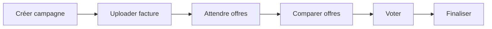

# Energy Campaigns Frontend Components

Composants Svelte pour les Achats Groupés d'Énergie (Energy Buying Groups) conforme GDPR et CREG belge.

## 📋 Vue d'ensemble

Ce module frontend permet aux copropriétés belges de créer et gérer des campagnes d'achat groupé d'énergie, avec chiffrement AES-256-GCM et k-anonymité garantie.

### 🎯 Objectif

- **Économies**: 15-25% sur factures d'électricité/gaz
- **Sécurité GDPR**: Chiffrement total, k-anonymité (k≥5), consentement explicite
- **Conformité CREG**: Commission de Régulation de l'Électricité et du Gaz belge

## 📂 Structure des composants

```
energy-campaigns/
├── CampaignStatusBadge.svelte       # Badge de statut (6 états)
├── EnergyCampaignList.svelte        # Liste des campagnes
├── CreateCampaignForm.svelte        # Formulaire de création
├── EnergyBillUpload.svelte          # Upload de facture (GDPR)
├── ProviderOffersList.svelte        # Comparaison d'offres
├── CampaignDetail.svelte            # Page détail complète
├── CreateProviderOfferForm.svelte   # Ajout d'offre (admin)
├── index.ts                         # Barrel export
└── README.md                        # Cette documentation
```

## 🚀 Pages Astro

```
pages/
├── energy-campaigns.astro           # Liste des campagnes (/energy-campaigns)
├── energy-campaigns/
│   ├── new.astro                    # Création (/energy-campaigns/new)
│   └── [id].astro                   # Détail (/energy-campaigns/:id)
```

## 🔧 Utilisation

### 1. Liste des campagnes

```svelte
<script>
  import { EnergyCampaignList } from "../components/energy-campaigns";
</script>

<EnergyCampaignList organizationId="uuid-here" />
```

### 2. Création de campagne

```svelte
<script>
  import { CreateCampaignForm } from "../components/energy-campaigns";

  function handleCreated(event) {
    const campaign = event.detail;
    console.log("Campaign created:", campaign);
  }
</script>

<CreateCampaignForm
  organizationId="uuid-here"
  buildingId="uuid-here"
  on:created={handleCreated}
  on:cancel={() => console.log("Cancelled")}
/>
```

### 3. Upload de facture

```svelte
<script>
  import { EnergyBillUpload } from "../components/energy-campaigns";

  function handleUploaded(event) {
    const upload = event.detail;
    console.log("Bill uploaded:", upload);
  }
</script>

<EnergyBillUpload
  campaignId="uuid-here"
  unitId="uuid-here"
  on:uploaded={handleUploaded}
  on:cancel={() => console.log("Cancelled")}
/>
```

### 4. Détail de campagne (page complète)

```svelte
<script>
  import { CampaignDetail } from "../components/energy-campaigns";
</script>

<CampaignDetail
  campaignId="uuid-here"
  currentUserId="uuid-here"
  currentUnitId="uuid-here"
  isAdmin={true}
/>
```

## 🎨 Workflow de la campagne

### 6 États (CampaignStatus)

1. **Draft** (📝 Brouillon): Préparation initiale
2. **CollectingData** (📊 Collecte de données): Upload des factures
3. **Negotiating** (🤝 Négociation): Réception des offres fournisseurs
4. **AwaitingFinalVote** (🗳️ Vote final): Sélection de l'offre
5. **Finalized** (✅ Finalisée): Signature des contrats
6. **Completed** (🎉 Terminée): Campagne achevée

### Workflow utilisateur



## 🔒 Sécurité GDPR

### Consentement explicite

Le composant `EnergyBillUpload` inclut:

- ✅ Checkbox de consentement GDPR obligatoire
- ✅ Explication détaillée des droits (Art. 7, 15, 17)
- ✅ Signature de consentement générée automatiquement
- ✅ Bouton "Retirer consentement" (Art. 7.3)

### K-anonymité

Le composant `CampaignDetail` affiche:

- ⚠️ Warning si < 5 participants
- 🔒 Statistiques cachées tant que k < 5
- ✅ Validation visuelle quand k ≥ 5

### Chiffrement

- Toutes les consommations sont chiffrées côté backend (AES-256-GCM)
- Seules les statistiques agrégées sont visibles
- Clé de chiffrement: Variable d'environnement `ENERGY_ENCRYPTION_MASTER_KEY`

## 🎨 Personnalisation

### Couleurs

Les badges utilisent Tailwind CSS:

- **Draft**: `bg-gray-100 text-gray-800`
- **CollectingData**: `bg-blue-100 text-blue-800`
- **Negotiating**: `bg-purple-100 text-purple-800`
- **AwaitingFinalVote**: `bg-yellow-100 text-yellow-800`
- **Finalized**: `bg-green-100 text-green-800`
- **Completed**: `bg-emerald-100 text-emerald-800`

### Icônes

- ⚡ Électricité
- 🔥 Gaz
- 🌡️ Chauffage
- 🌱 100% vert
- 🌿 50-79% vert
- ⚡ <50% vert

## 📊 API Client

Le module utilise `/lib/api/energy-campaigns.ts`:

```typescript
import {
  energyCampaignsApi,
  energyBillsApi,
} from "../lib/api/energy-campaigns";

// Créer une campagne
const campaign = await energyCampaignsApi.create({
  organization_id: "uuid",
  campaign_name: "Achat groupé 2025",
  energy_types: ["Electricity", "Gas"],
  campaign_start_date: "2025-01-01",
  campaign_end_date: "2025-03-31",
});

// Uploader une facture
const upload = await energyBillsApi.upload({
  campaign_id: "uuid",
  unit_id: "uuid",
  energy_type: "Electricity",
  total_kwh: 2500,
  billing_period_start: "2024-01-01",
  billing_period_end: "2024-03-31",
  consent_signature: "generated-signature",
});

// Lister les offres
const offers = await energyCampaignsApi.listOffers("campaign-uuid");

// Retirer le consentement GDPR
await energyBillsApi.withdrawConsent("upload-uuid");
```

## 🧪 Tests recommandés

### Tests unitaires (Vitest)

```typescript
import { render } from "@testing-library/svelte";
import CampaignStatusBadge from "./CampaignStatusBadge.svelte";

test("renders Draft status correctly", () => {
  const { getByText } = render(CampaignStatusBadge, {
    props: { status: "Draft" },
  });
  expect(getByText("Brouillon")).toBeInTheDocument();
});
```

### Tests E2E (Playwright)

```typescript
import { test, expect } from "@playwright/test";

test("create energy campaign flow", async ({ page }) => {
  await page.goto("/energy-campaigns/new");
  await page.fill("#campaign_name", "Test Campaign");
  await page.check('input[type="checkbox"][value="Electricity"]');
  await page.fill("#start_date", "2025-01-01");
  await page.fill("#end_date", "2025-03-31");
  await page.click('button[type="submit"]');
  await expect(page).toHaveURL(/\/energy-campaigns\/[a-f0-9-]+/);
});
```

## 📈 Performance

### Optimisations

- **Code splitting**: Chaque composant est lazy-loadable
- **Memoization**: Pas de re-calculs inutiles (Svelte reactive)
- **Pagination**: Liste des campagnes paginée (backend)

### Métriques cibles

- **FCP (First Contentful Paint)**: < 1.5s
- **LCP (Largest Contentful Paint)**: < 2.5s
- **TTI (Time to Interactive)**: < 3.5s

## 🌍 Internationalisation (i18n)

Actuellement en français belge. Pour ajouter d'autres langues:

```typescript
// TODO: Ajouter support i18n
import { _ } from "svelte-i18n";

<span>{$_("energy_campaigns.status.draft")}</span>
```

## 🔗 Liens utiles

- **Backend API**: `/backend/src/infrastructure/web/handlers/energy_campaign_handlers.rs`
- **Documentation**: `/docs/ENERGY_BUYING_GROUPS.rst`
- **Migration DB**: `/backend/migrations/20251204000000_create_energy_buying_groups.sql`
- **CREG**: https://www.creg.be/

## 📝 Licence

KoproGo SaaS - Propriétaire
